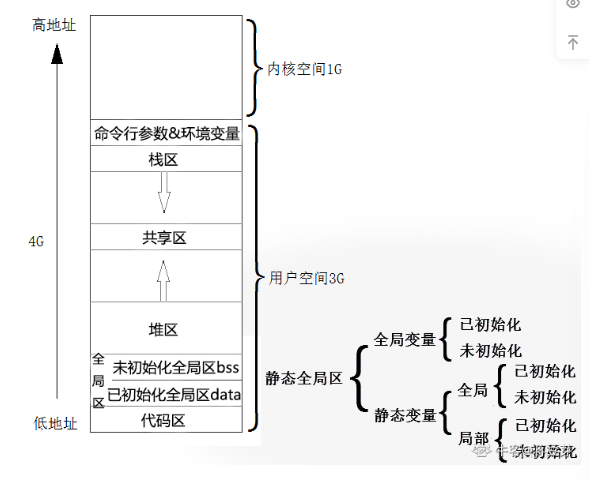

# C++面经

## 1.`int main(int argc,char ** argv)`中的参数代表什么

argv代表字符串数组，argc代表该数组的长度，字符串数组存储的是命令行参数。

## 2.结构体与共用体的区别

结构体是把几个变量关联起来，而共用体则是这几个变量使用同一段内存，成员间的值互相影响。

## 3.简述C++有几种值传递方式，之间的区别是什么

有三种传递方式，分别是值传递，指针传递，引用传递。

值传递，形参的值发生改变不会影响实参的值。

引用传递，形参的值会改变实参的值也随之改变。

指针传递，当指针的没有改变指向时，修改形参的值，实参也会改变。

## 4.说说源码、反码、补码

对于正数来说，源码、反码、补码相同。对于负整数来说反码为源码取反，补码为反码加一。产生的原因时因为计算机没有减法，通过补码就可以将减法变为加法。

## 5.全局变量与局部变量的区别

作用域不同，全局变量作用域一般为整个程序，局部变量为括住它的大括号。

存储位置不同，全局变量存储在全局数据区，局部变量一般存储在栈区。

声明周期不同，全局变量的生命周期是整个程序，局部在超过作用域后就不存在了。

## 6.说说数组与指针的区别

数组是一段连续的内存，储存相同类型的变量。而指针是指向一段内存的变量。如果使用`sizeof`求数组与指针的大小，数组会返回数组的大小，指针在32位机器返回4，在64位机器返回8。需要注意的是把数组作为形参会退化为指针。

## 7.数组指针与指针数组的区别

数组指针是指向数组的指针。指针数组是存储指针的数组。

## 8.指针函数与函数指针

函数指针是指向函数地址的指针，一般用于回调。而指针函数是说的返回值是指针的函数。

## 9.说说内存分布模型



分为代码段，数据段，bss段，堆，栈，文件映射区。

代码段有分为常量区与文本区，常量区存储字符串常量，文本区存储执行代码

数据段存储已经初始化的全局变量与静态变量。

BSS段存储未初始化的全局变量与静态变量。

堆区由程序员手动分配与释放。

栈区由系统自动分配与释放，存储局部变量，函数参数值。

文件映射区，使用mmap映射的文件就存储在这个地方。

## 10.堆和栈的区别

堆栈空间分配不同，栈的空间大小一般不大，而堆的大小接近指针能的空间的大小。

效率不同，对栈的操作有各种操作系统优化，比对的效率高很多。

分配方式不同，栈是由系统分配与释放，堆是由程序员手动分配与释放的。

产生碎片，栈是严格按照先进后出的规则维护的，而堆是随机分配的，频繁的申请堆会产生内存碎片。

## 11.说一说野指针

简单的说就是指针指向了非法的内存地址。产生的原因有，释放内存后并未将内存置空，局部指针没有赋值，数组指针越界。如果要细分的话，未初始化的指针且指向非法内存是野指针，指向最初指向的内存已经被释放的为悬空指针。

## 12.说一说内存泄漏

申请的内存不适用后没有及时释放导致内存泄漏。产生的原因有使用new或者malloc没有释放，子类继承父类，父类析构函数不为虚函数，使用文件句柄，socket等资源没有释放函数，sharead_ptr指针成环。避免内存泄露的方式有，有一个好的编码习惯，正确使用智能指针。

## 13.堆内存申请需要注意什么

为了避免频繁申请产生内存碎片可以使用内存池。为了避免内存泄漏应将不适用的内存及时释放。

## 14.说说内存碎片

内存不同的管理方式会产生不同的内存碎片，比如说使用页式管理时，程序没有填满一个页会产生内部碎片。使用段管理时，有一部分内存不够程序使用就造成了外部碎片。解决办法可以使用段页式管理。也可以使用内存池，避免频繁的申请堆内存。

## 15.请你说说malloc的内存管理原理

当开辟的空间小于128K时，调用brk()函数；当大于128k时调用mmap()。linux

malloc采用的是内存池的管理方式，以减少内存碎片。先申请大块内存作为堆区，然后将堆区分为多个内存块。当用户申请内存时，直接从堆区分配一块合适的空闲快。采用隐式链表将所有空闲块，每一个空闲块记录了一个未分配的、连续的内存地址。

## 16.什么时内存池

内存池是一种对象池，在使用对象前可以先申请一定数量的内存卡备用。当有新的内存需求时，就从内存池取出一部分内存快，内存不够时在继续申请新的内存。不需要此内存时，重新将内存放入内存池。

## 17.说说new/delete和malloc/free的区别。

malloc/free是C语言的标准库函数， new/delete是C++的运算符。它们都可用于申请动态内存和释放内存;

malloc/free不会去自动调用构造和析构函数，对于自定义数据类型的对象而言，光用malloc/free无法满足动态对象的要求；

malloc/free需要指定分配内存的大小，而new/delete会自动计算所需内存大小；

new返回的是指定对象的指针，而malloc返回的是void*，因此malloc的返回值一般都需要进行强制类型转换。

## 18.说说使用指针应该注意什么

定义指针时，应将指针初始化未nullptr。

使用数组指针需要注意数组长度，防止数组越界。

动态申请的内存不使用释放后应将指针置空。

## 19.初始化未0的全局变量在bss还是data

BSS段通常时指用来存放程序中未初始化未0的全局变量和静态变量的一块内存区域。特点式可读写的，在程序执行前BSS段会自动清零。

## 20.你怎么理解C和C++的区别

C语言属于C++的子集。C++语言可以很好的兼容C，同时C++又有很多新特性，比如说引用，智能指针，auto等。

C++是面向对象的编程语言，而C是面向过程的语言。

C++有类，继承，函数重载，模板等。

C语言有一些不安全的语言特性，如使用指针，强制转换等，C++通过强制类型转换符，智能指针等提高了安全性。

## 21.简述一下C++11语言的特点

C++11引入了nullptr关键字，相比NULL的宏定义，nullptr会转换为对应的指针类型。

引入了atuo变量，简化书写，提高效率，auto的判定不能有二义性。

Lambda匿名函数，进一步解决回调的问题。

右值引用，避免不必要的深拷贝，提高程序运行效率。

智能指针，防止内存泄漏的发生。                                 

## 22.简述C++从代码到可执行二进制文件的过程。

预编译、编译、汇编、链接。

预编译是把宏定义展开，处理条件预编译指令，过滤注释等。

编译是判断语法是否正确，并产生汇编文件。

汇编是将汇编代码汇编成可以执行的指令

链接则是将不同源文件产生的目标文件进行链接，从而形成一个可以执行的程序。

## 23.说说include头文件的顺序以及<>与“”的区别

优先搜索目录不同，双引号优先搜索工作目录-->编译器设置的头文件路径-->系统变量。尖括号是编译器设置的头文件路径-->系统路径。

## 24.动态链接与静态链接以及它们之间的区别。

静态链接，是在链接的时候就把已经要调用的函数或者过程链接到了生成的可执行文件中你，就算把静态库对应的文件删除也不影响程序的执行。生成的静态链接库，Windows下以.lib为后缀，Linux下以.a为后缀。

动态链接，是在链接的时候没有把调用的函数代码链接进去，而是在执行过程中，再去找要连接的函数，生成的可执行文件没有函数代码，只包含函数的重定位信息，当删除动态库时，程序不能运行。生成的动态链接库，Windows下以.dll为后缀，Linux下以.so为后缀。

区别：

静态链接是将各个模块的obj和库链接成一个可执行的程序，而动态链接则是在运行时寻找动态库的函数符合。

静态链接运行快，动态链接相比静态链接运行慢，不可以独立运行。

静态链接浪费空间，多进程会存在多个副本，当库和函数修改时也需要重新编译，动态链接节省空间，相同的函数只有一份，当库和模块修改时，不需要重新编译。

## 25.导入C函数的关键字是什么？C++和C编译时有什么不同？

关键字:在C++中，导入C函数的关键字时extern,形式表达为extern "C",其主要作用是让C++可以正确的调用其他C语言代码，加上extern "C"后这部分代码会按C语言惊醒编译，而不是C++语言。

区别：C++支持重载，寻找函数时是通过函数名与函数的参数形成的特征进行查找函数的，而C语言仅通过函数名来寻找函数。

## 26.说说什么是宏

#define 是宏，它用来将一个标识符定义为字符串，该标识符为宏名，字符串为替换文本。

该命令有两种格式，一种是不带参数的宏定义，另一种是带参数的宏定义。

## 27.为什么要少使用宏？C++有什么解决方案？

宏是在预编译的时候进行展开，不会进行语法检查与语义分析。如果不注意细节，使用宏很容易出现问题。

如果是宏常量可以使用const关键字代替，如果是类似函数的功能，可以使用内联函数或者模板代替。

## 28.说一说内联函数

在函数前加关键字inline，在其他地方使用到该函数时，编译器会对该函数进行展开。普通函数执行前会进行压栈出栈的过程，内联函数减少了这一过程，提高了效率。需要注意的是内联函数是向编译器的建议，编译器不一定会采纳。

## 29.说说内联函数与宏的区别

宏定义不是函数，是在预编译时进行暴力替换。而内联函数是一个函数，是在编译时进行代码插入。宏定义也没有类型检查，而内联函数会在编译时进行类型检查。宏定义的替换是一定发生的，内联函数仅仅是对编译器的建议。

## 30.什么是字节对齐？为什么要进行内存对齐？

为了使CPU能够对变量进行快速的访问，变量的起始位置应该具有某些特性，这就是所谓的“对齐”。这也是根本原因，为了提高效率。再有就是平台原因，有些系统对对齐要求非常严格，如果没有对齐就会发生错误。还有各个平台对存储空间的处理不同，某些数据只能从特定的地址开始存取。

具体规则如下：

内存对齐规则：

1.数据成员对齐规则：第一个数据成员放在offset为0的地方，以后每个数据成员的对齐按照#pragma pack指定的数值和这个数据成员自身长度中，比较小的那个进行；

2.结构(或联合)的整体对齐规则：在数据成员完成各自对齐之后，结构(或联合)本身也要进行对齐，对齐将按照#pragma pack指定的数值和结构(或联合)最大数据成员长度中，比较小的那个进行；

3.结构体作为成员：如果一个结构里有某些结构体成员，则结构体成员要从其内部最大元素大小的整数倍地址开始存储。

## 31.内联函数和函数的区别

内联函数避免了普通函数的开销，会在编译时对调用该函数位置进行替换。

内联函数使用了inline关键字，需要注意的是这个关键字仅仅是向编译器的建议。

使用内联函数由一定的限制，要求代码简单，不能包含复杂的结构控制语句，普通函数没有这个要求。

## 32.说说const的作用

修饰变量，说明变量不可改变

修饰指针，即常量指针与指针常量

修饰成员函数，说明该成员函数内不能修改成员变量

常量引用，经常用于形参类型，即避免了拷贝，又避免了函数对值的修改

## 33.const修饰函数的三个位置

```
//修饰返回值，
const int fun();
//修饰形参
int fun(const vector<int> & ve);
//修饰成员函数，使成员函数为只读函数
int fun() const ;
```

## 34.说说const 修饰指针如何区分`const int * a`,`int const * a`,`int *const a`,`const int a`,`const int * const a`

```c++
const int a;          //指的是a是一个常量，不允许修改。
const int *a;         //a指针所指向的内存里的值不变，即（*a）不变。常量指针
int const *a;         //同const int *a;指针常量
int *const a;         //a指针所指向的内存地址不变，即a不变
const int *const a;   //都不变，即（*a）不变，a也不变
```

## 35.说说静态变量，全局变量，局部变量的特点，以及使用场景。

全局变量作用域为全局，可以通过extern作用域其他非定义的源文件。储存在全局区

全局静态变量，作用域为全局作用域+文件作用域，无法在其他文件中使用。存储在全局区

局部变量，作用域为局部作用域，比如说函数内，循环内等。存储在栈区。

静态局部变量，作用域也是局部作用域，不过静态局部变量也是存储全局区。

## 36.说一说静态变量什么时候初始化。

在C语言中全局和静态变量初始化发生在任何代码之前，属于编译器初始化。

在C++规定中：全局和静态对象当且仅当对象首次用到时才进行构造。

## 37.static关键字的作用

静态变量在程序执行前就创建，在程序执行的整个周期都存在。（这句话就是本质）

局部静态变量：作用域是定义它的函数体或语句块内。该变量的内存只被分配一次，因此其值在下次调用时仍维持上次的值。

全局静态变量：作用域是定义它的文件内。

静态函数：静态函数只是在声明它的文件当中可见，不能被其他文件所用。

类静态成员：在静态成员属于整个类所有，只有一份，可以实现多个对象之间的数据共享。

类静态函数：静态成员函数不接受this指针，只能访问类静态变量。

## 38.静态成员函数与普通成员函数的区别

静态成员函数默认默认的this指针，所以不能访问非静态成员。

普通成员函数，会有一个默认的this指针指向对象本身，可以访问普通成员。

## 39.说说volatile和mutable

mutable是为了突破const的限制而设置的，被mutable修饰的变量永远处于可变状态。

volatile是为了编译器优化，这样，每次读取这个值都是从内存读取这个值，而不是从编译器。

## 40.说说volatile的应用

volatile的主要应用场景：外围设备的特殊寄存器，在中断服务函数中修改全局变量。多线程中修改全局变量。

## 41.说说原子操作

原子操作指的使由多步的操作组成的一个操作。这个操作要不执行，要不不执行。

## 42.说说指针与引用的区别

指针有自己的内存空间，引用只是取别名。

指针中途可以改变指向，引用不可以。

指针不必初始化，引用必须初始化。

指针有多级，引用只有一级。

使用sizeof,指针求的是指针的大小，引用求的是它引用的大小。

## 43.说说左值和右值

左值：指向内存位置的表达式被称为左值表达式，左值可以出现在等号左边或者右边。

右值：指得是在内存中某些地址的数值，右值是不能对其复制的表达式，也就是说右值只能出现在右边。

## 44.说说移动语义的原理

就是说以前在使用临时对象时，是基于临时对象的拷贝。而移动语义就不是使用拷贝，而是直接将这个临时对象关联起来（使临时对象有名字）从而提高效率。

## 45.多线程编程修改全局变量需要注意什么？

需要注意多线程的并发问题，我们可以在临界区使用使用原子操作或者互斥锁解决该问题。

## 46.说说类的访问权限有几种

有三种，公共，私有，保护

公共权限是类内和类外都可以访问，私有权限是只限于类内访问，保护成员是允许类内和派生类访问。

## 47.对象是值传递还是引用传递

引用传递和值传递的区别是引用传递不进行拷贝对象的操作。如果确定函数不会改变形参的值，那么我们可以用const引用传递，如果函数会改变形参的值，我们又不希望改变传入对象的值，可以使用值传递，希望改变值则使用引用传递或者指针。

## 48.拷贝构造函数的参数为什么必须是引用

如果使用值传递，对象的值传递会调用他的拷贝构造函数，这样会导致无穷递归的调用拷贝构造函数，从而导致栈溢出，程序错误。

## 49.判断构造次数和析构次数

```c++
#include <iostream>
using namespace std;
class Myclass{
public:
    Myclass(int n){number=n;} //构造函数
    Myclass(Myclass &other) {number=other.number;}//拷贝构造函数
    ~Myclass(){}//析构函数
private:
    int number;
};

Myclass fun(Myclass p){
    Myclass temp(p);
    return temp;
}

int main(){
    Myclass obj1(10),obj2(0);
    Myclass obj3(obj1);
    obj2=fun(obj3);
    return 0;
}
```

首先一共进行了6次构造函数调用，初始化`obj1`,`obj2`使用的是普通构造函数，`obj3`,`p`,`temp`,`temp`带临时存储空间使用的是拷贝构造函数，所以一共6此。构造函数与析构函数调用次数相同，所以析构函数也是6次。（经过测试，一共只有两次普通和三次拷贝，原因是编译器会优化`temp`到临时变量这个步骤。）

## 50.说说初始化列表的使用场景

成员对象或者其父类不适用无参构造函数初始化。const成员或者引用类型成员。

## 51.例题，Student1有几个受保护的成员

```c++
class Student{  
public:  
    void display();  
protected:  
    int num;  
    string name;  
    char sex;  
};  

class Student1:protected Student{  
public:  
    void display1();  
private:  
    int age;  
    string addr;  
}; 
```

保护继承会将父类的共有与保护都变为保护，所以有四个保护成员。

## 52.浅拷贝与深拷贝的区别。

当对象内成员设计动态内存分配时，浅拷贝是指针之间的复制，两个对象对应的指针指向同一块空间，如果使用深拷贝，会先申请空间，并把另一个空间的值复制过去，两个对象对应的指针指向不同的空间。

## 53.说说this指针

在每一个成员函数中都包含一个特殊的指针，这个指针的名字是固定的，称为this指针。它是指向本类对象的指针，它的值是当前被调用的成员函数所在的对象的起始地址。

## 54.说说C++中struct与class的区别

在C++中struct与class的唯一区别就是默认权限不同，struct默认权限是public，class的默认权限是private。

## 55.说说C++结构体和C结构体的区别

C语言是面向过程的语言，它的结构体没有任何面向对象的特性。C结构体的成员变量的访问权限是公共的，没有成员函数，也没有构造析构等函数，使用C语言结构体需要加上struct关键字，C++中的结构体在使用时可以葫芦struct关键字。

## 56.nullptr调用成员函数可以吗？

能，在编译时对象就绑定了成员函数，与指针空不空没有关系。

## 57.析构函数必须是虚函数吗？构造函数可以为虚函数吗？

构造函数不是必须为虚函数，当不存在继承关系时，没有必要将析构声明为虚函数。构造函数不可以为虚函数，以为虚函数需要虚表指针，没有构造函数那来虚表指针，没有虚表指针就没有虚函数，所以构造函数不能为虚函数。

## 58.构造和析构的顺序

构造函数，基类构造-->成员构造-->派生类构造。析构相反，派生析构-->成员对象析构-->基类析构。

## 59.说说你对多态的理解

利用虚函数，使父类指针指向子类对象时，调用的函数是子类的函数。换句话说基类指针可以按照基类的方式做事，也可以按照子类的方式做事，她有多种形态。

## 60.重载和重写，重定义(隐藏)的区别

重载是指统一作用域下，函数名相同参数列表不同的同名函数。而重写是指，子类继承父类，重写了父类的虚函数，函数名相同参数也相同。重定义则是子类继承父类，隐藏了与父类同名同参的函数。

## 61.可以通过引用实现多态吗？

可以，引用的时候更加类似于被const修饰不能改变方向的指针。虽然可以实现多态，但是没有指针的灵活性

```c++
#include <iostream>  
using namespace std;  
class Parent {  
public:  
 Parent() {}  
 virtual void func() { cout << "Parent" << endl; }  
};  
class Child :public Parent {  
public:  
 Child() {}  
 void func() { cout << "Child" << endl; }  
};  
int main() {   
 Parent parent;  
 Child child;
 Parent &rp = parent; 
 Parent &rc = child; 
 rp.func(); 
 rc.func(); 
 system("Pause");  
 return 0;  
}  
```

## 62.说说虚函数的工作机制。

C++虚函数的原理是虚函数表+虚表指针。

当一个类存在虚函数时，编译器会为这个类创建虚函数表，虚函数表就是一个数组，这个数组存放的是类中虚函数的地址。同时为每个类添加一个隐藏成员，该成员保存了指向虚函数表的指针。该成员占据该对象内存布局的最前端。

虚函数表只有一份，而虚函数指针是有多少个对象就会有多少个虚函数指针。

## 63.虚函数表什么时候创建？每个对象都会有一个虚函数表吗？

当一个类存在虚函数时，会在编译器在这个类创建一个虚函数表。所以虚函数表一个类只有一份，虚函数指针一个对象就有一个。

## 64.函数重载是怎么实现的？

C++同名不同参函数在编译后，成员函数的签名已经不一样了，自然不会冲突。

> 签名命名的方式是：**_z+函数名字符个数+函数参数列表**。
>
> 比如四个函数：
>
> ```c++
> void display(char str) { cout << str << endl; };  
> void display(int i) { cout << i << endl; };  
> int  display(double j) { cout << j << endl; };  
> double  display(short k) { cout << k << endl; };  
> ```
>
> 反编译后，对应的函数签名如下：
>
> ```
> 00000000004009df g     F .text    0000000000000045              main
> 0000000000400926 g     F .text    000000000000002d              _Z7displayc
> 0000000000400953 g     F .text    000000000000002a              _Z7displayi
> 000000000040097d g     F .text    0000000000000034              _Z7displayd
> 00000000004009b1 g     F .text    000000000000002e              _Z7displays
> ```
>
> 其中， 前缀 _z 是GCC的规定，7 是函数名display的字符个数，参数类型转换规则：int-->i，long-->l，char-->c，short-->s
>
> 可以看出来，函数重载与返回值类型没有关系。

## 65.纯虚函数了解吗？什么时候使用？

包含纯虚函数的类称为抽象类，它无法实例化。抽象类通常是作为基类，提供逻辑，它的派生类进行实现。

## 66.请说说操作符重载

我们可以重新定义或重载C++内置的运算符，这样就能使用自定义类型的运算符。它是带有特殊名称的函数，函数名使用关键字operator加上要重载的运算符构成。

## 67.那些操作符不可以重载

条件运算符(?:)，预处理符号(#)，成员访问运算符(.)等。如果这些重载会导致语义语法混淆，所以不能重载。

## 68.说说多重继承的二义性

如果b,c继承a，d又继承b,c。那么a的成员在b中有两份，d在调用时不知道使用那一份就导致了二义性。解决办法是使用虚继承，这样就可以使派生类只保留一份间接的基类成员。

## 69.迭代器与指针的区别？有了指针干嘛还要迭代器？

迭代器不是指针，是类模板，表现的像指针。它知识模拟了指针的一些功能，通过重载了指针的一些操作符，如`-->`,`*`,`++`,`--`等。迭代器是一种设计模式，它隐藏了容器内部的实现，给客户提供了统一的访问方式，就比如说map和list都可以使用++来获取下一个元素。

## 70.++i与i++

赋值顺序不同，++i是先加后赋值可以作为左值使用，i++是赋值后加不能作为左值。在迭代器中++i的效率比i++要高，因为i++要生成一个临时对象，如果这个对象包含很多成员，就会导致效率的降低。

## 71.请你说说STL

STL是C++标准库的一部分，使用模板把常用的算法与数据结构都实现了一遍，并且做到了算法与数据结构分离。

STL有6大组件，容器，迭代器，仿函数，算法，适配器，内存分配器。

## 72.vector如何删除重复的元素

如果无序我们要先给vector排序。

之后使用下面的函数删除

```c++
a.erase(unique(a.begin(),a.end()),a.end());
```

这样做的原因是vector删除元素的事件复杂度为O(n)，所以我们尽量只做一次删除操作。

## 73.迭代器删除问题

vector删除元素时会有迭代器失效的问题，在使用erase时要返回下一个迭代器的地址。

map，set，list不一样，删除时不会影响到下一个元素的迭代器。

## 74.请你说说函数模板模板函数。

函数模板的重点是模板。表示的是一个模板，专门用来生产函数。模板函数时函数模板的实例化。

## 75.说说智能指针，为什么智能指针不用手动释放内存？

智能指针是对普通指针进行封装，并且在智能指针调用构造函数时会自动销毁对应的内存地址。目前智能指针有`shared_ptr`,`unique_ptr`,`weak_ptr`，还有一个已经被启用的`auto_ptr`

## 76.auto_ptr有什么问题

auto指针存在的问题时，当两个指针指向同一块内存空间时会导致重复释放内存的问题，在C++11被弃用，应使用unique代替auto.

```c++
auto_ptr<string> p1 (new string ("I am jiang douya."));   
auto_ptr<string> p2;   
p2 = p1; //auto_ptr不会报错.  
```

## 77.智能指针常见接口

```c++
T* get();
T& operator*();
T* operator->();
T& operator=(const T& val);
```

- T 是模板参数, 也就是传入的类型；
- get() 用来获取 auto_ptr 封装在内部的指针, 也就是获取原生指针；
- operator*() 重载* , operator->() 重载了->, operator=()重载了=；

## 78.shared_ptr会不会内存泄漏？怎么解决？

会出现内存泄漏问题。当智能指针被循环引用时就会出现内存泄漏，我们可以使用weak_ptr来解决，weak_ptr时一个若引用，并不会使shared的计数增加。

## 79.说一说cast类型转换。

C++为了将强制类型转换变得更加明确，细化为4中转换方式，const_cast：去除指针或者引用的常量性。

static_cast：将一种数据类型转换为另一种数据类型。如果需要截断,补齐或者指针偏移编译器都会自动完成.

dynamic_cast：用于虚函数的类转换，用于向上转换和向下转换。dynamic_cast通过判断变量运行时类型和要转换的类型是否相同来判断是否能够进行向下转换。

reinterpret_cast： 在转换时，编译器不会做任何检查,截断,补齐的操作,只是把比特位拷贝过去.一般用于将指针转换为int类型，或者将int类型转换为指针。

## 80.说一说lambda

C++引入lambda表达式可以更近一步的简化我们的编码工作。

```c++
[外部参数引入](形参) mutable 或 exception 声明 -> 返回值类型 {函数体}  
```

返回值类型不写会自动推导。

## 81.构造函数和析构函数调用时机？

全局范围中的对象，静态对象：建立对象时调用构造函数，在主函数结束时调用析构函数。

局部中的对象：建立对象时调用构造函数，函数结束时调用析构函数。

动态分配的对象：建立对象时调用构造函数，调用释放时调用析构函数。

## 82.虚函数可以使内联函数吗？

可以，内联函数是在编译时期展开,而虚函数的特性是运行时才动态联编,所以两者有矛盾，虚函数表现多态性时不能内联

## 83.静态函数可以使虚函数吗？

静态成员函数属于一个类而非某一对象,没有this指针,它无法进行对象的判别。所以不可以使虚函数。

## 84.new/delete具体步骤

使用new操作符来分配对象内存时会经历三个步骤：

第一步：调用operator new 函数分配一块足够大的，原始的，未命名的内存空间以便存储特定类型的对象。

第二步：编译器运行相应的构造函数以构造对象，并为其传入初值。

第三部：对象构造完成后，返回一个指向该对象的指针。

使用delete操作符来释放对象内存时会经历两个步骤：

第一步：调用对象的析构函数。

第二步：编译器调用operator delete函数释放内存空间。

## 85.STL常用的容器有哪些以及各自的特点是什么?

vector:底层数据结构为数组 ，支持快速随机访问。

list:底层数据结构为双向链表，支持快速增删。

deque:底层数据结构为一个中央控制器和多个缓冲区，支持首尾（中间不能）快速增删，也支持随机访问。

stack:底层一般用deque/list实现，不用vector的原因应该是容量大小有限制，扩容耗时。

queue:底层一般用deque/list实现，不用vector的原因应该是容量大小有限制，扩容耗时。

priority_queue:的底层数据结构一般为vector为底层容器，堆heap为处理规则来管理底层容器实现。

set:底层数据结构为红黑树，有序，不重复。

multiset:底层数据结构为红黑树，有序，可重复。

map:底层数据结构为红黑树，有序，不重复。

multimap:底层数据结构为红黑树，有序，可重复。

unordered_set:底层数据结构为hash表，无序，不重复。

unordered_multiset:底层数据结构为hash表，无序，可重复 。

unordered_map :底层数据结构为hash表，无序，不重复。

unordered_multimap:底层数据结构为hash表，无序，可重复。

## 86.说说 vector 和 list 的区别

vector底层实现是数组，所以在内存中是连续存放的，随机读取效率高，但插入、删除效率低；list底层实现是双向链表，所以在内存中是任意存放的，插入、删除效率高，但访问元素效率低。

vector在中间节点进行插入、删除会导致内存拷贝，而list不会。

vector一次性分配好内存，不够时才进行2倍扩容；list每次插入新节点都会进行内存申请。

## 87.vector扩容原理

以原内存空间大小的2倍或者1.5倍配置一份新的内存空间，并将原空间数据拷贝过来进行初始化。

## 88.map与set的区别

map中的元素是键值对；Set仅是关键字的简单集合；

set的迭代器是const的，不允许修改元素的值；map允许修改value，但不允许修改key；

map支持用关键字作下标操作，set不支持下标操作

## 89.map和unordered_map的区别

map： map内部实现了一个红黑树，红黑树的每一个节点都代表着map的一个元素，因此所有元素都是有序的，对其进行查找、插入、删除得效率都是O(log n)；但是，因为每个结点都需要额外保存数据，所以空间占用率比较高。

unordered_map: unordered_map内部实现了一个哈希表，因此内部元素是无序的，对其进行查找、插入、删除得效率都是O(1)；但是建立哈希表比较费时。

## 90.头文件的作用是什么

通过头文件调用库功能。

头文件能加强类型安全的检查。

## 91.在头文件中声明，在对应实现文件中进行类的定义有什么意义

这样可以提高编译效率，因为分开的话，这个类只需要编译一次生成对应的目标文件，在其他地方用到这个类时，编译器查找到了头文件和目标文件，就不会再次编译这个类，从而大大提高了编译效率

## 92.assert()是什么

断言时宏，而非函数，assert宏定义在<cassert>中，作用是如果它的条件错误，则终止程序执行。

## 93.sizeof与strlen的区别

sizeof 是运算符，能获得保证能容纳实现所建立最大对象的字节大小。

strlen()是个函数，可以计算字符串的长度，直到遇到NULL结束

## 94.说说你了解的RTTI

RTTI(Run Time Type Identification)即通过运行时类型识别，程序能够使用基类的指针或引用来检查着这些指针或引用所指的对象的实际派生类型。

RTTI机制产生原因：C++是一种静态类型语言，其数据类型是在编译期就确定的，不能在运行时更改。然而由于面向对象程序设计中多态性的要求，C++中的指针或引用本身的类型，可能与它实际代表(指向或引用)的类型并不一致。有时我们需要将一个多态指针转换为其实际指向对象的类型，就需要知道运行时的类型信息，这就产生了运行时类型识别的要求。

C++中有两个函数用于运行时类型识别，分别是dynamic_cast和typeid，具体如下：

typeid函数返回一个对type_info类对象的引用，可以通过该类的成员函数获得指针和引用所指的实际类型；
dynamic_cast操作符，将基类类型的指针或引用安全地转换为其派生类类型的指针或引用。

## 95.explicit关键字

explicit 修饰构造函数时，可以防止隐式转换和复制初始化，必须显式初始化。

```c++
class A{
private:
    int a;
public :
    A(int x){
        a=x;
    }
}
A w=10;//ok
A w(10);//ok

class B{
private:
    int a;
public:
    A(int x) explicit{
        a=x;
    }
}
A w=10;//false;
A w(10);//ok
```

## 96. :: 范围解析运算符

该运算符可分为如下三类：

全局作用域符（::name）：用于类型名称（类、类成员、成员函数、变量等）前，表示作用域为全局命名空间
类作用域符（class::name）：用于表示指定类型的作用域范围是具体某个类的
命名空间作用域符（namespace::name）：用于表示指定类型的作用域范围是具体某个命名空间的

## 97:什么是std::move()以及什么时候使用它？

std::move()是C ++标准库中用于转换为右值引用的函数。当需要在其他地方“传输”对象的内容时使用std :: move，对象可以在不进行复制的情况下获取临时对象的内容，避免不必要的深拷贝。

## 98.函数参数压栈方式为什么是从右到左的？

因为C支持可变函数参数。C程序栈底为高地址，栈顶为低地址，函数最左边确定的参数在栈上的位置必须是确定的，否则意味着已经确定的参数是不能定位和找到的，这样是无法保证函数正确执行的。

## 99.C++如何处理返回值

生成一个临时变量存入内存单元，调用程序访问该内存单元，获得返回值。

## 100.类模板是什么？

类模板是对一批仅数据成员类型不同的类的抽象，用于解决多个功能相同、数据类型不同的类需要重复定义的问题。在建立类时候使用template及任意类型标识符T，之后在建立类对象时，会指定实际的类型，这样才会是一个实际的对象。

## 101.如何定义一个只能在堆上（栈上）生成对象的类？

**只能在堆上(动态分配)**

方法： 将析构函数设置为私有

原因：C++ 是静态绑定语言，编译器管理栈上对象的生命周期，编译器在为类对象分配栈空间时，会先检查类的析构函数的访问性。若析构函数不可访问，则不能在栈上创建对象。在堆上能创建对象，但是不能删除(delete)。

**只能在栈上(静态分配)**

方法：将 new 和 delete 重载为私有

原因： 在堆上生成对象，使用 new 关键词操作，其过程分为两阶段：第一阶段，使用 new 在堆上寻找可用内存，分配给对象；第二阶段，调用构造函数生成对象。将 new 操作设置为私有，那么第一阶段就无法完成，就不能够在堆上生成对象。

## 102.子类的指针能否转换为父类的指针？父类指针能否访问子类成员？

首先要明确，当一个父类指针指向子类对象时是安全的，但只能访问从父类继承的成员；然而当一个子类指针指向父类对象时，因为可能调用父类不存在的方法，所以是不安全的，会爆语法错误。

当自己的类指针指向自己类的对象时，无论调用的是虚函数还是实函数，其调用的都是自己的；

当指向父类对象的父类指针被强制转换成子类指针时，也就是子类指针指向父类对象，此时，子类指针调用函数时，只有非重写函数是自己的，虚函数是父类的；

当指向子类对象的子类指针被强制转换成父类指针时，也就是父类指针指向子类对象，此时，父类指针调用的虚函数都是子类的，而非虚函数都是自己的。

## 103.delete this

类的成员函数中可以调用delete this，但是在释放后，对象后续调用的方法不能再用到this指针；

delete this释放了类对象的内存空间，但是内存空间却并不是马上被回收到系统中，此时其中的值是不确定的；

delete的本质是为将被释放的内存调用一个或多个析构函数，如果在类的析构函数中调用delete this，会陷入无限递归，造成栈溢出。

## 104.一个空类class中有什么?

构造函数、拷贝构造函数、析构函数、赋值运算符重载、取地址操作符重载、被const修饰的取地址操作符重载

## 105.C++计算一个类的sizeof

一个空的类sizeof返回1，因为一个空类也要实例化，所谓类的实例化就是在内存中分配一块地址；

类内的普通成员函数不参与sizeof的统计，因为sizeof是针对实例的，而普通成员函数，是针对类体的；

一个类如果含有虚函数，则这个类中有一个指向虚函数表的指针

静态成员不影响类的大小，被编译器放在程序的数据段中；

普通继承的类sizeof，会得到基类的大小加上派生类自身成员的大小；

当存在虚拟继承时，派生类中会有一个指向虚基类表的指针。所以其大小应为普通继承的大小，再加上虚基类表的指针大小。

## 106.emplace_back()与push_back()的区别。

push_back() 向容器尾部添加元素时，首先会创建这个元素，然后再将这个元素拷贝或者移动到容器中（如果是拷贝的话，事后会自行销毁先前创建的这个元素）；而 emplace_back() 在实现时，则是直接在容器尾部创建这个元素，省去了拷贝或移动元素的过程。

## 107.分析一下push_back() 的时间复杂度

假设我们向数组里添加了n个元素，那么vector的扩容类似于，1，2，4，8，...，$2^{log_2(n)}$求和得$2^{log_2(n)+1}-1$=$2*n-1$，可知添加n个元素得时间复杂度为O(n)，则添加一个的时间复杂度为O(1)。

## 108.说说右值引用的作用

C++11引入右值引用的主要目的是为了移动语义和完美转发

移动语义是为了避免临时对象的拷贝，为类增加移动构造函数

完美转发，就是通过一个函数将参数继续转交给另一个函数，这个参数保持原有特征（原来是右值，现在还是右值，原理左值，现在还是左值

## 109.简述智能指针

智能指针其作用是管理一个指针，避免咋们程序员申请的空间在函数结束时忘记释放，造成内存泄漏这种情况滴发生。

然后使用智能指针可以很大程度上的避免这个问题，因为智能指针就是一个类，当超出了类的作用域是，类会自动调用析构函数，析构函数会自动释放资源。所以智能指针的作用原理就是在函数结束时自动释放内存空间，不需要手动释放内存空间。

## 110.野(wild)指针与悬空(dangling)指针有什么区别？如何避免？

野指针(wild pointer)：就是没有被初始化过的指针。用 `gcc -W		all` 编译, 会出现 `used uninitialized`警告。

悬空指针：是指针最初指向的内存已经被释放了的一种指针。(其实也是一种野指针)

无论是野指针还是悬空指针，都是**指向无效内存区域(这里的无效指的是"不安全不可控")的指针**。 访问"不安全可控"(invalid)的内存区域将导致"Undefined Behavior"。

**如何避免使用野指针？**在平时的编码中，养成在定义指针后且在使用之前完成**初始化**的习惯或者使用智能指针。

## 111.volatile 和 extern 关键字

**volatile 三个特性**

易变性：在汇编层面反映出来，就是两条语句，下一条语句不会直接使用上一条语句对应的 volatile 变量的寄存器内容，而是重新从内存中读取。

不可优化性：volatile 告诉编译器，不要对我这个变量进行各种激进的优化，甚至将变量直接消除，保证程序员写在代码中的指令，一定会被执行。

顺序性：能够保证 volatile 变量之间的顺序性，编译器不会进行乱序优化。

**extern**

在 C 语言中，修饰符 extern 用在变量或者函数的声明前，用来说明 “此变量/函数是在别处定义的，要在此处引用”。

注意 extern 声明的位置对其作用域也有关系，如果是在 main 函数中进行声明的，则只能在 main 函数中调用，在其它函数中不能调用。其实要调用其它文件中的函数和变量，只需把该文件用 #include 包含进来即可，为啥要用 extern？因为用 extern 会加速程序的编译过程，这样能节省时间。

在 C++ 中 extern 还有另外一种作用，用于指示 C 或者 C＋＋函数的调用规范。比如在 C＋＋ 中调用 C 库函数，就需要在 C＋＋ 程序中用 extern “C” 声明要引用的函数。这是给链接器用的，告诉链接器在链接的时候用C 函数规范来链接。主要原因是 C＋＋ 和 C 程序编译完成后在目标代码中命名规则不同，用此来解决名字匹配的问题。

## 112.面向对象的三大特性，并举例说明

C++ 面向对象的三大特征是：封装、继承、多态。

**所谓封装**

就是把客观事物封装成抽象的类，并且类可以把自己的数据和方法只让信任的类或者对象操作，对不可信的进行信息隐藏。一个类就是一个封装了数据以及操作这些数据的代码的逻辑实体。在一个对象内部，某些代码或某些数据可以是私有的，不能被外界访问。通过这种方式，对象对内部数据提供了不同级别的保护，以防止程序中无关的部分意外的改变或错误的使用了对象的私有部分。

**所谓继承**

是指可以让某个类型的对象获得另一个类型的对象的属性的方法。它支持按级分类的概念。继承是指这样一种能力：它可以使用现有类的所有功能，并在无需重新编写原来的类的情况下对这些功能进行扩展。通过继承创建的新类称为“子类”或者“派生类”，被继承的类称为“基类”、“父类”或“超类”。继承的过程，就是从一般到特殊的过程。要实现继承，可以通过“继承”和“组合”来实现。

继承概念的实现方式有两类：

实现继承：实现继承是指直接使用基类的属性和方法而无需额外编码的能力。

接口继承：接口继承是指仅使用属性和方法的名称、但是子类必需提供实现的能力。

**所谓多态**

就是向不同的对象发送同一个消息，不同对象在接收时会产生不同的行为（即方法）。即一个接口，可以实现多种方法。

多态与非多态的实质区别就是函数地址是早绑定还是晚绑定的。如果函数的调用，在编译器编译期间就可以确定函数的调用地址，并产生代码，则是静态的，即地址早绑定。而如果函数调用的地址不能在编译器期间确定，需要在运行时才确定，这就属于晚绑定。

## 113.编译器处理虚函数表应该如何处理

对于派生类来说，编译器建立虚函数表的过程其实一共是三个步骤：

- 拷贝基类的虚函数表，如果是多继承，就拷贝每个有虚函数基类的虚函数表
- 当然还有一个基类的虚函数表和派生类自身的虚函数表共用了一个虚函数表，也称为某个基类为派生类的主基类
- 查看派生类中是否有重写基类中的虚函数， 如果有，就替换成已经重写的虚函数地址；查看派生类是否有自身的虚函数，如果有，就追加自身的虚函数到自身的虚函数表中。

## 114.构造函数或析构函数中调用虚函数会怎样

实际上是不应该在构造函数或析构函数中调用虚函数的，因为没有动态绑定的效果，父类构造函数中调用的仍然是父类版本的函数，子类中调用的仍然是子类版本的函数。

举例来说就是，有一个动物的基类，基类中定义了一个动物本身行为的虚函数 action_type()，在基类的构造函数中调用了这个虚函数。

派生类中重写了这个虚函数，我们期望着根据对象的真实类型不同，而调用各自实现的虚函数，但实际上当我们创建一个派生类对象时，首先会创建派生类的基类部分，执行基类的构造函数，此时，派生类的自身部分还没有被初始化，对于这种还没有初始化的东西，C++选择当它们还不存在作为一种安全的方法。

也就是说构造派生类的基类部分是，编译器会认为这就是一个基类类型的对象，然后调用基类类型中的虚函数实现，并没有按照我们想要的方式进行。即对象在派生类构造函数执行前并不会成为一个派生类对象。

在析构函数中也是同理，派生类执行了析构函数后，派生类的自身成员呈现未定义的状态，那么在执行基类的析构函数中是不可能调用到派生类重写的方法的。所以说，我们不应该在构在函数或析构函数中调用虚函数，就算调用一般也不会达到我们想要的结果。

## 115.静态绑定和动态绑定的介绍

说起静态绑定和动态绑定，我们首先要知道静态类型和动态类型，静态类型就是它在程序中被声明时所采用的类型，在编译期间确定。动态类型则是指“目前所指对象的实际类型”，在运行期间确定。

静态绑定，又名早绑定，绑定的是静态类型，所对应的函数或属性依赖于对象的静态类型，发生在编译期间。

动态绑定，又名晚绑定，绑定的是动态类型，所对应的函数或属性依赖于动态类型，发生在运行期间。

比如说，virtual 函数是动态绑定的，非虚函数是静态绑定的，缺省参数值也是静态绑定的。这里呢，就需要注意，我们不应该重新定义继承而来的缺省参数，因为即使我们重定义了，也不会起到效果。因为一个基类的指针指向一个派生类对象，在派生类的对象中针对虚函数的参数缺省值进行了重定义， 但是缺省参数值是静态绑定的，静态绑定绑定的是静态类型相关的内容，所以会出现一种派生类的虚函数实现方式结合了基类的缺省参数值的调用效果，这个与所期望的效果不同。

## 116.const 与 #define 的区别

const 定义的常量是变量带类型，而 #define 定义的只是个常数不带类型；

define 只在预处理阶段起作用，简单的文本替换，而 const 在编译、链接过程中起作用；

define 只是简单的字符串替换没有类型检查。而const是有数据类型的，是要进行判断的，可以避免一些低级错误；

define 预处理后，占用代码段空间，const 占用数据段空间；

const 不能重定义，而 define 可以通过 #undef 取消某个符号的定义，进行重定义；

define 独特功能，比如可以用来防止文件重复引用。

## 117.#define 和别名 typedef 的区别

执行时间不同，typedef 在编译阶段有效，typedef 有类型检查的功能；#define 是宏定义，发生在预处理阶段，不进行类型检查；

功能差异，typedef 用来定义类型的别名，定义与平台无关的数据类型，与 struct 的结合使用等。

#define 不只是可以为类型取别名，还可以定义常量、变量、编译开关等。

作用域不同，#define 没有作用域的限制，只要是之前预定义过的宏，在以后的程序中都可以使用。

而 typedef 有自己的作用域。

## 118.define 与 inline 的区别

#define是关键字，inline是函数；

宏定义在预处理阶段进行文本替换，inline 函数在编译阶段进行替换；

inline 函数有类型检查，相比宏定义比较安全；

## 119.说一下 fork，wait，exec 函数

父进程产生子进程使用 fork 拷贝出来一个父进程的副本，此时只拷贝了父进程的页表，两个进程都读同一块内存。

当有进程写的时候使用写实拷贝机制分配内存，exec 函数可以加载一个 elf 文件去替换父进程，从此父进程和子进程就可以运行不同的程序了。

fork 从父进程返回子进程的 pid，从子进程返回 0，调用了 wait 的父进程将会发生阻塞，直到有子进程状态改变，执行成功返回 0，错误返回 -1。

exec 执行成功则子进程从新的程序开始运行，无返回值，执行失败返回 -1。

## 120.const 与 constexpr

constexpr表示这玩意儿在编译期就可以算出来（前提是为了算出它所依赖的东西也是在编译期可以算出来的）。而const只保证了运行时不直接被修改（但这个东西仍然可能是个动态变量）。


## 121.什么是组合？

一个类里面的数据成员是另一个类的对象，即内嵌其他类的对象作为自己的成员；创建组合类的对象：首先创建各个内嵌对象，难点在于构造函数的设计。创建对象时既要对基本类型的成员进行初始化，又要对内嵌对象进行初始化。

创建组合类对象，构造函数的执行顺序：先调用内嵌对象的构造函数，然后按照内嵌对象成员在组合类中的定义顺序，与组合类构造函数的初始化列表顺序无关。然后执行组合类构造函数的函数体，析构函数调用顺序相反。

## 122.动态联编与静态联编

在 C++ 中，联编是指一个计算机程序的不同部分彼此关联的过程。按照联编所进行的阶段不同，可以分为静态联编和动态联编；

静态联编是指联编工作在编译阶段完成的，这种联编过程是在程序运行之前完成的，又称为早期联编。要实现静态联编，在编译阶段就必须确定程序中的操作调用（如函数调用）与执行该操作代码间的关系，确定这种关系称为束定，在编译时的束定称为静态束定。静态联编对函数的选择是基于指向对象的指针或者引用的类型。其优点是效率高，但灵活性差。

动态联编是指联编在程序运行时动态地进行，根据当时的情况来确定调用哪个同名函数，实际上是在运行时虚函数的实现。这种联编又称为晚期联编，或动态束定。动态联编对成员函数的选择是基于对象的类型，针对不同的对象类型将做出不同的编译结果。

C++中一般情况下的联编是静态联编，但是当涉及到多态性和虚函数时应该使用动态联编。动态联编的优点是灵活性强，但效率低。动态联编规定，只能通过指向基类的指针或基类对象的引用来调用虚函数，其格式为：指向基类的指针变量名->虚函数名（实参表）或基类对象的引用名.虚函数名（实参表）

实现动态联编三个条件：

必须把动态联编的行为定义为类的虚函数；

类之间应满足子类型关系，通常表现为一个类从另一个类公有派生而来；

必须先使用基类指针指向子类型的对象，然后直接或间接使用基类指针调用虚函数；

## 123.程序员定义的析构函数被扩展的过程？

- 析构函数的本体首先被执行
  如果class有成员对象 ，而该成员对象有析构函数，那么它们会以声明顺序相反的顺序被调用
- 如果对象中含有vptr，现在会被重新设定，指向适当的基类的虚函数表
- 如果有任何直接的（上一层）非虚基类有析构函数，它们会以声明顺序相反的顺序被调用
- 如果有虚基类函数，且其有析构函数，如若讨论类为，最末端的派生类（most_derived class） ，则这些析构函数会以原来的构造顺序的相反顺序被调用

## 124.构造函数的扩展过程？

记录在成员初始化列表中的数据成员初始化操作会被放在构造函数的函数体内，并与成员的声明顺序为顺序；

如果一个成员并没有出现在成员初始化列表中，但它有一个默认构造函数，那么默认构造函数必须被调用；

如果 class 有虚表，那么它必须被设定初值；

所有上一层的基类构造函数必须被调用；

所有虚基类的构造函数必须被调用。

## 125.那些函数不能是虚函数

**构造函数**，构造函数初始化对象，派生类必须知道基类函数干了什么，才能进行构造；当有虚函数时，每一个类有一个虚表，每一个对象有一个虚表指针，虚表指针在构造函数中初始化；

**内联函数**，当虚函数表现为多态性时，内联函数不能为虚函数。当虚函数不表现多态性时，内联函数就可以为虚函数，此时该函数在编译时可以确定。

**静态函数**，静态函数不属于对象属于类，静态成员函数没有this指针，因此静态函数设置为虚函数没有任何意义。

**友元函数**，友元函数不属于类的成员函数，不能被继承。对于没有继承特性的函数没有虚函数的说法。

**普通函数**，普通函数不属于类的成员函数，不具有继承特性，因此普通函数没有虚函数。

