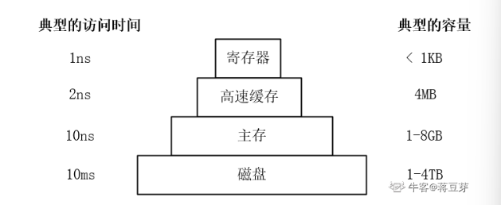
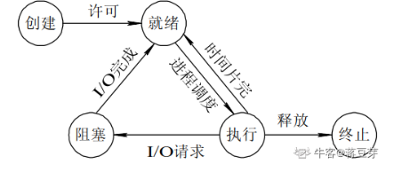
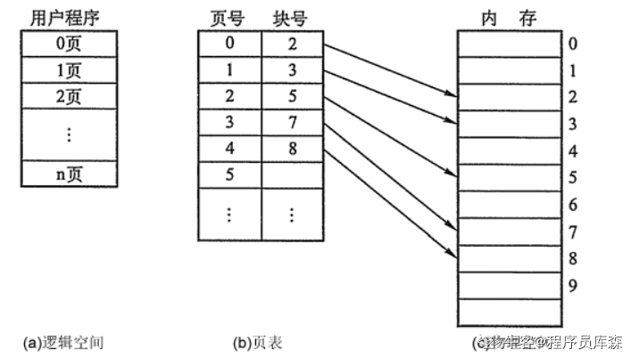
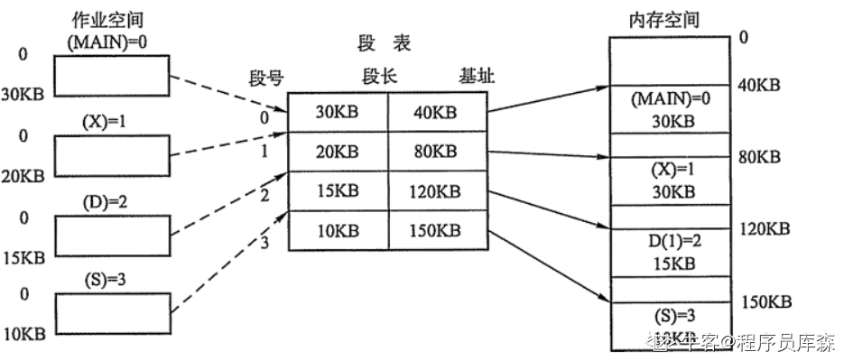

# 计算机操作系统

## 1.操作系统的功能

操作系统主要有CPU管理，设备管理，存储管理，作业管理，文件管理。

**CPU管理**：主要工作是进程调度。

**存储管理**：分为存储分配、存储共享、存储保护、存储扩张。

**设备管理**：分为设备分配、设备传输控制、设备独立性。

**文件管理**：文件存储空间的挂历、目录管理、文件操作管理、文件保护。

**作业管理**：是负责用户提交的要求。

## 2.说说CPU工作原理

CPU的原理就是：**控制单元**在时序脉冲的作用下，将**程序计数器**里所指向的指令地址送到地址总线上，然后CPU将这个地址里的指令读到**指令寄存器**进行译码，对于执行指令过程中所需要用到的数据，会将数据地址也送到地址总线，然后CPU把数据读到CPU的**内部存储单元**（内部寄存器）暂存起来，最后命令**运算单元**对数据进行处理加工。这个过程不断重复，直到程序结束。

## 3.说说CPU流水线

CPU执行一条指令时，分为几个步骤，CPU并不会等一条指令执行完才执行下一条指令，而是像流水线一样。

经典MIPS**五级流水线**将执行的生命周期分为五个部分：取指、译码、执行、访存、写回。

## 4.内核态与用户态的区别

内核态和用户态：内核态与用户态是操作系统的两种运行级别。内核态拥有最高权限，可以访问所有系统指令，用户态则只能访问一部分指令。

什么的是进入内核态：系统调用、设备中断、异常。其中系统调用是主动进入内核态，其他是被动的。

为什么区分用户态和内核态：在CPU指令中，有一些指令是非常危险的，如有错用，会导致整个系统的崩溃。比如：清内存、设置时钟等。所以区分用户态和内核态是出于安全的考虑。

## 5.什么是系统调用

系统中设置了一组用户实现各种系统功能的子程序，称为系统调用。用户可以通过系统调用命令在自己的应用程序中调用它们。它有普通函数的区别是，系统调用由操作系统提供，运行于核心态，而不同函数调用由函数库或者用户自己提供，运行于用户态。

>系统调用的机制其核心还是使用了操作系统为用户特别开放的一个**中断**来实现，该中断是程序人员自己开发出的一种正常的异常，这个异常具体就是调用int $0x80的汇编指令，这条汇编指令将产生向量为0x80的编程异常。
>
>产生中断（软中断）后，调用中断处理程序，调用System_call函数，就完成操作系统内核态的调用了。

## 6.说说并发与并行

并发：对于单个CPU，在一个时刻只有一个进程在运行，但是进程切换时间很小(纳秒级)，多个任务不停的切换。

并行：对于多个CPU，多个进程同时运行。

区别：并行是真的在统一时间运行，而并发只是在宏观上感觉是同时运行的。

## 7.说说物理内存的层次

物理内存由四个层次：分别是寄存器、高速缓存、主存、磁盘。



> 操作系统会对物理内存进行管理，有一个部分称为**内存管理器(memory manager)**，它的主要工作是有效的管理内存，记录哪些内存是正在使用的，在进程需要时分配内存以及在进程完成时回收内存。

## 8.说说存储类型

ROM 只读存储器，是一种只能读出事先所存数据的固态半导体存储器。其特性是一旦存储资料就无法删除或改变。

RAM 随机存取器，是与CPU直接交换数据的内存存储器，也叫主存（内存）。它可以随时读写，而且速度快。

## 9.Linux操作系统命令

查看进程运行状态 ：ps命令

```shell
ps -ef | grep #关键字筛选
-e #显示所有程序
-f #显示UID，PPID，C与STIME栏位
```

查看内存使用情况的指令：free命令。

```shell
free -m #查看内存使用情况
-b 　#以Byte为单位显示内存使用情况。
-k 　#以KB为单位显示内存使用情况。
-m 　#以MB为单位显示内存使用情况。
```

打包与解压：tar

```shell
tar -xzvf 文件名 #解压
tar -czvf 压缩文件名 被压缩文件名 #打包
-x #解压
-c #打包
-z #有gzip属性
-v #显示所有过程
-f #指定文件
```

修改文件权限：chmod

```shell
chmod +x 文件名
+x #给文件添加可执行权限
chmod 777 文件名
777 #给owner/group/others(自己/组/其他)赋予read/write/execute(读/写/执行)权限
```

> ```shell
> [root@www ~]# chmod [-R] xyz 文件或目录 
> 选项与参数： 
> xyz : 就是刚刚提到的数字类型的权限属性，为 rwx 属性数值的相加。 
> -R : 进行递归(recursive)的持续变更，亦即连同次目录下的所有文件都会变更
> 读写执行权限如下表
> ```

| R    | W    | X    |
| ---- | ---- | ---- |
| 4    | 2    | 1    |

提高权限：sudo

```shell
sudo chown root xxx
```


### 更多常用操作命令

| 命令       | 功能                                                         |
| ---------- | ------------------------------------------------------------ |
| man        | 帮助命令                                                     |
| ls命令     | 查看当前文件与目录信息                                       |
| cd命令     | 用于切换当前目录                                             |
| pwd命令    | 用于显示工作目录。                                           |
| mkdir命令  | mkdir 命令用于创建文件夹。                                   |
| rm命令     | 删除文件或文件夹命令                                         |
| rmdir 命令 | 从一个目录中删除一个或多个子目录项                           |
| mv命令     | 移动文件或文件夹命令                                         |
| cp命令     | 复制命令                                                     |
| cat命令    | 查看文件内容；连接文件                                       |
| more命令   | more 会以一页一页的显示文件内容                              |
| less命令   | less 与 more 类似，但使用 less 可以随意浏览文件              |
| grep命令   | 该命令常用于分析一行的信息，若当中有我们所需要的信息，就将该行显示出来，该命令通常与管道命令一起使用，用于对一些命令的输出进行筛选加工。 |
| ps命令     | 查看进程情况                                                 |
| top命令    | 可以查看操作系统的信息，如进程、CPU占用率、内存信息等        |
| kill命令   | 向进程发送终止信号                                           |

## 10.常见信号

SIGHUP，该信号让进程立即关闭.然后重新读取配置文件之后重启。

SIGKILL，用来立即结束程序的运行。本信号不能被阻塞、处理和忽略。一般用于强制中止进程。

SIGTERM，正常结束进程的信号。

SIGCHLD，子进程结束时，父进程会收到这个信号。

## 11.grep命令

grep是一个强大的文本搜索，利用正则匹配查找文本中是否有符合的字符串，如果某一行存在，就把改行打印到标准输出。

## 12.说说ping命令

ping命令用于检测网络，执行ping命令会使用ICMP传输层协议，发出要求回应的信息，如果目的主机网络没有问题，就会回应该信息，因此得知该主机运作正常。

## 13.进程有那五种状态

进程有创建、就绪、执行、阻塞、终止五种状态。



新建状态：
线程创建但没有启动  

就绪状态：
线程处于可运行的状态，当线程获得CPU的时间片后会被执行，时间片耗尽或主动放弃当次时间片（yield方法）时再次进入就绪状态。  

运行状态：
线程得到时间片被CPU执行  

阻塞状态：
线程放弃CPU的时间片（一直到某个条件达成），主动进入阻塞的状态。  

- 同步阻塞：线程由于尝试获得对象的同步锁但无法取得时，进入锁池，等待其他线程释放该对象的锁。  

- 等待阻塞：线程主动放弃对对象上的锁的占用，进入等待对象通知的队列。指wait方法  

- 其他阻塞：线程主动进入休眠状态，等待条件达成。指sleep、join方法或I/O请求。  

终止状态：
线程任务结束或异常退出。

## 14.说一说Linux的fork的作用

fork函数用来创建一个子进程。对于父进程，fork函数会返回子进程的PID。对于子进程，fork函数会返回0。如果出错则返回-1。

## 15.说说写时复制

当创建新的进程时，连数据段和堆栈段都不再立马复制，而是等到需要修改数据段或者堆栈段的数据时再复制，这就是写时复制。这样更加节省进程空间，提高效率。

## 16.说说守护进程，如何创建

**守护进程**是运行再后台的一种生存期长的特殊进程。它独立于控制中断，处理一些系统级别的任务。

创建过程如下

1.创建子进程，终止父进程。

2.调用setsid()，创建一个新会话。

3.将当前目录更改为根目录。

4.重新文件权限掩码。

5.关闭不需要的文件描述符。

## 17.说说孤儿进程和僵尸进程，如何解决僵尸进程

**孤儿进程**，是指父进程推出后，而它的子进程还在运行，那么这些子进程就称为孤儿进程。孤儿进程将被init进程所首页，并且有init进程对他们完整状态收集工作。

**僵尸进程**，是指一个进程使用fork函数创建子进程，如果子进程退出，而父进程没有调用wait()或者waitpid系统嗲用取得子进程的终止状态，那么子进程的进程描述符仍然保存在系统中，占用系统资源，这种进程称为僵尸进程。

两者的区别是，孤儿进程是父进程退出，而子进程未退出。僵尸进程是父进程未退出，而子进程退出。

**解决僵尸进程**

一般，为了防止僵尸进程，在fork子进程后我们要及时使用wait系统调用，同时，当子进程退出时，内核都会给父进程一个SIGCHLD信号，我们可以建立一个SIGCHLD信号的信号处理函数，在函数体中调用wait（或者waitpid），就可以清理退出的子进程以达到防止僵尸进程的目的。

也可以使用kill命令，`$ps aux | grep Z`可以获取所有僵尸进程。输入`kill -s SIGCHLD pid(父进程)`这样子进程退出后父进程会收到信号。输入kill -9 pid(父进程pid)，杀死父进程，这样子进程就会被init收养。

## 18.进程间通讯方式有那些。

进程间通信主要包括管道、系统IPC（消息队列、信号量、信号、共享内存）、套接字socket。

管道：包括命名管道和无名管道，无名管道半双工，只能用于具有亲缘关系的进程，可以看作一种特殊的文件；命名管道可以允许无亲缘关系的进程间通信。

消息队列：消息的链接表，放在内核中。消息队列独立于发送与接受集训，进程终止时，消息队列内容并不会被删除；消息队列可以实现消息的随机查询，可以按照消息的类型读取。

信号量：是一个计数器，可以用来控制多个进程对共享资源的访问。信号量用于实现进程间的互斥与同步。

信号：用于通知接受进程某个事件的发生。

共享内存：使多个进程访问同一块内存空间。

套接字：用于不同主机直接的通信。

## 19.什么是操作系统？请简要概述一下

操作系统是管理计算机硬件和软件资源的计算机程序，提供一个计算机用户与计算机硬件系统之间的接口。

向上对用户程序提供接口，向下接管硬件资源。

操作系统本质上也是一个软件，作为最接近硬件的系统软件，负责处理器管理、存储器管理、设备管理、文件管理和提供用户接口。

## 20.进程通讯中的管道实现原理是什么

操作系统在内核中开辟一块缓冲区（称为管道）用于通信。管道是一种两个进程间统一时刻进行单项通讯的机制。是半双工的。

## 21.说说什么是信号量

信号量是一个计数器，可以控制资源被进程访问的数量。进行p操作时，如果值大于0，就减一，否则阻塞。进行v操作时，如果有等待就唤醒，否则加一。

## 22.System V信号量 与 Posix信号量

1、POSIX信号量常用于线程；system v信号量常用于进程的同步。

2、从使用的角度，System V 信号量的使用比较复杂，而 POSIX 信号量使用起来相对简单。

3、对 POSIX 来说，信号量是个非负整数。而 System V 信号量则是一个或多个信号量的集合，它对应的是一个信号量结构体，这个结构体是为 System V IPC 服务的，信号量只不过是它的一部分。

4、Posix信号量是基于内存的，即信号量值是放在共享内存中的，它是由可能与文件系统中的路径名对应的名字来标识的。而System v信号量则是基于内核的，它放在内核里面。

5、POSIX 信号量的头文件是 <semaphore.h>，而 System V 信号量的头文件是 <sys/sem.h>。

6、Posix还有有名信号量，一般用于进程同步, 有名信号量是内核持续的。

## 23.多进程共享内存可能存在什么问题？如何处理？

在并发时，内存共享会导致数据不准确，所以使用内存共享时需要考虑访问的同步问题，比如加入互斥锁或者信号量实现同步。

## 24.一个线程占多大内存

一个linux线程大概占8M内存。linux的栈是通过缺页来分配内存的，不是所有栈地址空间都分配了内存。因此，8M是最大小号，实际的内存消耗只会略大于实际需要的内存（内部损耗，每个在4k以内）

## 25.32位可以访问4GB以上的内存吗

正常情况下是不可以的。因为计算机使用二进制，32位正好是2的32次方，正好是4G，所以大于4G就没办法表示了。

## 26.进程、线程、协程

进程：程序是指令，数据及其组织形式的描述，而进程则是程序运行的实例，包括程序计数器，寄存器和变量的当前值。

线程：微进程，一个进程里更小粒度的执行单元。一个进程里包括多个线程并发执行任务。

协程：微线程，在子程序内部执行，可在子程序内部中断，转而执行别的子程序，在适当的时候再返回来接着执行。

## 27.线程与进程的区别

一个线程属于一个进程；一个进程可以有多个线程。

一个线程挂掉，对应的进程挂掉；一个进程挂掉，不会影响其他进程。

进程是分配系统资源的最小单位；线程CPU调度的最小单位。

进程系统开销显著大于线程开销；线程需要的资源更少。

进程在执行时拥有独立的内存单元，多个线程共享进程的内存，如代码段，数据段，扩展段；但每个线程拥有自己的栈段和寄存器组。

## 28.线程与协程的区别

协程的执行效率极高。协程直接操作栈基本没有内核切换的开销，所以上下文的切换非常快，切换开销比线程更小。

协程不需要多线程的锁机制，因为多个协程从属于一个线程，不存在同时写变量冲突，效率比线程高。

一个线程可以有多个协程。

## 29.互斥量能不能进程中使用？

能。不同的进程之间，存在资源竞争或并发使用的问题，所以需要互斥量。进程中也需要互斥量，因为一个进程可以包含多个线程，线程与线程之间需要通过互斥的手段进行同步，避免导致共享数据修改引起冲突。可以使用互斥锁，属于互斥量的一种。

## 30.说说线程间同步的方式有那些？

线程间的同步方式包括互斥锁、信号量、条件变量、读写锁。（这个是说的有一些具体实现的）。

互斥锁，采用互斥对象机制，之哟拥有互斥对象的线程才可以访问。因为互斥对象只有一个，所以可以保证公共资源不会被多个线程同时访问。

信号量：计数器，允许多个线程访问同一资源

条件变量：通过条件变量通知操作的方式来保持多线程同步。

读写锁：读写锁与互斥量类似。但互斥量要么是锁住的状态，要不是不加锁的状态。读写锁一次只允许一个线程写，但允许多个线程读，这样效率就比互斥量高。

## 31.有了进程为什么还要有线程？

**原因**，进程再早期的多任务操作系统中是基本的**执行单元**。每次进程切换，都要先保存进程资源然后再恢复，这称为上下文切换。**但是频繁的切换将引起额外的开销，从而严重印象系统的性能**。为了减少进程切换的开销，人们把两个任务放到一个进程中，每个任务用一个更小**粒度**的执行单元将来实现并发执行，这就是线程。

**线程与进程对比**：

**进程间的信息难以共享**，由于出去只读代码段外，父子进程并未共享内存，因此必须采用进程间通讯方式进行信息交换（将信息拷贝到内核，从内核拷贝出来），但统一进程的多线程共享内存，如代码段、数据段、扩展段，线程间信息交流十分方便。

再有就是使用fork创建进程的代价相对较高，即便利用写时复制技术，仍然需要妇科诸如内存页表和文件描述符指令的多进程属性，这就意味着fork调用再时间上的开销依然不菲。**创建线程比创建进程通常要快10倍甚至更多**。线程间共享虚拟地址空间的，无需采用写时复制来复制内存，也无序复制页表。

## 32.单核机器上写多线程，是否需要考虑加锁，为什么

在单核机器上写多线程程序，仍然需要线程锁。

原因：线程锁通常用来线程的同步与通讯。在单核机器是的多线程程序，仍然存在线程同步的问题。因为在抢占式操作系统中，通常为每个线程分配一个时间片，当某个线程时间片耗尽时，操作系统会将其挂起，然后运行另一个线程。如果这两个线程共享某些数据，**不适用线程锁的前提下，可能会导致共享数据修改引起的冲突**

## 33.简述互斥锁与读写锁的区别

互斥锁机制：mutex，用于保证任何时刻，都只能有一个线程访问对象。当获取锁操作失败时，线程会进入阻塞，等待锁释放。

互斥锁与读写锁：

读写锁区分读者与写者，而互斥锁不区分

互斥锁同一时间只允许一个线程访问该对象，无论读写；读写锁同一时间只允许一个写者，但是允许多个读者同时读对象。

## 34.说说线程池设计思路，线程池线程的数量由什么决定？

### 设计思路

设置一个生产者消费者队列，作为临界资源。

初始化n个线程，让其运行起来，加锁去队列里取任务运行。

当任务队列为空时，所有线程阻塞。

当生产者来了一个任务后，先对队列加锁，把任务挂到队列是，然后使用条件变量(或信号量)取通知阻塞的一个线程来处理。

### 线程池中线程的数量

线程数量和CPU、IO、并发、并行相关。如果是CPU密集型应用，则线程池大小设置为：CPU数目+1，如果是IO密集型应用，则线程池大小设置为：2*CPU+1。最佳线程数目 = （线程等待时间与线程CPU时间之比 + 1)\*CPU数目

为什么要创建线程池

创建线程和销毁线程的花销是比较大的，这些时间有可能比处理业务的时间还要长，这样频繁的创建与销毁线程，再加上业务工作线程，消耗系统资源的时间，可能导致系统资源不足，效率也比较低。所以线程池最直观的表现就是提高了效率。

### 线程池的核心线程与普通线程

比如说任务队列最大值为100，有10个核心线程，若突然来了10个任务，那么10个核心线程直接处理，如果来100个，那么10个核心线程处理10个，剩余90个在任务队列。如果来了120个，10个核心线程处理，100个在任务队列，剩下的10个创建普通进程来处理多余的任务。

## 35.进程与线程相比为什么慢？

进程的开销显著大于线程的开销，线程需要的资源更少。

进程切换的开销比线程大。多进程切换时需要刷新TLB并获取新的地址空间，然后切换硬件上下文和内核栈；多线程切换时只需要切换硬件上下文和内核栈。

进程通信时间比线程开销大。因为进程需要频繁的的进行进程到内核空间，再从内核空间到进程的数据传输。而同一进程的线程因为共享进程的内存地址，所以不需要走内核空间。

## 36.简述GDB常见命令，什么是条件断点，多进程下如何调试。

**GDB调试**：gdb调试的是可执行文件，在gcc编译时加入-g，告诉gcc在编译时加入的调试信息，这样gdb才能调试这个被编译的文件 `gcc -g test.c -o test`

**GDB命令格式**：

1.quit:退出gdb，结束调试

2.list:查看源代码

```gdb
list 5,10 :显示5-10行代码
list test.c 5,10:显示指定文件5-10行代码
list get_sum:显示get_sum函数周围代码
list test.c get_sum:显示指定文件函数周围代码
```

3.reserse-search:字符串用来从当前行向前查找第一个匹配的字符串。

4.run:开始执行程序

5.help list/all:查看帮助信息

6.break：设置断点

```gdb
break 7 :在指定行设置断点
break get_sum:以函数名设置断点
break 行号或者函数名 if条件：以条件表达式设置断点
```

7.watch 条件表达式：条件表达式发送改变程序就会停下来。

8.next:继续执行下一条语句，会把函数当作一条语句执行

9.setp:继续执行下一条语句，会进入函数

**多进程调试**

```gdb
set follow-fork-mode child 调试子进程
set follow-fork-mode parent 调试父进程
```

## 37.简述进程组

进程组即多个进程的集合,进程组有一个组长,组长进程的PID等于进程组的PGID。

## 38.简述LRU及其实现方式

**LRU算法**：LRU算法用于缓存淘汰，思路是将缓存中最近最少使用的对象删除。

**实现方式**：利用unordered_map与链表

```c++
class LRUCache{
private:
    list<pair<int,int> > cache;
    unordered_map<int,list<pair<int,int> >::iterator > mp;
    int maxcache;
public:
    LRUCache(int maxche):maxcache(maxche){}
    int get(int key){
        if( mp.count(key) ){
            cache.push_back({key,mp[key]->second});
            cache.erase(mp[key]);
            mp[key] = --cache.end();
            return mp[key]->second;
        }
        return -1;
    }
    void put(int key,int value){
        cache.push_back({key,value});
        if( mp.count(key) ) cache.erase(mp[key]);
        mp[key] = --cache.end();
        if(maxcache < cache.size() ){
          mp.erase(cache.begin()->first);
          cache.pop_front();
        }
    }
};
```

## 39.什么是页表，为什么要有？

页表是虚拟内存的概念。操作系统虚拟内存到物理内存的映射表，就被称为页表。

原因：不可能每一个虚拟内存都有对应的物理内存地址。这张表将大得真正得物理地址也放不下，于是操作系统引入了页得概念。进行分页，这样可以简述虚拟内存页对应物理内存页得映射表大小。

## 40.简述操作系统中断的缺页中断

缺页异常：malloc和mmap函数在分配内存时只是建立进程虚拟地址空间，并没有分配虚拟内存对应得物理内存。当进程访问这些没有建立映射关系得虚拟内存时，处理器自动触发一个**缺页异常**，引发**缺页中断**

**缺页中断**：缺页异常会引发一个缺页中断，此时操作系统会根据外页表中的**外存地址**在外存中找到所缺的一页，将其调入**内存**。

## 41.简述虚拟内存和物理内存，为什么要有虚拟内存，好处是什么？

虚拟内存：操作系统通常为每一个进程分配一个独立的地址空间，这个地址空间是虚拟内存。虚拟内存与物理内存通过页表对应（不是一一对应，不然怎么来的页面置换算法）

### 使用虚拟内存的好处

扩大地址空间。每个进程都可以独占4G（32位）空间，虽然真实物理内存没有那么多。

内存保护：防止不同进程对物理内存的争夺和践踏，可以对特定内存地址提供写保护，防止恶意篡改。

可以避免内存碎片，虽然物理内存可能不连续，但是会在虚拟内存上连续。

### 使用虚拟内存的缺点

虚拟内存需要额外构建数据结构，占用空间。

虚拟地址到物理地址的转换增加了执行时间。

页面换入换出耗时。

一页如果只有一部分数据，浪费内存。

## 42.虚拟地址到物理地址怎么映射的？

通过页表，页表的内容就是该进程的虚拟地址到物理地址的映射，页表中的每一项都记录了这个页的基地址。

## 43.简述MMU

MMU即内存管理单元，该硬件负责处理虚拟地址到物理地址的转化工作。快表也存储在MMU上。

## 44.简述自旋锁和互斥锁的使用场景

**自选锁**：当一个线程尝试去获取某一把锁的时候，如果这个锁此时已经被别人获取(占用)，那么此线程就无法获取到这把锁，该线程将会等待，间隔一段时间后会再次尝试获取。

互斥锁用于临界区持锁时间比较长的操作，比如下面这些情况都可以考虑

1.临界区有io操作

2.临界区代码复杂或者循环量打

3.临界区竞争激烈

4.单核处理器

**自旋锁**主要用在临界区持锁时间非常短并且CPU资源不紧张的情况下。

## 45.公平锁与非公平锁

**公平锁**：就是很公平，每个线程在获取锁时会先查看维护的等待队列，如果为空，或者当前线程就是等待队列的第一个，就占有锁，否则就会加入到等待队列中，以后会按照FIFO(先进先出)的规则从队列中取到自己。

**非公平锁**：非公平锁比较粗鲁，上来就直接尝试占有锁，如果尝试失败，就再采用类似公平锁那种方式。与公平锁相比它的吞吐量比公平锁大。

## 46.死锁与活锁

**死锁**：是指两个或两个以上的进程（或线程）再执行过程中，因争夺资源而造成的一种相互等待的现象，若无外力作用，它们都将无法推进下去。此时系统处于死锁状态或系统产生了死锁，这些永远在相互等待的进程称为死锁进程

**活锁**：是指线程1可以使用资源，但是它很礼貌，让其他线程先使用资源，线程2同线程1。这样你让我，我让你，最后两个线程都无法使用资源。

## 47.说说sleep与wait的区别？

sleep是一个延时函数，让进程或者线程进入休眠。休眠完毕后继续运行。

wait是父进程回收子进程PCB资源的一个系统调用

## 48.介绍一下5中IO模型

IO即数据的读取或写入操作。通常一个用户进程的完整IO分为两个阶段：用户进程空间与内核空间的相互切换，内核空间与设备空间的相互切换。我们通常说的IO是指网络IO和磁盘IO。

**阻塞IO**：进程发起IO系统调用后，进程被阻塞，转到内核空间处理，整个IO处理完毕后返回进程。调用者一直等待，等函数有返回后才会有下一步动作。

**非阻塞IO**：进程发起IO系统调用后，内核数据还没好，不进行等待，而是返回一个错误，这样进程就不阻塞了。

**IO多路复用**：通过IO多路复用去监听多个IO是否能够有IO读或者写，如果IO状态发生变化再进行对应的操作。

**信号驱动IO**：使用信号驱动IO，进程继续运行不阻塞，当IO事件就绪，进程会收到SIGIO信号，然后处理IO事件。

**异步IO**：进程发起IO系统调用后立即返回，当内核将数据拷贝到缓冲区后，再通知应用程序。用户可以直接去使用数据。

## 49.简述同步与异步的区别

**同步**：所有操作都做完，才返回给用户结果。双方的动作是经过双方协调的，步调一致的。

**异步**：不用等所有操作都做完，就响应用户请求。双方并不需要协调，都可以随意进行各自的操作。

## 50.阻塞与非阻塞的区别

**阻塞**：调用者调用了某个函数，等待这个函数返回，期间什么也不做。这个函数返回之后才会有下一步动作

**非阻塞**：非阻塞等待，每隔一段事件就去检测IO事件是否就绪。没有就绪就去做其他事情。

## 51.BIO、NIO有什么区别？

BIO（Blocking I/O）：阻塞IO。

NIO（New I/O）：同时支持阻塞与非阻塞模式。NIO的做法是让一个线程不断地轮询每个IO的状态，看看是否有IO状态发生改变，从而进行下一步操作。

## 52.说说IO多路复用技术有那些，区别是什么

linux中IO多路复用有select、poll、epoll。

区别：

poll与select

1.poll与select不同，通过pollfd数据向内核传递需要关注的事件，没有描述符个数的限制，pollfd中events字段和revents分贝用于标示关注的事件和发生的事件，故pollfd数组只需要背初始化一次。

epoll与select

1.每次调用select，都需要把fd集合从用户态拷贝到内核态，这个开销在fd很多时会很大；而epoll保证了每个fd在整个过程中只会拷贝一次。

2.每次调用select都要在内核态遍历传递进来的所有fd，而epoll只需要轮询一次fd集合，同时查看就绪链表中有没有就绪的fd就可以了。

3.select支持的文件描述符数量太少了，默认是1024。epoll没有文件描述符限制。

## 53.说说epoll的原理

epoll提供了三个函数，epoll_create、epoll_ctl、epoll_wait。

epoll首先创建一个epoll对象，然后使用epoll_ctl对这个对象进行操作（添加、删除、修改），把需要监控的描述符加进去，这些描述符会以epoll_event结构体的形式组成一颗红黑树，接着阻塞在epoll_wait，当某个fd上有事件发生时，内核将会把其对应的结构体放入一个链表中，返回有事件的链表。

## 54.epoll的水平触发与边缘触发

LT模式（水平触发），只要这个fd还有数据可读，每次epoll_wait都会返回这个事件，提醒用户去操作；

ET（边缘触发）模式中，它只会提示一次，所以需要用户一次性把数据读完。

## 55.简述多级页表

多级页表用于减少内存的占用。以二级页表为例，虚拟地址被分为DIR,PAGE和offset三部分，通过顶级页表和DIR，寻找到该二级页表的起始位置，再通过二级页表的起始位置和PAGE，找到页物理地址，最后加上页偏移，即可得到最终的物理地址。

## 56.内核与外壳分别是什么？

- 内核就是能操作硬件的程序
  - 内核管理系统的进程、内存、设备驱动程序、文件、网络等，决定着系统的性能和稳定性
- 外壳就是围绕内核的应用程序


## 57.进程调度算法有哪些？

先到先服务：本着公平的原则，谁先来服务谁，可能会导致一个很小的操作需要等待很长的时间。

短作业优先：让时间短的作业先来，如果一直有小作业进来，会导致大作业一直无法运行。

时间片调度算法：就是给每个进程分配一个时间片，这样轮询调度，让每个进程都可以获得运行时间，比较公平。

优先级算法：为每个进程分配一个优先级，优先级高的先执行。

多级反馈队列调度算法：将进程分为1，2，4，8等大小不同的时间片，时间片小的优先级高。保证了短作业优先完成，长作业也得到了执行。

## 58.操作系统的内存管理主要做什么？

负责内存的分配和回收（malloc：申请内存，free：释放内存）

将逻辑地址转化为相应的物理地址

## 59.内存管理机制和内存管理方式有哪些？

连续分配管理：为用户分配一个连续的内存空间

- 块式管理
  - 将内存分成几个固定大小的块，每个块只包含一个进程。如果程序需要的内存较少，那么分配的这块内存很大一部分几乎被浪费了。在块中没有被使用到的空间即为碎片

离散分配管理：允许一个程序使用的内存分布在离散或者不相邻的内存中

- 页式管理
  - 将内存分为大小相等且固定的一页一页的形式，页较小，相比于块式管理划分得更细，提高内存利用率，减少碎片。页式管理通过页表对应逻辑地址和物理地址
  - 逻辑地址划分为固定大小的页，同样，物理地址划分为同样大小的页框，页与页框之间通过页表对应起来
  - 没有外碎片(页的大小是固定的)，但是会产生内碎片(一个页可能会填不满)
- 段式管理
  - 将程序的地址空间划分为若干段，如代码段、数据段、堆栈段等
  - 每一段具有实际意义
  - 段式管理通过段表对应逻辑地址和物理地址
  - 没有内碎片，但是会存在外碎片
- 段页式管理
  - 先将主存分成若干段，每个段又分成若干页，段页式管理中段与段之间以及段的内部都是离散的。
  - 集合了段式管理和页式管理的优点，提高内存的利用效率

## 60. 什么是分页？

把内存空间划分为**大小相等且固定的块**，作为主存的基本单位。因为程序数据存储在不同的页面中，而页面又离散的分布在内存中，**因此需要一个页表来记录映射关系，以实现从页号到物理块号的映射。**

访问分页系统中内存数据需要**两次的内存访问** (一次是从内存中访问页表，从中找到指定的物理块号，加上页内偏移得到实际物理地址；第二次就是根据第一次得到的物理地址访问内存取出数据)。



## 61.什么是分段？

**分页是为了提高内存利用率，而分段是为了满足程序员在编写代码的时候的一些逻辑需求(比如数据共享，数据保护，动态链接等)。**

分段内存管理当中，**地址是二维的，一维是段号，二维是段内地址；其中每个段的长度是不一样的，而且每个段内部都是从0开始编址的**。由于分段管理中，每个段内部是连续内存分配，但是段和段之间是离散分配的，因此也存在一个逻辑地址到物理地址的映射关系，相应的就是段表机制。



由于分段管理中，**每个段内部是连续内存分配，但是段和段之间是离散分配的**，因此也存在一个逻辑地址到物理地址的映射关系，相应的就是**段表机制**。段表中的每一个表项记录了该段在内存中的起始地址和该段的长度。段表可以放在内存中也可以放在寄存器中。

访问内存的时候根据段号和段表项的长度计算当前访问段在段表中的位置，然后访问段表，得到该段的物理地址，根据该物理地址以及段内偏移量就可以得到需要访问的内存。由于也是两次内存访问，所以分段管理中同样引入了[联想](https://gitee.com/Stard/xkzz-study/blob/master/docs/操作系统71问.md)寄存器。

## 62. 什么是段页式管理？

- **页式存储管理能有效地提高内存利用率，而分段存储管理能反映程序的逻辑结构并有利于段的共享**
- 段页式管理就是将程序分为多个逻辑段，在每个段里面又进行分页，即将分段和分页组合起来使用。
- 为了实现地址变换，系统为每个进程建立一张段表，而每个分段有一张页表（在一个进程中，段表只有一个，而页表可能有多个）
- 在进行地址变换时，**首先通过段表查到页表起始地址，然后通过页表找到页帧号，最后形成物理地址**。如图所示，**进行一次访问实际需要至少三次访问主存**，这里同样可以使用快表以加快查找速度，其关键字由段号、页号组成，值是对应的页帧号和保护码。
- 三次内存访问：
  1. 访问内存中的段表查到页表的起始地址
  2. 访问内存中的页表找到页帧号，形成物理地址
  3. 得到物理地址后，再一次访问内存，存取指令或者数据

## 63. 内存碎片是什么？

- 内部碎片
  - 一个进程分配到了一个固定大小的内存块
  - 但是进程实际所需的空间小于分区块
  - 此时分区块剩余的空间无法被系统利用，称为内部碎片
- 外部碎片
  - 空闲内存分为小区块被不同进程使用
  - 当某个进程需要大空间的时候，此时虽然空闲空间足够大，但是由于剩余空间被划分为大大小小的区块，没有一个足够大让程序可以使用
- 解决方法
- 外碎片
  - 紧凑技术
  - 让操作系统不时对进程进行移动和整理，比较费时
- 内碎片
  - 内存交换
  - 先将已使用的部分交换到硬盘，然后再重新加载到内存，不过再次加载时应该放到一个新的区域上，这样子之前空出来的部分就可以使用了

## 64.快表和多级页表是什么？

- 分页内存管理中有两点比较重要：
  - 虚拟地址到物理地址的转换要快
  - 解决虚拟地址空间大，页表也会很大的问题
- 快表
  - 用来缓存页表的一部分或者全部内容，是一种特殊的高速缓冲存储器
  - 使用快表后的地址转换流程：
    - 根据虚拟地址中的页号查找快表
    - 如果该页在快表中，直接从快表中读取相应的物理地址
    - 如果该页不在快表中，就访问内存的页表，从页表中得到物理地址，同时将该页表中的该映射表项添加到快表中
    - 当快表填满后，又要登记新的页的时候，就按照一定的淘汰策略淘汰掉快表中的一个页
- 多级页表
  - 避免把全部页表都放在内存中
  - 第一级的页表覆盖了全部的虚拟地址空间，但是由于采用了分级，因此第一级的页表项较少，占用内存少
    - 第一级页表只记录了下一级页表的物理地址，因此第一级页表占用的内存空间较少
    - 根据一级页表得到的物理地址，找到下一级页表所在的页，然后加载进来，这样子就能够避免将不需要的页加载到内存中
  - 后面的几级页表可以在用到的时候再进行创建
  - 而且后面的几级页表可以先存放在磁盘上，根据程序运行的局部性原理，虚拟内存映射存在局部性，因此后面几级的页表可以在需要时再调入内存，进一步减少内存的占用
- 为了提高内存的利用率，提出了多级页表，用时间换空间；为了补偿损失的时间，提出了快表

## 65.快表的工作流程？

- CPU给出逻辑地址，由某个硬件(MMU)算得页号、页内偏移量，将页号与快表中的所有页号进行比较
- 如果找到匹配的页号，说明要访问的页表项在快表中有副本，则直接从中取出该页对应的内存块号，再将内存块号与页内偏移量拼接形成物理地址，最后，访问该物理地址对应的内存单元。因此，若快表命中，则访问某个逻辑地址仅需一次访存即可。
- 如果没有找到匹配的页号，则需要访问内存中的页表，找到对应页表项，得到页面存放的内存块号，再将内存块号与页内偏移量拼接形成物理地址，最后，访问该物理地址对应的内存单元。因此,若快表未命中，则访问某个逻辑地址需要两次访存(注意:在找到页表项后，应同时将其存入快表,以便后面可能的再次访问。但若快表已满，则必须按照指定的算法对旧的页表项进行替换)

|                        | 地址变换过程                                                 | 访问一个逻辑地址的访存次数                      |
| ---------------------- | ------------------------------------------------------------ | ----------------------------------------------- |
| 基本地址变换机构       | ①算页号、页内偏移量 ②检查页号合法性 ③查页表，找到页面存放的内存块号 ④根据内存块号与页内偏移量得到物理地址 ⑤访问目标内存单元 | 两次访存                                        |
| 具有快表的地址变换机构 | ①算页号、页内偏移量 ②检查页号合法性 ③查快表。若命中，即可知道页面存放的内存块号，可直接进行⑤;若未命中则进行④ ④查页表，找到页面存放的内存块号，并且将页表项复制到快表中 ⑤根据内存块号与页内偏移量得到物理地址 ⑥访问目标内存单元 | 快表命中，只需一次访存 快表未命中，需要两次访存 |

## 66.分页机制和分段机制的共同点和区别？

- 共同点：
  - 都是为了提高内存利用率，减少内存碎片
  - 两者都是离散内存分配。但是每个页和每个段内部是连续的
- 不同点：
  - 页的大小是固定的，由操作系统决定；段的大小不固定，取决于当前运行的程序
  - 分页是为了满足操作系统内存管理的需要，没有具体的含义，而段是逻辑信息单位，在程序中体现为代码段，数据段，能够更好地满足用户的需求

## 67.分页系统是什么？

- 分页是将磁盘或者硬盘分为大小固定的块，称为页
- 将内存分为同样大小的块，称为页框
  - 程序执行的时候，将磁盘的页装入页框中
- 页和页框由两部分组成，分别是页号和偏移量
- 通过操作系统维护的页表来维护页框和页之间的关系
  - 页表中，页号为索引，页框号为表的内容

## 68. 逻辑(虚拟)地址与物理地址的含义？

- 在编程中指针指向的内存地址就是逻辑地址，逻辑地址由操作系统决定
- 物理地址是指真实内存单元的地址

## 69. CPU寻址？为什么需要虚拟地址空间？

- CPU寻址使用的是虚拟寻址的方式，将虚拟地址翻译成物理地址，以此访问到真实的物理内存
- 一般完成该工作是CPU中的内存管理单元（MMU）的硬件
- 如果没有虚拟地址空间的话，程序将直接操作真实的物理内存，此时：
  - 用户可以访问和修改任意内存，很容易有意或无意间破坏操作系统，造成操作系统崩溃
  - 同时运行多个程序将会非常困难，因为多个程序之间有可能会相互覆盖对方内存地址上的数据
- 通过使用虚拟地址空间：
  - 程序可以使用一系列连续的虚拟地址空间来访问物理地址中不相邻的内存空间
  - 程序可以使用虚拟地址来访问大于可用物理内存的内存缓冲区间。当物理内存不足时，可以将物理内存页保存到磁盘中。数据和代码页可以根据需要在物理内存和磁盘间移动
  - 不同进程间的虚拟地址彼此隔离。因此不同的进程无法干涉彼此正在使用的物理内存

## 70. 什么是虚拟内存？

- 虚拟内存是计算机系统提供的一种内存管理技术
- ==它给每个进程提供了一连续的虚拟地址空间，使得每一个进程具有独占主存的错觉，通过将内存扩展到硬盘空间，让程序可以拥有超过系统物理内存大小的可用内存空间==
- 它定义了一个连续的虚拟地址空间，并且把内存扩展到了硬盘空间
- 虚拟内存允许程序不用将地址空间中的每一页都映射到物理内存，也就是说一个程序不需要全部调入内存就可以运行，这使得有限的内存运行大程序成为可能
  - 对于没有映射到物理内存的页，可以在使用的时候将其装入物理内存
- 虚拟内存是计算机系统提供的一种内存管理技术，它给每个进程提供了一个一致的、私有的、连续的地址空间，把内存扩展到了硬盘空间，让程序可以拥有超过物理内存大小的内存空间

## 71.逻辑地址与物理地址的转换过程？

- 内存管理单元(MMU)管理逻辑地址和物理地址的转换，其中页表存储页(逻辑地址空间)和页框(物理内存空间)的映射表
- 一个虚拟地址分为两个部分，一个部分存储页面号，一部分存储偏移量，两个部分结合，就可以在页表中得到页对应的页框地址

## 72. 局部性原理了解吗？

- 在某个较短的时间内，程序执行局限于某一小部分，程序访问的存储空间也局限于某个区域
- 两个方面：
  - 时间局部性：某条指令被执行后，不久后可能会再次执行；某个数据被访问后，不久后可能会再次被访问。该局部性的典型原因是程序中存在大量的循环操作。
  - 空间局部性：程序访问了某个存储单元后，不久后其附近的存储单元也将被访问到。因为程序指令往往是顺序存放、顺序执行的，数据一般也是聚簇存储的。
- 时间局部性通过将近来使用的指令和数据存储在高速缓存中，并且使用高速缓存的层次结构来实现。空间局部性则使用较大的高速缓存并通过预取机制集成到高速缓存中实现。
- 利用局部性原理来实现高速缓存

## 73.虚拟存储器，是什么？

就是把一部分程序装入内存，将其他部分留在外存。由于外存往往比内存大，所以我们可以运行比实际内存大的程序。

## 74. 页面置换算法有哪些？

OPT(最佳页面)置换算法：如果我们能知道那个页面再将来一段时间不会使用，当然我们很难知道那个页面将来不会使用，所以这个算法目前处在一个理想层面。

FIFO(先进先出)页面置换算法：谁先进来的谁先出去，有够公平的。有一点优化就是，出去前检测是否被使用，如果被使用过就放他一次，继续检测下一个就好了。

LFU(最少使用)页面置换算法：那个用的少，就把那个换出去。可是以前用的少不代表现在用的少。

LRU(最近最久未使用)页面置换算法：如果在一段时间内使用最少使用，我们就放弃他。实现方面我们可以考虑一个队列，使用了的进程拿出来放在队列尾部，这样队列头就是最近最久未使用的。还有就是为每个页分配一个长度确定的二进制位，定时右一一位，使用时将最左边的0改为1，这样最小的数就是最近最久未使用的。

## 75.进程空间包含什么？

进程空间可以分为两部分

- 进程独占的用户空间
- 进程共享的内核空间
  - 用户程序无法读写内核空间

##  76.为什么要区分内核态和用户态？

- 在CPU指令中，有一部分代码非常危险，一旦用错，那么整个系统都会崩溃
- 因此，CPU将指令分为特权指令和非特权指令，特权指令只有处于内核态的情况下才能使用，非特权指令可以在用户态下使用
- 当用户程序想要使用特权指令时，只能通过系统调用来请求操作系统提供的服务程序来完成工作
- 避免用户程序直接调用特权指令导致系统崩溃
- 将操作系统的运行状态分为用户态和内核态，主要是为了对访问能力进行限制，防止随意进行一些比较危险的操作导致系统的崩溃，比如设置时钟、内存清理，这些都需要在内核态下完成 。
- 用户态
  - 只能访问受限的内存空间
- 内核态
  - 可以访问内存的所有数据

## 77.用户态切换到内核态时机

- 系统调用
  - 用户进程主动切换到内核态
  - 用户态进程通过系统调用申请使用操作系统提供的服务完成工作
  - 核心是使用操作系统为用户提供的一个中断来实现
    - 例如Linux的int 80h中断
- 异常
  - 运行的用户进程遭遇事先不可知的异常，切换到处理该异常的内核相关进程，转到了内核态
  - 比如：缺页异常
- 外设中断
  - 外设完成相应操作后，会触发相应中断，切换到内核中对应的处理程序
  - 比如说，硬盘读写完成，会切换到相应的中断处理程序，执行后续操作

## 78. 磁盘调度算法有哪些？

- 先来先服务
  - 按照磁盘请求的顺序进行调度
  - 好处
    - 公平简单
  - 不足
    - 未对寻道做任何优化，寻道时间可能较长
- 最短寻道时间优先
  - 优先调度与当前磁道最近的磁道
  - 好处
    - 平均时间缩短
  - 不足
    - 有可能会出现饥饿现象
- 电梯算法
  - 磁头总是保持一个方向运行，直到该方向上没有请求为止，再转变方向
  - 好处
    - 考虑移动方向，所有请求都会满足
    - 解决最短寻道时间优先方法的饥饿问题

## 79. 产生死锁的条件？预防策略？避免策略？解决方法？

- 四大条件

  - 互斥
  - 循环等待
  - 不剥夺
  - 请求并持有
- 死锁预防

  - 破坏四大条件之一
  - 可以给资源编号，按照顺序请求资源
- 死锁避免

  - 银行家算法
- 具体处理方法

  - 鸵鸟政策
    - 因为解决死锁代价很高，而发生死锁的概率较低，因此可以直接采用鸵鸟政策
  - 死锁检测与死锁恢复
    - 不阻止死锁，但是检测到死锁会尝试恢复
    - 检测方法通过判断有向图是否存在环路

## 80.进程执行过程？

- 编译：将源代码编译成若干模块
- 链接：将编译后的模块和所需要的库函数进行链接。链接包括三种形式：静态链接，装入时动态链接（将编译后的模块在链接时一边链接一边装入），运行时动态链接（在执行时才把需要的模块进行链接）
- 装入：将模块装入内存运行
- 装入的时候会使用分页技术

## 81. PCB是什么？进程地址空间包含什么？

- PCB就是进程控制块，是操作系统中的一种数据结构，用于表示进程状态，操作系统通过PCB对进程进行管理
- PCB中包含有：进程标识符，处理器状态，进程调度信息，进程控制信息
- 进程地址空间
  - 代码段text：存放程序的二进制代码
  - 初始化的数据Data：已经初始化的变量和数据
  - 未初始化的数据BSS：还没有初始化的数据
  - 栈
  - 堆

## 82. 内核空间和用户空间是怎样区分的？

- 在Linux中虚拟地址空间范围为0到4G，最高的1G地址（0xC0000000到0xFFFFFFFF）供内核使用，称为内核空间，低的3G空间（0x00000000到0xBFFFFFFF）供各个进程使用，就是用户空间
- 内核空间中存放的是内核代码和数据，而进程的用户空间中存放的是用户程序的代码和数据

## 83. 同一个进程内的线程会共享什么资源？

- 该进程的地址空间
- 全局变量
- 堆空间
- 线程的栈空间是自己独有的

## 84. 字节序的大小端是什么含义？

- 字节序是对象在内存中存储的方式，大端即为最高有效位在前面，小端即为最低有效位在前面

## 85.什么是交换空间？

- 操作系统把物理内存(physical RAM)分成一块一块的小内存，每一块内存被称为**页(page)**。当内存资源不足时，**Linux把某些页的内容转移至硬盘上的一块空间上，以释放内存空间**。硬盘上的那块空间叫做**交换空间**(swap space),而这一过程被称为交换(swapping)。**物理内存和交换空间的总容量就是虚拟内存的可用容量。**
- 用途：
  - 物理内存不足时一些不常用的页可以被交换出去，腾给系统。
  - 程序启动时很多内存页被用来初始化，之后便不再需要，可以交换出去。

## 86. 缓冲区溢出是什么？有什么危害？

- 缓冲区溢出是指当计算机向缓冲区填充数据时超出了缓冲区本身的容量，溢出的数据覆盖在合法数据上。

  危害有以下两点：

  - 程序崩溃，导致拒绝服务
  - 跳转并且执行一段恶意代码

- 造成缓冲区溢出的主要原因是程序中没有仔细检查用户输入。

## 87. 硬链接和软链接有什么区别？

- 硬链接就是在目录下创建一个条目，记录着文件名与 `inode` 编号，这个 `inode` 就是源文件的 `inode`。删除任意一个条目，文件还是存在，只要引用数量不为 `0`。但是硬链接有限制，它不能跨越文件系统，也不能对目录进行链接。
- 符号链接文件保存着源文件所在的绝对路径，在读取时会定位到源文件上，可以理解为 `Windows` 的快捷方式。当源文件被删除了，链接文件就打不开了。因为记录的是路径，所以可以为目录建立符号链接。

## 88. 中断处理过程？

- 保护现场：将当前执行程序的相关数据保存在寄存器中，然后入栈。
- 开中断：以便执行中断时能响应较高级别的中断请求。
- 中断处理
- 关中断：保证恢复现场时不被新中断打扰
- 恢复现场：从堆栈中按序取出程序数据，恢复中断前的执行状态。

## 89. 轮询和中断是什么？

- 轮询：CPU对**特定设备**轮流询问。中断：通过**特定事件**提醒CPU。
- 轮询：效率低等待时间长，CPU利用率不高。中断：容易遗漏问题，CPU利用率不高。

## 90. 操作系统如何实现锁？

- 首先要搞清楚一个概念，**在硬件层面，CPU提供了原子操作、关中断、锁内存总线的机制**；**OS基于这几个CPU硬件机制，就能够实现锁**；再**基于锁，就能够实现各种各样的同步机制**（信号量、消息、Barrier等）
- 在多线程编程中，为了保证数据操作的一致性，操作系统引入了锁机制，用于保证临界区代码的安全。通过锁机制，能够保证在多核多线程环境中，在某一个时间点上，只能有一个线程进入临界区代码，从而保证临界区中操作数据的一致性。
- **锁机制的一个特点是它的同步原语都是原子操作**
- 那么操作系统是如何保证这些同步原语的原子性呢？
- 操作系统之所以能构建锁之类的同步原语，是因为==硬件已经为我们提供了一些原子操作==，例如：
  - 中断禁止和启用（interrupt enable/disable）
  - 内存加载和存入（load/store）测试与设置（test and set）指令
- 禁止中断这个操作是一个硬件步骤，中间无法插入别的操作。同样，中断启用，测试与设置均为一个硬件步骤的指令。在这些硬件原子操作之上，我们便可以构建软件原子操作：锁，睡觉与叫醒，信号量等。

## 91.操作系统使用锁的原语操作有哪些？

- 可以使用**中断禁止，测试与设置**两种**硬件原语来实现软件的锁原语**。这两种方式比较起来，显然**测试与设置**更加简单，也因此使用的**更为普遍**。此外，**test and set还有一个优点，就是可以在多CPU环境下工作，而中断启用和禁止则不能**
- 使用中断启用与禁止来实现锁：
  - 要防止一段代码在执行过程中被别的进程插入，就要考虑在一个单处理器上，一个线程在执行途中被切换的途径。我们知道，要切换进程，必须要发生上下文切换，上下文切换只有两种可能：
    - **一个线程自愿放弃CPU而将控制权交给操作系统调度器**（**通过yield之类的操作系统调用来实现**）；
    - **一个线程被强制放弃CPU而失去控制权（通过中断来实现）**
  - 原语执行过程中，我们不会自动放弃CPU控制权，因此**要防止进程切换，就要在原语执行过程中不能发生中断。所以采用禁止中断**，且不自动调用让出CPU的系统调用，就可以防止进程切换，将一组操作变为原子操作。
  - 中断禁止：就是禁止打断，**使用可以将一系列操作变为原子操作**
  - 中断启用：就是从这里开始，可以被打断，允许操作系统进行调度
  - 缺点：使用中断实现锁，繁忙等待，不可重入
- 使用测试与设置指令来实现锁
  - 测试与设置（test & set）指令：以不可分割的方式执行如下两个步骤：
    - 判断值是否与预期一致，如果一致就修改值变为新值
    - 设置操作：将1写入指定内存单元；
    - 读取操作：返回指定内存单元里原来的值（写入1之前的值）
  - 缺点：繁忙等待，不可重入

## 92.操作系统中的堆栈是什么？有什么区别？

- **操作系统的堆和栈是指对内存进行操作和管理的一些方式**，这和数据结构中的堆和栈是有区别的

- 栈

  - 栈也可以称之为栈内存，是一个具有动态内存区域，存储函数内部（包括main函数）的局部变量，方法调用及函数参数值
  - **由编译器/系统自动分配和释放**。例如，声明在函数中一个局部变量，即int b，系统自动在栈中为变量b开辟空间
  - 栈存放**函数的参数值，局部变量的值**等。其操作方式类似于数据结构中的栈，满足：“先进后出”的原则存取，也就是位于栈内的元素，必须等到其上面（对应的地址为较低的地址）的数据或函数执行完成后，弹出后才可以进行下面的元素的操作
  - 栈是由系统自动分配的，一般速度较快（**栈的速度高于堆的速度**）
  - 申请大小的限制：栈是向低地址扩展的，是一块连续的内存的区域。栈顶的地址和栈的最大容量**是系统预先规定好的**，栈的大小是2M（也有的说是1M，总之是一个编译时就确定的常数 ) ，**如果申请的空间超过栈的剩余空间时，将提示overflow**。因此，**能从栈获得的空间较小**。

- 堆

  - 一般由程序员分配释放，并指明大小，堆被程序申请使用的内存在被主动释放前一直有效。堆需要由由程序员手动释放，**不及时回收容易产生内存泄露**。 程序结束时可能由操作系统回收。
  - 栈是存放在一级缓存中的，而堆则是存放在二级缓存中的，**堆的生命周期由程序员决定**（并不是一旦成为孤儿对象就能被回收），所以调用这些对象的速度要相对来得低一些，故堆的速度慢于栈的速度
  - 与数据结构中的堆是不同的，分配方式类似于[链表](https://gitee.com/Stard/xkzz-study/blob/master/docs/操作系统71问.md)（空闲[链表](https://gitee.com/Stard/xkzz-study/blob/master/docs/操作系统71问.md)法），**堆是向高地址扩展的数据结构，是不连续的内存区域**，这是由于系统是用[链表](https://gitee.com/Stard/xkzz-study/blob/master/docs/操作系统71问.md)来存储空闲内存地址的，自然是不连续的，而[链表](https://gitee.com/Stard/xkzz-study/blob/master/docs/操作系统71问.md)的遍历方向是由低地址向高地址。**堆的大小受限于计算机系统中有效的虚拟内存**。由此可见，堆获得的空间比较灵活，也比较大。

- 区别

  - 空间分配：栈由操作系统自动分配释放；堆一般由程序员分配释放
  - 申请效率对比：由于栈是由操作系统管理，所相比堆有一定的优化就，所以栈的效率相对较高
  - 申请大小的限制：栈是向低地址扩展的数据结构，是一块连续的内存的区域；堆是向高地址扩展的数据结构，是不连续的内存区域

## 93. cpu占用率和负载的区别？

- CPU占用率：显示的是程序在运行期间实际占用的CPU百分比。也就是说在一段时间内，CPU真正运行的时长
- CPU负载：显示的是一段时间内正在使用和等待使用CPU的平均任务数。
  - top命令中的load average:系统平均负载是CPU的Load，它所包含的信息不是CPU的使用率状况，而是在一段时间内CPU正在处理以及等待CPU处理的进程数之和的统计信息，也就是CPU使用队列的长度的统计信息。这个数字越小越好
  - Linux记录cpu负载的时候是将cpu队列中的运行进程数和不可中断进程数都统计在内的，这样在对cpu负载分析的时候就需要考虑不可中断的进程的情况
- 对于单核CPU而言，如果每隔5分钟检测一次得出的负载均为1的话，那么说明CPU一直很忙，一般来说，0.7会比较合适，然后乘以核数，得出总的CPU负载
- 高cpu使用率时，负载不一定很高 一个机器48个核如果全100%的使用率，那么整个机器使用率是100%，但是负载也可能只是48刚好满负载而已。
- 高负载的时候，cpu使用率不一定高 可能由于多个进程运行不可中断的IO，导致活跃进程数量增加，这个时候负载会飚的很高，但是cpu可能很低

## 94. vim使用？

- 分为三种模式：命令模式、输入模式、底线命令模式


- 刚启动为命令模式，输入i变为输入模式，输入：进入底线命令模式，任何模式下按esc进入命令模式
- 底线命令模式
  - q 退出程序
  - w 保存文件

## 95.操作系统有哪些分类？

操作系统常规可分为批处理操作系统、分时操作系统、实时操作系统。

若一个操作系统兼顾批操作和分时的功能，则称该系统为通用操作系统。

常见的通用操作系统有：Windows、Linux、MacOS等。

## 96.进程如何通过共享内存通信？

它使得多个进程可以访问同一块内存空间，不同进程可以及时看到对方进程中对共享内存中数据得更新。这种方式需要依靠某种同步操作，如互斥锁和信号量等。

特点：

1. 共享内存是最快的一种IPC，因为进程是直接对内存进行操作来实现通信，避免了数据在用户空间和内核空间来回拷贝。
2. 因为多个进程可以同时操作，所以需要进行同步处理。
3. 信号量和共享内存通常结合在一起使用，信号量用来同步对共享内存的访问。

## 97.什么是信号

一个信号就是一条小消息，它通知进程系统中发生了一个某种类型的事件。 Linux 系统上支持的30 种不同类型的信号。 每种信号类型都对应于某种系统事件。低层的硬件异常是由内核异常处理程序处理的，正常情况下，对用户进程而言是不可见的。信号提供了一种机制，通知用户进程发生了这些异常。

1. 发送信号：内核通过更新目的进程上下文中的某个状态，发送（递送）一个信号给目的进程。发送信号可以有如下两种原因：
   - 内核检测到一个系统事件，比如除零错误或者子进程终止。
   - —个进程调用了kill 函数， 显式地要求内核发送一个信号给目的进程。一个进程可以发送信号给它自己。
2. 接收信号：当目的进程被内核强迫以某种方式对信号的发送做出反应时，它就接收了信号。进程可以忽略这个信号，终止或者通过执行一个称为信号处理程序(signal handler)的用户层函数捕获这个信号。

## 98.如何编写正确且安全的信号处理函数

1. 处理程序要尽可能简单。 避免麻烦的最好方法是保持处理程序尽可能小和简单。例如，处理程序可能只是简单地设置全局标志并立即返回；所有与接收信号相关的处理都由主程序执行，它周期性地检查(并重置)这个标志。

2. 在处理程序中只调用异步信号安全的函数。 所谓异步信号安全的函数(或简称安全的函数)能够被信号处理程序安全地调用，原因有二：要么它是可重入的(例如只访问局部变量），要么它不能被信号处理程序中断。

3. 保存和恢复errno。 许多Linux 异步信号安全的函数都会在出错返回时设置errno在处理程序中调用这样的函数可能会干扰主程序中其他依赖于分。解决方法是在进人处理程序时把errno 保存在一个局部变量中，在处理程序返回前恢复它。注意，只有在处理程序要返回时才有此必要。如果处理程序调用_exit终止该进程，那么就不需要这样做了。

4. 阻塞所有的信号，保护对共享全局数据结构的访问。 如果处理程序和主程序或其他处理程序共享一个全局数据结构，那么在访问(读或者写)该数据结构时，你的处理程序和主程序应该暂时阻塞所有的信号。这条规则的原因是从主程序访问一个数据结构d 通常需要一系列的指令，如果指令序列被访问d 的处理程序中断，那么处理程序可能会发现d 的状态不一致，得到不可预知的结果。在访问d 时暂时阻塞信号保证了处理程序不会中断该指令序列。

5. 用volatile 声明全局变量。 考虑一个处理程序和一个main 函数，它们共享一个全局变量g 。处理程序更新g，main 周期性地读g， 对于一个优化编译器而言，main 中g的值看上去从来没有变化过，因此使用缓存在寄存器中g 的副本来满足对g 的每次引用是很安全的。如果这样，main 函数可能永远都无法看到处理程序更新过的值。可以用volatile 类型限定符来定义一个变量，告诉编译器不要缓存这个变量。例如：volatile 限定符强迫编译器毎次在代码中引用g时，都要从内存中读取g的值。一般来说，和其他所有共享数据结构一样，应该暂时阻塞信号，保护每次对全局变量的访问。

   ```c
   volatile int g;
   ```

6. 用sig*atomic*t声明标志。在常见的处理程序设计中，处理程序会写全局标志来记录收到了信号。主程序周期性地读这个标志，响应信号，再清除该标志。对于通过这种方式来共享的标志，C 提供一种整型数据类型sig*atomic*t对它的读和写保证会是原子的（不可中断的）。

7. 信号的一个与直觉不符的方面是未处理的信号是不排队的。因为 pending 位向量中每种类型的信号只对应有一位，所以每种类型最多只能有一个未处理的信号。关键思想是如果存在一个未处理的信号就表明至少有一个信号到达了。

## 99.进程调度的时机

1. 当前运行的进程运行结束。
2. 当前运行的进程由于某种原因阻塞。
3. 执行完系统调用等系统程序后返回用户进程。
4. 在使用抢占调度的系统中，具有更高优先级的进程就绪时。
5. 分时系统中，分给当前进程的时间片用完。

## 100.不能进行进程调度的情况

1. 在中断处理程序执行时。
2. 在操作系统的内核程序临界区内。
3. 其它需要完全屏蔽中断的原子操作过程中。

## 101.为什么需要线程？

线程产生的原因：进程可以使多个程序能并发执行，以提高资源的利用率和系统的吞吐量；但是其具有一些缺点：

1. 进程在同一时刻只能做一个任务，很多时候不能充分利用CPU资源。
2. 进程在执行的过程中如果发生阻塞，整个进程就会挂起，即使进程中其它任务不依赖于等待的资源，进程仍会被阻塞。

引入线程就是为了解决以上进程的不足，线程具有以下的优点：

1. 从资源上来讲，开辟一个线程所需要的资源要远小于一个进程。
2. 从切换效率上来讲，运行于一个进程中的多个线程，它们之间使用相同的地址空间，而且线程间彼此切换所需时间也远远小于进程间切换所需要的时间（这种时间的差异主要由于缓存的大量未命中导致）。
3. 从通信机制上来讲，线程间方便的通信机制。对不同进程来说，它们具有独立的地址空间，要进行数据的传递只能通过进程间通信的方式进行。线程则不然，属于同一个进程的不同线程之间共享同一地址空间，所以一个线程的数据可以被其它线程感知，线程间可以直接读写进程数据段（如全局变量）来进行通信（需要一些同步措施）。

## 102.多线程模型

1. 多对一模型。将多个用户级线程映射到一个内核级线程上。该模型下，线程在用户空间进行管理，效率较高。缺点就是一个线程阻塞，整个进程内的所有线程都会阻塞。几乎没有系统继续使用这个模型。
2. 一对一模型。将内核线程与用户线程一一对应。优点是一个线程阻塞时，不会影响到其它线程的执行。该模型具有更好的并发性。缺点是内核线程数量一般有上限，会限制用户线程的数量。更多的内核线程数目也给线程切换带来额外的负担。linux和Windows操作系统家族都是使用一对一模型。
3. 多对多模型。将多个用户级线程映射到多个内核级线程上。结合了多对一模型和一对一模型的特点。

## 103.进程同步的方法

协作进程之间相互等待对方消息或信号的协调关系称为进程同步。进程互斥本质上也是一种进程同步。 进程的同步方法：

1. 互斥锁
2. 读写锁
3. 条件变量
4. 记录锁(record locking)
5. 信号量
6. 屏障（barrier）

## 104.线程同步的方法

操作系统中，属于同一进程的线程之间具有相同的地址空间，线程之间共享数据变得简单高效。遇到竞争的线程同时修改同一数据或是协作的线程设置同步点的问题时，需要使用一些线程同步的方法来解决这些问题。

线程同步的方法：

1. 互斥锁
2. 读写锁
3. 条件变量
4. 信号量
5. 自旋锁
6. 屏障（barrier）

## 105.进程同步与线程同步有什么区别

进程之间地址空间不同，不能感知对方的存在，同步时需要将锁放在多进程共享的空间。而线程之间共享同一地址空间，同步时把锁放在所属的同一进程空间即可。

## 106.实时操作系统的概念

实时操作系统（Real-time operating system, RTOS），又称即时操作系统，它会按照排序运行、管理系统资源，并为开发应用程序提供一致的基础。 实时操作系统与一般的操作系统相比，最大的特色就是“实时性”，如果有一个任务需要执行，实时操作系统会马上（在较短时间内）执行该任务，不会有较长的延时。这种特性保证了各个任务的及时执行。

## 107.优先级反转是什么？如何解决

由于多进程共享资源，具有最高优先权的进程被低优先级进程阻塞，反而使具有中优先级的进程先于高优先级的进程执行，导致系统的崩溃。这就是所谓的优先级反转(Priority Inversion)。其实,优先级反转是在高优级(假设为A)的任务要访问一个被低优先级任务(假设为C)占有的资源时,被阻塞.而此时又有优先级高于占有资源的任务(C)而低于被阻塞的任务(A)的优先级的任务(假设为B)时,于是,占有资源的任务就被挂起(占有的资源仍为它占有),因为占有资源的任务优先级很低,所以,它可能一直被另外的任务挂起.而它占有的资源也就一直不能释放,这样,引起任务A一直没办法执行.而比它优先低的任务却可以执行。

目前解决优先级反转有许多种方法。其中普遍使用的有2种方法：一种被称作优先级继承(priority inheritance)；另一种被称作优先级极限(priority ceilings)。

1. 优先级继承(priority inheritance) 优先级继承是指将低优先级任务的优先级提升到等待它所占有的资源的最高优先级任务的优先级.当高优先级任务由于等待资源而被阻塞时,此时资源的拥有者的优先级将会自动被提升。
2. 优先级天花板(priority ceilings)优先级天花板是指将申请某资源的任务的优先级提升到可能访问该资源的所有任务中最高优先级任务的优先级.(这个优先级称为该资源的优先级天花板)。

## 108.可重入锁

可重入锁，即该锁A被线程1获得，

此时线程1可以再次请求获取锁A。

在释放的时候，如果线程1释放了锁A一次，它仍然获得锁A的状态。因此，在释放锁的时候，需要释放锁的次数等于获取锁的次数