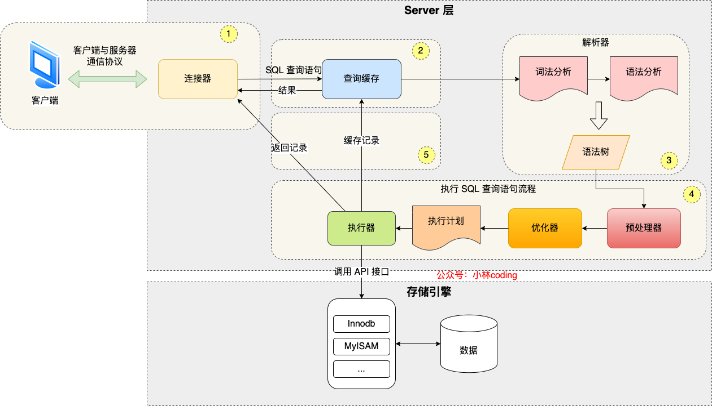
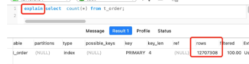
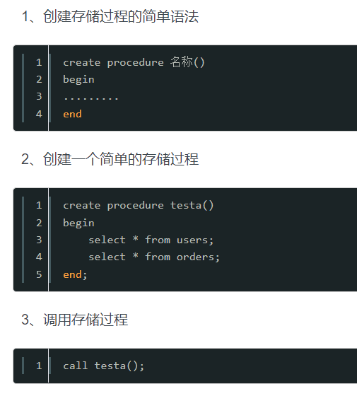
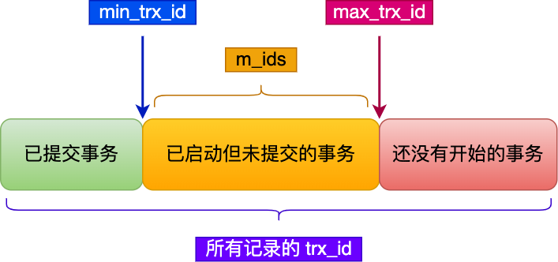
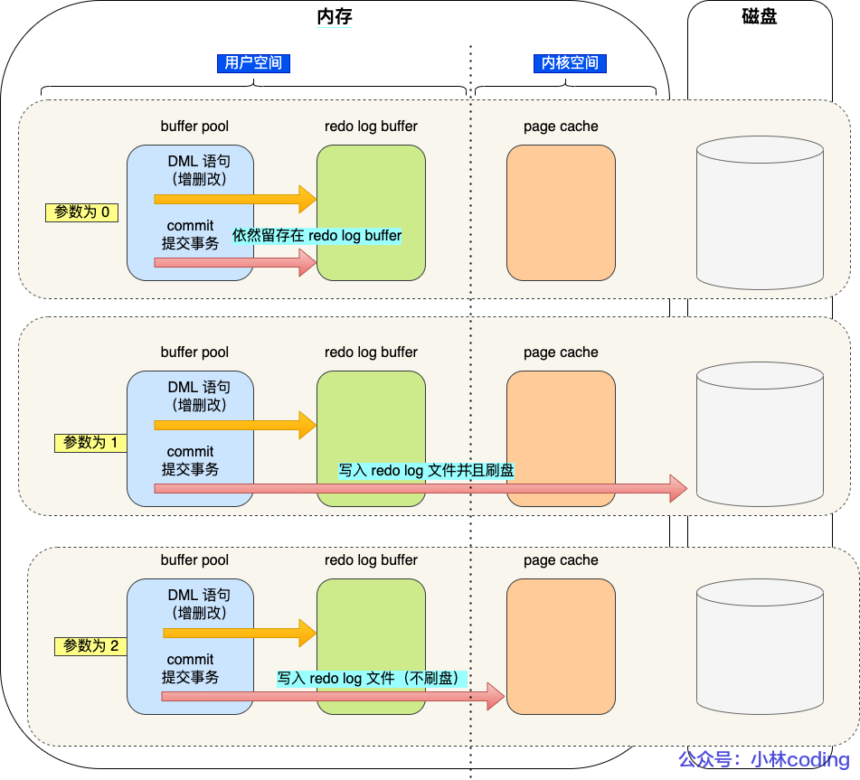
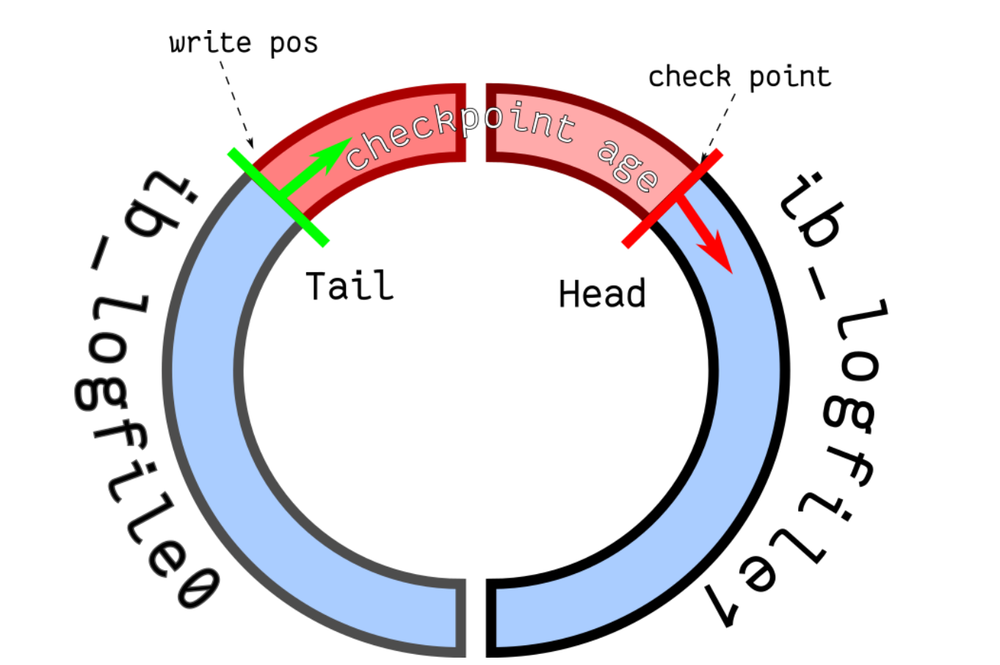
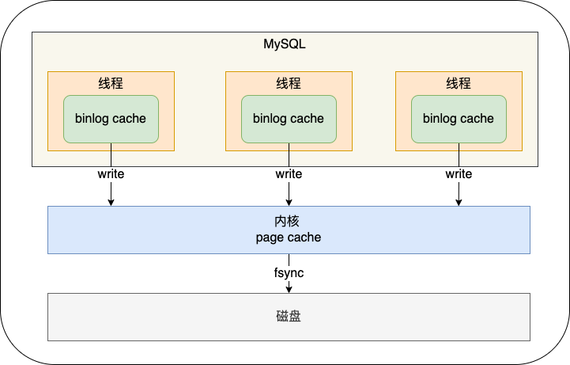

# 数据库

## 1.数据库事务以及四个特性（ACID）

数据库**事务**（ transaction）是访问并可能操作各种数据项的一个数据库**操作序列**，这些操作要么全部执行,要么全部不执行，是一个**不可分割的工作单位**。事务由事务开始与事务结束之间执行的全部数据库操作组成。数据库事务数数据库最小逻辑单元。

**四个特性**：

**原子性**（Atomicity）：原子性是指事务包含的所有操作要么全部成功，要么全部失败回滚。失败回滚的操作事务，将不能对事务有任何影响。

**一致性**（Consistency）：一致性是指事务必须使数据库从一个一致性状态变换到另一个一致性状态，也就是说一个事务执行之前和执行之后都必须处于一致性状态。例如：A和B进行转账操作，A有200块钱，B有300块钱；当A转了100块钱给B之后，他们2个人的总额还是500块钱，不会改变。

**隔离性**（Isolation）：隔离性是指当多个用户并发访问数据库时，比如同时访问一张表，数据库每一个用户开启的事务，不能被其他事务所做的操作干扰（也就是事务之间的隔离），多个并发事务之间，应当相互隔离。

例如同时有T1和T2两个并发事务，从T1角度来看，T2要不在T1执行之前就已经结束，要么在T1执行完成后才开始。将多个事务隔离开，每个事务都不能访问到其他事务操作过程中的状态；就好比上锁操作，只有一个事务做完了，另外一个事务才能执行。

**持久性**（Durability）：持久性是指事务的操作，一旦提交，对于数据库中数据的改变是永久性的，即使数据库发生故障也不能丢失已提交事务所完成的改变。

## 2.数据库三大范式

**第一范式**（1NF）：数据字段设计时必须满足**原子性**

数据表中的每一列（每个字段）必须是**不可拆分的最小单元**，也就是确保每一列的原子性；（比如“姓名与年龄“，我们应该拆分成两个字段：“姓名“、“年龄“。）

**第二范式**（2NF）：字段设计不能存在部分依赖。

满足1NF后，要求表中的所有列，**都必须依赖于同一个主键**，而不能有任何一列与主键没有关系，也就是说一个表只描述一件事情；（比如我们主字段是教师的“姓名“，那么字段“年龄“、“工号“、“工资“、“电话“都是与教师相关的，而字段“销售额“跟我们教师没有关系，就要去掉。）

**第三范式**（3NF）：字段设计不能存在传递依赖。

必须先满足第二范式（2NF），要求：表中的每一列只与主键直接相关而不是间接相关；（如果某一属性依赖于其他非主键属性，而其他非主键属性又依赖于主键，那么这个属性就是间接依赖于主键）

## 3.事务的隔离级别

事务的**隔离性**就是指，多个并发的事务同时访问一个数据库时，一个事务不应该被另一个事务所干扰，每个并发的事务间要相互进行隔离。

1.**读未提交**（Read Uncommitted）：因为没有行级共享锁，会出现**脏读**。

脏读就是，比如两个事务都在操作同一个表，A事务修改了C字段的值没有提交该事务；而B事务也在读取C字段的值，就在这时A事务发生了失败回滚，那么C字段的值返回原来的值，所以B事务发生了脏读。**整个过程结束，数据库没有发生任何改变，B事务却读到了奇怪的值，这就是脏读**。解决办法是行级共享锁。

2.**读提交**（Read Committed）：通过行级共享锁，解决了脏读问题，但因为事务没有加锁，导致前后读取数据不一致，即**不可重复读**。

不可重复读就是，比如两个事务都在操作同一个表，A事务先读取了C字段的值后继续操作下一个字段；而B事务在这个时候修改了C字段的值。A事务再读取C字段的值，发现同一个事务下，竟然前后两次读取不一样，这就很怪异了，这就是**不可重复读**。解决办法是对事务进行加锁。

3.**可重复读**（Repeated Read）：通过事务加锁，解决了不可重复读问题，但因为表没有加锁，会出现**幻读**的情况，比如多了一行数据。

幻读就是，比如两个事务都在操作同一个表，A事务先读取了表的行数；而B事务在这个时候为表格新插入了一行数据。A事务再读取表的行数，发现竟多了一行，这就很怪异了，这就是**幻读**。解决办法是对表进行加锁。

4.串行化（Serializable）：可解决脏读、不可重复读、幻读问题，**通过对表直接加锁的方式，但数据库的读取效率降低**。

mysql默认隔离级别为**可重复读**。

## 4.什么是数据库索引

**索引**是对数据库表中一列或多列的值进行排序的一种结构，使用索引可快速访问数据库表中的特定信息。与在表中搜索所有的行相比，索引有助于更快地获取信息。**唯一、不为空、经常被查询的字段适合建立索引**。

## 5.MySQL中有哪些索引？有什么特点？

- **普通索引**：仅加速查询
- **唯一索引**：加速查询 + 列值唯一（可以有null）
- **主键索引**：加速查询 + 列值唯一（不可以有null）+ 表中只有一个
- **组合索引**：多列值组成一个索引，专门用于组合搜索，其效率大于索引合并
- **全文索引**：对文本的内容进行分词，进行搜索
- **索引合并**：使用多个单列索引组合搜索
- **覆盖索引**：select的数据列只用从索引中就能够取得，不必读取数据行，换句话说查询列要被所建的索引覆盖
- **聚簇索引**：表数据是和主键一起存储的，主键索引的叶结点存储行数据(包含了主键值)，二级索引的叶结点存储行的主键值。使用的是B+树作为索引的存储结构，非叶子节点都是索引关键字，但非叶子节点中的关键字中不存储对应记录的具体内容或内容地址。叶子节点上的数据是主键与具体记录(数据内容)


## 6.什么情况下数据库索引会失效

1.如果条件中有or，即使其中有条件带索引也不会使用（要想使用or，又想让索引生效，只能将or条件中的每个列都加上索引）

2.不符合最左匹配原则（最左匹配原则 顾名思义：最左优先，以最左边的为起点任何连续的索引都能匹配上）

3.like查询是以%开头

4.如果mysql估计使用全表扫描要比使用索引快,则不使用索引

## 7.引起慢查询的常见原因及一些解决方案

（1）没有索引或者没有用到索引（这是查询慢最常见的问题，是程序设计的缺陷）

（2）锁或者死锁（这也是查询慢最常见的问题，是程序设计的缺陷）

（3）查询语句不好，没有优化

（4）网络速度慢

（5）内存不足

解决方案：

（1）根据查询条件,建立索引,优化 索引、优化访问方式

（2）优化锁。可以使用乐观锁、读写锁

（3）优化查询语句

（4）提升网络速度

（5）扩大服务器内存

## 8.聚簇索引与非聚簇索引

**聚簇索引**：将数据存储与索引放到了一块，找到索引也就找到了数据

**非聚簇索引**：将数据存储于索引分开结构，索引结构的叶子节点指向了数据的对应行

## 9.数据库主键和外键

**主键**是能确定一条记录的唯一标识，比如，一条记录包括身份正号，姓名，年龄。

身份证号是唯一能确定你这个人的，其他都可能有重复，所以，身份证号是主键。

**外键**用于与另一张表的关联。是能确定另一张表记录的字段，用于保持数据的一致性。

比如，A表中的一个字段，是B表的主键，那他就可以是A表的外键。

## 10.mysql知道哪些存储引擎，它们的区别

MyISAM、InnoDB。从MySQL5.5版本之后，MySQL的默认内置存储引擎是**InnoDB**

1.InnoDB 支持事务、支持所有隔离级别、行级锁、外键关联、灾难恢复性好、索引和数据是在一起的、用的B+树。不保存行列的信息，使用select需要扫描全表，查找慢些。

2.MyISAM 不支持事务、不支持行级锁、外键关联，灾难恢复性差、在读写的时候需要锁住整个表，效率低些。但是查找的时候保持行列信息，通过select可以查找相对比较快，索引和数据是分开的、用的B+树。

## 11.关系型数据库和非关系型数据库的区别

1.**关系型数据库**：指采用了关系模型来组织数据的数据库。
关系模型指的就是**二维表格模型**，而一个关系型数据库就是由二维表及其之间的联系所组成的一个数据组织。比如mysql就是关系型数据库。

2.**非关系型数据库**：指非关系型的，分布式的，且一般不保证遵循`ACID`原则的数据存储系统。

### 非关系型数据库结构

非关系型数据库以**键值对**存储，且结构不固定，每一个元组可以有不一样的字段，每个元组可以根据需要增加一些自己的键值对，不局限于固定的结构，可以减少一些时间和空间的开销。

如典型的Redis就是非关系型数据库。

## 12.数据库垂直与水平拆分怎么做

**垂直拆分**：一个数据库由很多表的构成，每个表对应着不同的业务，垂直切分是指按照业务将表进行分类，分布到不同的数据库上面
**水平拆分**：同一个表拆到不同的数据库中，可以理解为将表中的某些行切分到一个数据库，而另外的某些行又切分到其他的数据库中

## 13.什么是内联接、左联接、右联接

内联接（Inner Join）：匹配2张表中字段相等的记录。
左联接（Left Outer Join）：返回左表，并且返回左表与右表字段相等的记录
右联接（Right Outer Join）：返回右表，并且返回右表与左表字段相等的记录


## 14.MVCC原理

**MVCC**的英文全称是 Multiversion Concurrency Control ，中文意思是多版本并发控制技术。原理是，通过数据行的多个版本管理来实现数据库的并发控制，简单来说就是保存数据的历史版本。可以通过比较版本号决定数据是否显示出来。**读取数据的时候不需要加锁可以保证事务的隔离效果**。
**MVCC 可以解决什么问题？**

1.读写之间阻塞的问题，通过 MVCC 可以让读写互相不阻塞，读不相互阻塞，写不阻塞读，这样可以提升数据并发处理能力。

2.降低了死锁的概率，这个是因为 MVCC 采用了乐观锁的方式，读取数据时，不需要加锁，写操作，只需要锁定必要的行。

3.解决了一致性读的问题，当我们朝向某个数据库在时间点的快照是，只能看到这个时间点之前事务提交更新的结果，不能看到时间点之后事务提交的更新结果。

## 15.乐观锁与悲观锁

**悲观锁**：总是假设最坏的情况，每次去拿数据的时候都认为别人会修改，所以每次在拿数据的时候都会上锁，这样别人想拿这个数据就会阻塞直到它拿到锁。传统的关系型数据库里边就用到了很多这种锁机制，比如行锁，表锁等，读锁，写锁等，都是在做操作之前先上锁。
**乐观锁**：顾名思义，就是很乐观，每次去拿数据的时候都认为别人不会修改，所以不会上锁，但是在更新的时候会判断一下在此期间别人有没有去更新这个数据，可以使用版本号等机制。乐观锁适用于多读的应用类型，这样可以提高吞吐量，像数据库提供的类似于write_condition机制，其实都是提供的乐观锁。
要明确一下：无论是悲观锁还是乐观锁，都是人们定义出来的概念，可以认为是一种思想。其实不仅仅是关系型数据库系统中有乐观锁和悲观锁的概念，像memcache、hibernate、tair等都有类似的概念。所以，不应该拿乐观锁、悲观锁和其他的数据库锁等进行对比。

### 实现方式

悲观锁的实现可以依靠数据库里的锁机制，如排它锁。
乐观锁的实现Compare and Swap(CAS)：当多个线程尝试使用CAS同时更新同一个变量时，只有其中一个线程能更新变量的值，而其它线程都失败，失败的线程并不会被挂起，而是被告知这次竞争中失败，并可以再次尝试。
乐观锁每次在执行数据的修改操作时，都会带上一个版本号，一旦版本号和数据的版本号一致就可以执行修改操作并对版本号执行+1操作，否则就执行失败。因为每次操作的版本号都会随之增加，所以不会出现**ABA问题**，因为版本号只会增加不会减少。除了version以外，还可以使用时间戳，因为时间戳天然具有顺序递增性。
ABA：如果另一个线程修改V值假设原来是A，先修改成B，再修改回成A。当前线程的CAS操作无法分辨当前V值是否发生过变化。关于ABA问题举一个例子：在你非常渴的情况下你发现一个盛满水的杯子，你一饮而尽。之后再给杯子里重新倒满水。然后你离开，当杯子的真正主人回来时看到杯子还是盛满水，他当然不知道是否被人喝完重新倒满。解决这个问题的方案的一个策略是每一次倒水假设有一个自动记录仪记录下，这样主人回来就可以分辨在她离开后是否发生过重新倒满的情况。这也是解决ABA问题目前采用的策略。用**悲观锁**就可以解决这个问题。

## 16.mysql的四种日志

1. **错误日志**：记录mysql运行过程ERROR，WARING等信息，系统出错或某条记录出问题可查看ERROR日志。
2. **日常运行日志**：记录mysql中每条请求数据。
3. **二进制日志**：binlog，包含一些事件，数据库的改动等。
4. **慢查询日志**：用于mysql的性能调优。

## 17.mysql主从复制

**主从复制**（也称 AB 复制）允许将来自一个MySQL数据库服务器（主服务器）的数据复制到一个或多个MySQL数据库服务器（从服务器）。实现数据库的读写分离，主数据库主要进行写操作，而从数据库负责读操作。同时数据库有多个副本，也可保证数据库安全，主服务器如果出问题，可以将从服务器升级为主服务器。

三种复制方式

-- 基于SQL语句的复制(statement-based replication, SBR)，

-- 基于行的复制(row-based replication, RBR)，

-- 混合模式复制(mixed-based replication, MBR)。

## 18.怎么优化查询

索引优化（选择合适索引、索引避免失效），分库分表，读写分离

## 19.mysql如何建立和删除索引

```mysql
create index my_index on [table] //为表格table的name字段创建一个名为my_index的索引
drop index my_index on [table] //删除表格table的名为my_index的索引
```

## 20.group by、where、having、order by

1.**where**：数据库中常用的是where关键字，用于在初始表中筛选查询。它是一个约束声明，用于约束数据，在返回结果集之前起作用。

2.**group by**:对select查询出来的结果集按照某个字段或者表达式进行分组，获得一组组的集合，然后从每组中取出一个指定字段或者表达式的值。

3.**having**：用于对where和group by查询出来的分组经行过滤，查出满足条件的分组结果。它是一个过滤声明，是在查询返回结果集以后对查询结果进行的过滤操作。

4.**order by** 关键字用于对结果集按照一个列或者多个列进行排序。order by关键字默认按照升序对记录进行排序。如果需要按照降序对记录进行排序，您可以使用 DESC 关键字。

## 21.数据库笛卡尔乘积

设A,B为集合，用A中元素为第一元素，B中元素为第二元素构成有序对，所有这样的有序对组成的集合叫做A与B的笛卡尔积，记作AxB.

## 22.SQL中的NOW()和CURRENT_DATE()两个函数有什么区别？

NOW（）命令用于显示当前年份，月份，日期，小时，分钟和秒。 CURRENT_DATE（）仅显示当前年份，月份和日期。

## 23.创建索引时需要注意什么？

非空字段：应该指定列为NOT NULL，除非你想存储NULL。在 MySQL 中，含有空值的列很难进行查询优化，因为它们使得索引、索引的统计信息以及比较运算更加复杂。你应该用0、一个特殊的值或者一个空串代替空值；

取值离散大的字段：（变量各个取值之间的差异程度）的列放到联合索引的前面，可以通过count()函数查看字段的差异值，返回值越大说明字段的唯一值越多字段的离散程度高；

索引字段越小越好：数据库的数据存储以页为单位一页存储的数据越多一次IO操作获取的数据越大效率越高。 唯一、不为空、经常被查询的字段 的字段适合建索引

## 24.MySQL中CHAR和VARCHAR的区别有哪些？

char的长度是不可变的，用空格填充到指定长度大小，而varchar的长度是可变的。

char的存取数度还是要比varchar要快得多

char的存储方式是：对英文字符（ASCII）占用1个字节，对一个汉字占用两个字节。varchar的存储方式是：对每个英文字符占用2个字节，汉字也占用2个字节。

## 25.MySQL 索引使用的注意事项

MySQL 索引通常是被用于提高 WHERE 条件的数据行匹配时的搜索速度，在索引的使用过程中，存在一些使用细节和注意事项。

函数，运算，否定操作符，连接条件，多个单列索引，最左前缀原则，范围查询，不会包含有NULL值的列，like 语句不要在列上使用函数和进行运算

## 26.既然索引有那么多优点，为什么不对表总的每一列创建一个索引呢？

当对表中的数据进行增加、删除和修改的时候，**索引也要动态的维护**，这样就降低了数据的维护速度。

**索引需要占物理空间**，除了数据表占数据空间之外，每一个索引还要占一定的物理空间，如果要建立聚簇索引，那么需要的空间就会更大。

**创建索引和维护索引要耗费时间**，这种时间随着数据量的增加而增加

## 27.索引如何提高查询速度的

将无序的数据变成相对有序的数据（就像查有目的一样）

## 28.你知道哪些数据库结构优化的手段？

**范式优化**： 比如消除冗余（节省空间。。）

**反范式优化**：比如适当加冗余等（减少join）

**限定数据的范围**： 务必禁止不带任何限制数据范围条件的查询语句。比如：我们当用户在查询订单历史的时候，我们可以控制在一个月的范围内。

**读/写分离**： 经典的数据库拆分方案，主库负责写，从库负责读；

**拆分表**：分区将数据在物理上分隔开，不同分区的数据可以制定保存在处于不同磁盘上的数据文件里。这样，当对这个表进行查询时，只需要在表分区中进行扫描，而不必进行全表扫描，明显缩短了查询时间，另外处于不同磁盘的分区也将对这个表的数据传输分散在不同的磁盘I/O，一个精心设置的分区可以将数据传输对磁盘I/O竞争均匀地分散开。对数据量大的时时表可采取此方法。可按月自动建表分区。

## 29.数据库优化中有一个比较常用的手段就是把数据表进行拆分，关于拆分数据表你了解哪些？

拆分其实又分**垂直拆分**和**水平拆分**

案例： 简单购物系统暂设涉及如下表：

1.产品表（数据量10w，稳定）

2.订单表（数据量200w，且有增长趋势）

3.用户表 （数据量100w，且有增长趋势）

以 MySQL 为例讲述下水平拆分和垂直拆分，MySQL能容忍的数量级在百万静态数据可以到千万

**垂直拆分**

解决问题：表与表之间的io竞争

不解决问题：单表中数据量增长出现的压力

方案： 把产品表和用户表放到一个server上 订单表单独放到一个server上

**水平拆分**

解决问题：单表中数据量增长出现的压力

不解决问题：表与表之间的io争夺

方案：**用户表** 通过性别拆分为男用户表和女用户表，**订单表** 通过已完成和完成中拆分为已完成订单和未完成订单，**产品表** 未完成订单放一个server上，已完成订单表盒男用户表放一个server上，女用户表放一个server上(女的爱购物 哈哈)。

## 30.为什么MySQL索引适用用B+树而不用hash表和B树？

利用Hash需要把数据全部**加载到内存中**，如果数据量大，是一件很**消耗内存**的事，而采用B+树，是基于**按照节点分段加载，由此减少内存消耗**。

和业务场景有段，**对于唯一查找**（查找一个值），Hash确实更快，**但数据库中经常查询多条数据**，这时候由于B+数据的有序性，与叶子节点又有链表相连，他的查询效率会比Hash快的多。

b+树的**非叶子节点不保存数据**，**只保存子树的临界值**（最大或者最小），所以同样大小的节点，**b+树相对于b树能够有更多的分支，使得这棵树更加矮胖，查询时做的IO操作次数也更少**。

## 31.关系型数据库的四大特性在得不到保障的情况下会怎样？

ACID，原子性(Atomicity)、一致性(Consistency)、隔离性(Isolation)、持久性(Durability)

我们以从A账户转账50元到B账户为例进行说明一下ACID这四大特性。

**原子性**

原子性是指一个事务是一个不可分割的工作单位，**其中的操作要么都做，要么都不做**。即要么转账成功，要么转账失败，是不存在中间的状态！

**如果无法保证原子性会怎么样？**

OK，就会出现数据不一致的情形，A账户减去50元，而B账户增加50元操作失败。系统将无故丢失50元~

**一致性**

一致性是指事务执行前后，数据处于一种合法的状态，这种状态是语义上的而不是语法上的。 那什么是合法的数据状态呢？这个状态是满足预定的约束就叫做合法的状态，再通俗一点，这状态是由你自己来定义的。**满足这个状态，数据就是一致的，不满足这个状态，数据就是不一致的！**

**如果无法保证一致性会怎么样？**

- 例一:A账户有200元，转账300元出去，此时A账户余额为-100元。你自然就发现了此时数据是不一致的，为什么呢？因为你定义了一个状态，余额这列必须大于0。
- 例二:A账户200元，转账50元给B账户，A账户的钱扣了，但是B账户因为各种意外，余额并没有增加。你也知道此时数据是不一致的，为什么呢？因为你定义了一个状态，要求A+B的余额必须不变。

**隔离性**

隔离性是指**多个事务并发执行的时候，事务内部的操作与其他事务是隔离的**，并发执行的各个事务之间不能互相干扰。

**如果无法保证隔离性会怎么样**？

假设A账户有200元，B账户0元。A账户往B账户转账两次，金额为50元，分别在两个事务中执行。如果无法保证隔离性，A可能就会出现扣款两次的情形，而B只加款一次，凭空消失了50元，依然出现了数据不一致的情形！

**持久性**

根据定义，**持久性是指事务一旦提交，它对数据库的改变就应该是永久性的**。接下来的其他操作或故障不应该对其有任何影响。

如果无法保证持久性会怎么样？

在MySQL中，为了解决CPU和磁盘速度不一致问题，MySQL是将磁盘上的数据加载到内存，对内存进行操作，然后再回写磁盘。好，假设此时宕机了，在内存中修改的数据全部丢失了，持久性就无法保证。

设想一下，系统提示你转账成功。但是你发现金额没有发生任何改变，此时数据出现了不合法的数据状态，我们将这种状态认为是**数据不一致**的情形。

## 32.数据库如何保证原子性？

主要是利用 Innodb 的**undo log**。 **undo log**名为回滚日志，是实现原子性的关键，当事务回滚时能够撤销所有已经成功执行的 SQL语句，他需要记录你要回滚的相应日志信息。 例如

- 当你delete一条数据的时候，就需要记录这条数据的信息，回滚的时候，insert这条旧数据
- 当你update一条数据的时候，就需要记录之前的旧值，回滚的时候，根据旧值执行update操作
- 当年insert一条数据的时候，就需要这条记录的主键，回滚的时候，根据主键执行delete操作

**undo log**记录了这些回滚需要的信息，当事务执行失败或调用了**rollback**，导致事务需要回滚，便可以利用**undo log**中的信息将数据回滚到修改之前的样子。

## 33.数据库如何保证持久性？

主要是利用Innodb的**redo log**。重写日志， 正如之前说的，MySQL是先把磁盘上的数据加载到内存中，在内存中对数据进行修改，再写回到磁盘上。如果此时突然宕机，内存中的数据就会丢失。 怎么解决这个问题？ 简单啊，事务提交前直接把数据写入磁盘就行啊。 这么做有什么问题？

- 只修改一个页面里的一个字节，就要将整个页面刷入磁盘，太浪费资源了。毕竟一个页面16kb大小，你只改其中一点点东西，就要将16kb的内容刷入磁盘，听着也不合理。
- 毕竟一个事务里的SQL可能牵涉到多个数据页的修改，而这些数据页可能不是相邻的，也就是属于随机IO。显然操作随机IO，速度会比较慢。

于是，决定采用**redo log**解决上面的问题。当做数据修改的时候，不仅在内存中操作，还会在**redo log**中记录这次操作。当事务提交的时候，会将**redo log**日志进行刷盘(**redo log**一部分在内存中，一部分在磁盘上)。当数据库宕机重启的时候，会将redo log中的内容恢复到数据库中，再根据**undo log**和**binlog**内容决定回滚数据还是提交数据。

**采用redo log的好处？**

其实好处就是将**redo log**进行刷盘比对数据页刷盘效率高，具体表现如下：

- **redo log**体积小，毕竟只记录了哪一页修改了啥，因此体积小，刷盘快。
- **redo log**是一直往末尾进行追加，属于顺序IO。效率显然比随机IO来的快。

## 34.数据库如何保证一致性？

分为两个层面来说。

- **从数据库层面**，数据库通过原子性、隔离性、持久性来保证一致性。也就是说ACID四大特性之中，C(一致性)是目的，A(原子性)、I(隔离性)、D(持久性)是手段，是为了保证一致性，数据库提供的手段。**数据库必须要实现AID三大特性，才有可能实现一致性**。例如，原子性无法保证，显然一致性也无法保证。
- **从应用层面**，通过代码判断数据库数据是否有效，然后决定回滚还是提交数据！

## 35.数据库高并发是我们经常会遇到的，你有什么好的解决方案吗？

- 在web服务框架中加入缓存。在服务器与数据库层之间加入缓存层，将高频访问的数据存入缓存中，减少数据库的读取负担。
- 增加数据库索引，进而提高查询速度。（不过索引太多会导致速度变慢，并且数据库的写入会导致索引的更新，也会导致速度变慢）
- 主从读写分离，让主服务器负责写，从服务器负责读。
- 将数据库进行拆分，使得数据库的表尽可能小，提高查询的速度。
- 使用分布式架构，分散计算压力。

## 36.都知道数据库索引采用B+树而不是B树，原因也有很多，主要原因是什么？

主要原因：B+树只要遍历叶子节点就可以实现整棵树的遍历，而且在数据库中基于范围的查询是非常频繁的，而B树只能中序遍历所有节点，效率太低。

## 37.游标是什么？

游标是对查询出来的结果集作为一个单元来有效的处理。一般不使用游标，但是需要逐条处理数据的时候，游标显得十分重要。


## 38.MySQL中为什么要有事务回滚机制？

而在 MySQL 中，恢复机制是通过回滚日志（undo log）实现的，所有事务进行的修改都会先记录到这个回滚日志中，然后在对数据库中的对应行进行写入。 当事务已经被提交之后，就无法再次回滚了。

回滚日志作用： 

1. 能够在发生错误或者用户执行 ROLLBACK 时提供回滚相关的信息 
2. 在整个系统发生崩溃、数据库进程直接被杀死后，当用户再次启动数据库进程时，还能够立刻通过查询回滚日志将之前未完成的事务进行回滚，这也就需要回滚日志必须先于数据持久化到磁盘上，是我们需要先写日志后写数据库的主要原因。


## 39.数据库并发事务会带来哪些问题？

数据库并发会带来脏读、幻读、丢弃更改、不可重复读这四个常见问题，其中：

**脏读**：在第一个修改事务和读取事务进行的时候，读取事务读到的数据为100，这是修改之后的数据，但是之后该事务满足一致性等特性而做了回滚操作，那么读取事务得到的结果就是脏数据了。

**幻读**：一般是T1在某个范围内进行修改操作（增加或者删除），而T2读取该范围导致读到的数据是修改之间的了，强调范围。

**丢弃修改**：两个写事务T1 T2同时对A=0进行递增操作，结果T2覆盖T1，导致最终结果是1 而不是2，事务被覆盖

**不可重复读**：T2 读取一个数据，然后T1 对该数据做了修改。如果 T2 再次读取这个数据，此时读取的结果和第一次读取的结果不同。


## 40.数据库悲观锁和乐观锁的原理和应用场景分别有什么？

悲观锁，先获取锁，再进行业务操作，一般就是利用类似 SELECT … FOR UPDATE 这样的语句，对数据加锁，避免其他事务意外修改数据。 当数据库执行SELECT … FOR UPDATE时会获取被select中的数据行的行锁，select for update获取的行锁会在当前事务结束时自动释放，因此必须在事务中使用。

乐观锁，先进行业务操作，只在最后实际更新数据时进行检查数据是否被更新过。并不会对数据加锁，而是通过对比数据的时间戳或者版本号，来实现乐观锁需要的版本判断。


## 41.MySQL索引主要使用的两种数据结构是什么？

- **哈希索引**，对于哈希索引来说，底层的数据结构肯定是哈希表，因此**在绝大多数需求为单条记录查询**的时候，可以选择哈希索引，查询性能最快；其余大部分场景，建议选择BTree索引

- **BTree索引**，Mysql的BTree索引使用的是B树中的B+Tree，BTREE索引就是一种将索引值按一定的算法，存入一个树形的数据结构中（二叉树），每次查询都是从树的入口root开始，依次遍历node，获取leaf。

  但对于主要的两种存储引擎（MyISAM和InnoDB）的实现方式是不同的。

## 42.数据库为什么要进行分库和分表呢？都放在一个库或者一张表中不可以吗？

分库与分表的目的在于，减小数据库的单库单表负担，提高查询性能，缩短查询时间。

**通过分表**，可以减少数据库的单表负担，将压力分散到不同的表上，同时因为不同的表上的数据量少了，起到提高查询性能，缩短查询时间的作用，此外，可以很大的缓解表锁的问题。 分表策略可以归纳为垂直拆分和水平拆分： **水平分表**：取模分表就属于随机分表，而时间维度分表则属于连续分表。 如何设计好垂直拆分，我的建议：将不常用的字段单独拆分到另外一张扩展表. 将大文本的字段单独拆分到另外一张扩展表, 将不经常修改的字段放在同一张表中，将经常改变的字段放在另一张表中。 对于海量用户场景，可以考虑取模分表，数据相对比较均匀，不容易出现热点和并发访问的瓶颈。

**库内分表**，仅仅是解决了单表数据过大的问题，但并没有把单表的数据分散到不同的物理机上，因此并不能减轻 MySQL 服务器的压力，仍然存在同一个物理机上的资源竞争和瓶颈，包括 CPU、内存、磁盘 IO、网络带宽等。

**分库与分表带来的分布式困境与应对之策** 数据迁移与扩容问题----一般做法是通过程序先读出数据，然后按照指定的分表策略再将数据写入到各个分表中。 分页与排序问题----需要在不同的分表中将数据进行排序并返回，并将不同分表返回的结果集进行汇总和再次排序，最后再返回给用户。


## 43.不可重复读和幻读区别是什么？可以举个例子吗？

**不可重复读的重点是修改，幻读的重点在于新增或者删除。**

- 例1（同样的条件, 你读取过的数据, 再次读取出来发现值不一样了 ）：事务1中的A先生读取自己的工资为 1000的操作还没完成，事务2中的B先生就修改了A的工资为2000，导致A再读自己的工资时工资变为 2000；这就是不可重复读。

- 例2（同样的条件, 第1次和第2次读出来的记录数不一样 ）：假某工资单表中工资大于3000的有4人，事务1读取了所有工资大于3000的人，共查到4条记录，这时事务2 又插入了一条工资大于3000的记录，事务1再次读取时查到的记 录就变为了5条，这样就导致了幻读。

  

## 44.MySQL中有四种索引类型，可以简单说说吗？

- **FULLTEXT** ：即为全文索引，目前只有MyISAM引擎支持。其可以在CREATE TABLE ，ALTER TABLE ，CREATE INDEX 使用，不过目前只有 CHAR、VARCHAR ，TEXT 列上可以创建全文索引。
- **HASH** ：由于HASH的唯一（几乎100%的唯一）及类似键值对的形式，很适合作为索引。 HASH索引可以一次定位，不需要像树形索引那样逐层查找,因此具有极高的效率。但是，这种高效是有条件的，即只在“=”和“in”条件下高效，对于范围查询、排序及组合索引仍然效率不高。
- **BTREE** ：BTREE索引就是一种将索引值按一定的算法，存入一个树形的数据结构中（二叉树），每次查询都是从树的入口root开始，依次遍历node，获取leaf。这是MySQL里默认和最常用的索引类型。
- **RTREE** ：RTREE在MySQL很少使用，仅支持geometry数据类型，支持该类型的存储引擎只有MyISAM、BDb、InnoDb、NDb、Archive几种。 相对于BTREE，RTREE的优势在于范围查找。


## 45.视图的作用是什么？可以更改吗？

视图是虚拟的表，与包含数据的表不一样，视图只包含使用时动态检索数据的查询；不包含任何列或数据。使用视图可以简化复杂的 sql 操作，隐藏具体的细节，保护数据；视图创建后，可以使用与表相同的方式利用它们。

视图不能被索引，也不能有关联的触发器或默认值，如果视图本身内有order by 则对视图再次order by将被覆盖。

创建视图：create view xxx as xxxx

对于某些视图比如未使用联结子查询分组聚集函数Distinct Union等，是可以对其更新的，对视图的更新将对基表进行更新；但是视图主要用于简化检索，保护数据，并不用于更新，而且大部分视图都不可以更新。

## 46.一道场景题：假如你所在的公司选择MySQL数据库作数据存储，一天五万条以上的增量，预计运维三年，你有哪些优化手段？

- 设计良好的数据库结构，允许部分数据冗余，尽量避免join查询，提高效率。
- 选择合适的表字段数据类型和存储引擎，适当的添加索引。
- MySQL库主从读写分离。
- 找规律分表，减少单表中的数据量提高查询速度。
- 添加缓存机制，比如Memcached，Apc等。
- 不经常改动的页面，生成静态页面。
- 书写高效率的SQL。比如 SELECT * FROM TABEL 改为 SELECT field_1, field_2, field_3 FROM TABLE。

## 47.数据库中的主键、超键、候选键、外键是什么？（很棒）

- **超键**：在关系中能唯一标识**元组的属性集**称为关系模式的超键
- **候选键**：不含有**多余属性的超键**称为候选键。也就是在候选键中，若再删除属性，就不是键了！
- **主键**：**用户选作元组标识的一个候选键程序主键**
- **外键**：如果关系模式**R中属性K是其它模式的主键**，那么**k在模式R中称为外键**。

**举例**：

| 学号     | 姓名   | 性别 | 年龄 | 系别   | 专业     |
| -------- | ------ | ---- | ---- | ------ | -------- |
| 20020612 | 李辉   | 男   | 20   | 计算机 | 软件开发 |
| 20060613 | 张明   | 男   | 18   | 计算机 | 软件开发 |
| 20060614 | 王小玉 | 女   | 19   | 物理   | 力学     |
| 20060615 | 李淑华 | 女   | 17   | 生物   | 动物学   |
| 20060616 | 赵静   | 男   | 21   | 化学   | 食品化学 |
| 20060617 | 赵静   | 女   | 20   | 生物   | 植物学   |

1. 超键：于是我们从例子中可以发现 学号是标识学生实体的唯一标识。那么该元组的超键就为学号。除此之外我们还可以把它跟其他属性组合起来，比如：(`学号`，`性别`)，(`学号`，`年龄`)
2. 候选键：根据例子可知，学号是一个可以唯一标识元组的唯一标识，因此学号是一个候选键，实际上，候选键是超键的子集，比如 （学号，年龄）是超键，但是它不是候选键。因为它还有了额外的属性。
3. 主键：简单的说，例子中的元组的候选键为学号，但是我们选定他作为该元组的唯一标识，那么学号就为主键。
4. 外键是相对于主键的，比如在学生记录里，主键为学号，在成绩单表中也有学号字段，因此学号为成绩单表的外键，为学生表的主键。

**主键为候选键的子集，候选键为超键的子集，而外键的确定是相对于主键的。**

## 48.MySQL常见的存储引擎InnoDB、MyISAM的区别？适用场景分别是？

1. 事务：MyISAM不支持，InnoDB支持 
2. 锁级别： MyISAM 表级锁，InnoDB 行级锁及外键约束
3. MyISAM存储表的总行数；InnoDB不存储总行数；
4. MyISAM采用非聚集索引，B+树叶子存储指向数据文件的指针。InnoDB主键索引采用聚集索引，B+树叶子存储数据

**适用场景**： MyISAM适合： 插入不频繁，查询非常频繁，如果执行大量的SELECT，MyISAM是更好的选择， 没有事务。 InnoDB适合： 可靠性要求比较高，或者要求事务； 表更新和查询都相当的频繁， 大量的INSERT或UPDATE

## 49.执行一条 SQL 查询语句，期间发生了什么？

- 连接器：建立连接，管理连接、校验用户身份；
- 查询缓存：查询语句如果命中查询缓存则直接返回，否则继续往下执行。MySQL 8.0 已删除该模块；
- 解析 SQL，通过解析器对 SQL 查询语句进行词法分析、语法分析，然后构建语法树，方便后续模块读取表名、字段、语句类型；
- 执行 SQL：执行 SQL 共有三个阶段：
  - 预处理阶段：检查表或字段是否存在；将 `select *` 中的 `*` 符号扩展为表上的所有列。
  - 优化阶段：基于查询成本的考虑， 选择查询成本最小的执行计划；
  - 执行阶段：根据执行计划执行 SQL 查询语句，从存储引擎读取记录，返回给客户端；

怎么样？现在再看这张图，是不是很清晰了。




## 50.说一说Drop、Delete与Truncate的共同点和区别

- Drop直接删掉表;
- Truncate删除表中数据，再插入时自增长id又从1开始 ;
- Delete删除表中数据，可以加where字句。

delete是数据操纵语言（DML），其按行删除，支持where语句，执行操作采用行锁，执行操作时会将该操作记录在redo和undo中，因此支持回滚。

truncate是数据定义语言（DDL），其操作隐式提交，不支持回滚，不支持where，删除时采用表级锁进行删除。

## 51.索引的分类

我们可以按照四个角度来分类索引。

- 按「数据结构」分类：**B+tree索引、Hash索引、Full-text索引**。
- 按「物理存储」分类：**聚簇索引（主键索引）、二级索引（辅助索引）**。
- 按「字段特性」分类：**主键索引、唯一索引、普通索引、前缀索引**。
- 按「字段个数」分类：**单列索引、联合索引**。

## 52.为什么MySql InnoDB 选择 B+tree作为索引的数据结构？

**B+Tree vs B Tree:**

- 存储相同数量级别的情况下，B+Tree树高比B Tree低，磁盘I/O次数更少
- B+Tree叶子节点用双向链表链接起来，适合返回查询，B Tree无法做到这一点

**B+Tree vs 二叉树：**

- 随着数据量的增加，二叉树的树高会越来越高，磁盘I/O次数也会更多，B+Tree在千万级别的数据量下，高度依然维持在3~4层左右。

**B+Tree vs Hash：**

- 虽然Hash的等值查询效率很高，但是无法做到范围查询

## 53.什么时候用索引

- 字段由唯一性限制的，比如说商品编码
- 经常用于 WHERE 查询条件的字段
- 经常用于 GROUP BY 和 ORDER BY字段

什么时候不需要创建索引

- WHTER 条件，GROUP BY,ORDER BY里用不到的字段
- 字段中存在大量的重复数据，不需要创建索引
- 表数据太少的时候，不需要创建索引
- 经常更新的字段不用创建索引。

## 54.什么时候索引会失效

- 当我们使用左或者左右模糊匹配的时候，也就是`like %xx`或者`like %xx%`这两种法昂是都会导致索引失效。
- 当我们在查询条件中对索引列做了计算、函数、类型转换操作，会导致索引失效。（mysql8.0对添加了函数索引)
- 联合索引要能正确使用遵循最左匹配原则，也就是按照最左优先的发放时进行索引的匹配，否则就会导致索引失效。
- 在WHRERE子句中，如果在OR前的条件事索引列，而在OR后的条件列不是索引列，那么索引会失效。
- 具体是否失效我们可以使用 EXPLAN查看type字段的执行字段。

## 55.有什么优化索引的方法

- 前缀索引优化：减少了比较长度，比如说varchar,binary这些字段
- 覆盖索引优化：不需要回表
- 主键索引自增：防止页分裂，从而读到内存后产生造成大量的内存碎片。
- 防止索引失效。

## 56.MySQL使用like "%x",索引一定会失效吗？

当查询字段被二级索引覆盖时，会遍历二级索引，而不是全表扫描，虽然全索引扫描与全表扫描效率差不多，但是索引并没有失效。

## 57.count(*) 和 count(1) 有什么区别？哪个性能最好？

count(\*)与count(1)的效率相同，mysql5.7的官方手册有说明这一点。总的来说存在$count(*) = count(1) \ge count(有索引字段) > count(无索引字段)$

### InnoDB为什么要通过遍历方式来计数？

 InnoDB 存储引擎是支持事务的，同一个时刻的多个查询，由于多版本并发控制（MVCC）的原因，InnoDB 表“应该返回多少行”也是不确定的，所以无法像 MyISAM一样，只维护一个 row_count 变量。

### 如何优化 count(*)？

**第一种**，使用近似值近似值，使用show table status 或者 explain进行估算。



**第二种**，使用额外表保存计数值。

## 58.简述MySQL中的按粒度的锁分类

表级锁: 对当前操作的整张表加锁,实现简单，加锁快，但并发能力低。

行锁: 锁住某一行，如果表存在索引，那么记录锁是锁在索引上的，如果表没有索引，那么 InnoDB 会创建一个隐藏的聚簇索引加锁。行级锁能大大减少数据库操作的冲突。其加锁粒度最小，并发度高，但加锁的开销也最大，加锁慢，会出现死锁。

Gap 锁：也称为间隙锁: 锁定一个范围但不包括记录本身。其目的是为了防止同一事物的两次当前读出现幻读的情况。

Next-key Lock： 行锁+gap锁。

## 59.如何解决数据库死锁

1. 预先检测到死锁的循环依赖，并立即返回一个错误。
2. 当查询的时间达到锁等待超时的设定后放弃锁请求。

## 60.简述InnoDB存储引擎

InnoDB 是 MySQL 的默认事务型引擎，支持事务，表是基于聚簇索引建立的。支持表级锁和行级锁，支持外键，适合数据增删改查都频繁的情况。

InnoDB 采用 MVCC 来支持高并发，并且实现了四个标准的隔离级别。其默认级别是 REPEATABLE READ，并通过间隙锁策略防止幻读，间隙锁使 InnoDB 不仅仅锁定查询涉及的行，还会对索引中的间隙进行锁定防止幻行的插入。

## 61.简述MyISAM存储引擎

MySQL5.1及之前，MyISAM 是默认存储引擎。MyISAM不支持事务，Myisam支持表级锁，不支持行级锁，表不支持外键，该存储引擎存有表的行数，count运算会更快。适合查询频繁，不适合对于增删改要求高的情况

## 62.简述Memory存储引擎

Memory存储引擎将所有数据都保存在内存，不需要磁盘 IO。支持哈希索引，因此查找速度极快。Memory 表使用表级锁，因此并发写入的性能较低。

## 63.稠密索引与稀疏索引

- **稠密索引**： 在密集索引中，数据库中的每个搜索键值都有一个索引记录。这样可以加快搜索速度，但需要更多空间来存储索引记录本身。索引记录包含搜索键值和指向磁盘上实际记录的指针。


- **稀疏索引**： 在稀疏索引中，不会为每个搜索关键字创建索引记录。此处的索引记录包含搜索键和指向磁盘上数据的实际指针。要搜索记录，我们首先按索引记录进行操作，然后到达数据的实际位置。如果我们要寻找的数据不是我们通过遵循索引直接到达的位置，那么系统将开始顺序搜索，直到找到所需的数据为止。


## 64.Innodb与MyIsam使用的时稠密索引还是稀疏索引？

Innodb的聚簇索引（主键）是稠密索引，非聚簇（辅助）索引是稀疏索引，所以理所当然一个表只能建立一个稠密索引，但是可以有多个稀疏索引。Innodb的主键索引是与数据存在一起的，所以通过稠密索引，找到叶子结点就可以找到目标数据。
Myisam是稀疏索引，跳跃式的索引存储，它的索引和数据行都是分开的。所以不管怎样，它都会在找到对应索引位置后进行一次回表查询。

## 65.简述辅助索引与回表查询

辅助索引是非聚集索引，叶子节点不包含记录的全部数据，包含了一个书签用来告诉InnoDB哪里可以找到与索引相对应的行数据。

通过辅助索引查询，先通过书签查到聚集索引，再根据聚集索引查对应的值，需要两次，也称为回表查询。

## 66.简述联合索引和最左匹配原则

联合索引是指对表上的多个列的关键词进行索引。

对于联合索引的查询，如果精确匹配联合索引的左边连续一列或者多列，则mysql会一直向右匹配直到遇到范围查询（>,<,between,like）就停止匹配。Mysql会对第一个索引字段数据进行排序，在第一个字段基础上，再对第二个字段排序。

## 67.简述覆盖索引

覆盖索引指一个索引包含或覆盖了所有需要查询的字段的值，不需要回表查询，即索引本身存了对应的值。

## 68.基于主键索引的查询和非主键索引的查询有什么区别？

对于select * from 主键=XX，基于主键的普通查询仅查找主键这棵树，对于select * from 非主键=XX，基于非主键的查询有可能存在回表过程（回到主键索引树搜索的过程称为回表），因为非主键索引叶子节点仅存主键值，无整行全部信息。

## 69.非主键索引的查询一定会回表吗？

不一定，当查询语句的要求字段全部命中索引，不用回表查询。如select 主键 from 非主键=XX，此时非主键索引叶子节点即可拿到主键信息，不用回表。

## 70.简述MySQL使用EXPLAIN 的关键字段

explain关键字用于分析sql语句的执行情况，可以通过他进行sql语句的性能分析。

type：表示连接类型，从好到差的类型排序为

- system：系统表，数据已经加载到内存里。
- const：常量连接，通过索引一次就找到。
- eq_ref：唯一性索引扫描，返回所有匹配某个单独值的行。
- ref：非主键非唯一索引等值扫描，const或eq_ref改为普通非唯一索引。
- range：范围扫描，在索引上扫码特定范围内的值。
- index：索引树扫描，扫描索引上的全部数据。
- all：全表扫描。

key：显示MySQL实际决定使用的键。

key_len：显示MySQL决定使用的键长度，长度越短越好

Extra：额外信息

- Using filesort：MySQL使用外部的索引排序，很慢需要优化。
- Using temporary：使用了临时表保存中间结果，很慢需要优化。
- Using index：使用了覆盖索引。
- Using where：使用了where。

## 71.简述MySQL优化流程

1. 通过慢日志定位执行较慢的SQL语句
2. 利用explain对这些关键字段进行分析
3. 根据分析结果进行优化

## 72.简述MySQL中的日志log

redo log: 存储引擎级别的log（InnoDB有，MyISAM没有），该log关注于事务的恢复.在重启mysql服务的时候，根据redo log进行重做，从而使事务有持久性。

undo log：是存储引擎级别的log（InnoDB有，MyISAM没有）保证数据的原子性，该log保存了事务发生之前的数据的一个版本，可以用于回滚，是MVCC的重要实现方法之一。

binlog：数据库级别的log，关注恢复数据库的数据

## 73.读提交和可重复读都基于MVCC实现，有什么区别？

在可重复读级别下，只会在事务开始前创建视图，事务中后续的查询共用一个视图。而读提交级别下每个语句执行前都会创建新的视图。因此对于可重复读，查询只能看到事务创建前就已经提交的数据。而对于读提交，查询能看到每个语句启动前已经提交的数据。

## 74.InnoDB如何保证事务的原子性、持久性和一致性？

利用undo log保障原子性。该log保存了事务发生之前的数据的一个版本，可以用于回滚，从而保证事务原子性。

利用redo log保证事务的持久性，该log关注于事务的恢复.在重启mysql服务的时候，根据redo log进行重做，从而使事务有持久性。

利用undo log+redo log保障一致性。事务中的执行需要redo log，如果执行失败，需要undo log 回滚。

## 75.MySQL是如何保证主备一致的？

MySQL通过binlog（二进制日志）实现主备一致。binlog记录了所有修改了数据库或可能修改数据库的语句，而不会记录select、show这种不会修改数据库的语句。在备份的过程中，主库A会有一个专门的线程将主库A的binlog发送给 备库B进行备份。其中binlog有三种记录格式：

1. statement:记录对数据库进行修改的语句本身，有可能会记录一些额外的相关信息。优点是binlog日志量少，IO压力小，性能较高。缺点是由于记录的信息相对较少，在不同库执行时由于上下文的环境不同可能导致主备不一致。
2. row:记录对数据库做出修改的语句所影响到的数据行以及对这些行的修改。比如当修改涉及多行数据，会把涉及的每行数据都记录到binlog。优点是能够完全的还原或者复制日志被记录时的操作。缺点是日志量占用空间较大，IO压力大，性能消耗较大。
3. mixed:混合使用上述两种模式，一般的语句使用statment方式进行保存，如果遇到一些特殊的函数，则使用row模式进行记录。MySQL自己会判断这条SQL语句是否可能引起主备不一致，如果有可能，就用row格式， 否则就用statement格式。但是在生产环境中，一般会使用row模式。

## 76.redo log与binlog的区别？

1. redo log是InnoDB引擎特有的，只记录该引擎中表的修改记录。binlog是MySQL的Server层实现的，会记录所有引擎对数据库的修改。
2. redo log是物理日志，记录的是在具体某个数据页上做了什么修改；binlog是逻辑日志，记录的是这个语句的原始逻辑。
3. redo log是循环写的，空间固定会用完；binlog是可以追加写入的，binlog文件写到一定大小后会切换到下一个，并不会覆盖以前的日志。

## 77.crash-safe(崩溃恢复)能力是什么？

InnoDB通过redo log保证即使数据库发生异常重启，之前提交的记录都不会丢失，这个能力称为crash-safe。

## 78.WAL技术是什么？

WAL的全称是Write-Ahead Logging，它的关键点就是先写日志，再写磁盘。事务在提交写入磁盘前，会先写到redo log里面去。如果直接写入磁盘涉及磁盘的随机I/O访问，涉及磁盘随机I/O访问是非常消耗时间的一个过程，相比之下先写入redo log，后面再找合适的时机批量刷盘能提升性能。

## 79.两阶段提交是什么？

为了保证binlog和redo log两份日志的逻辑一致，最终保证恢复到主备数据库的数据是一致的，采用两阶段提交的机制。

1. 执行器调用存储引擎接口，存储引擎将修改更新到内存中后，将修改操作记录redo log中，此时redo log处于prepare状态。
2. 存储引擎告知执行器执行完毕，执行器生成这个操作对应的binlog，并把binlog写入磁盘。
3. 执行器调用引擎的提交事务接口，引擎把刚刚写入的redo log改成提交commit状态，更新完成。

## 80.只靠binlog可以支持数据库崩溃恢复吗？

不可以。 历史原因：

1. InnoDB在作为MySQL的插件加入MySQL引擎家族之前，就已经是一个提供了崩溃恢复和事务支持的引擎了。InnoDB接入了MySQL后，发现既然binlog没有崩溃恢复的能力，那引入InnoDB原有的redo log来保证崩溃恢复能力。 实现原因：
2. binlog没有记录数据页修改的详细信息，不具备恢复数据页的能力。binlog记录着数据行的增删改，但是不记录事务对数据页的改动，这样细致的改动只记录在redo log中。当一个事务做增删改时，其实涉及到的数据页改动非常细致和复杂，包括行的字段改动以及行头部以及数据页头部的改动，甚至b+tree会因为插入一行而发生若干次页面分裂，那么事务也会把所有这些改动记录下来到redo log中。因为数据库系统进程crash时刻，磁盘上面页面镜像可以非常混乱，其中有些页面含有一些正在运行着的事务的改动，而一些已提交的事务的改动并没有刷上磁盘。事务恢复过程可以理解为是要把没有提交的事务的页面改动都去掉，并把已经提交的事务的页面改动都加上去这样一个过程。这些信息，都是binlog中没有记录的，只记录在了存储引擎的redo log中。
3. 操作写入binlog可细分为write和fsync两个过程，write指的就是指把日志写入到文件系统的page cache，并没有把数据持久化到磁盘,fsync才是将数据持久化到磁盘的操作。通过参数设置sync_binlog为0的时候，表示每次提交事务都只write，不fsync。此时数据库崩溃可能导致部分提交的事务以及binlog日志由于没有持久化而丢失。

## 81.简述MySQL主从复制

MySQL提供主从复制功能，可以方便的实现数据的多处自动备份，不仅能增加数据库的安全性，还能进行读写分离，提升数据库负载性能。

主从复制流程：

1. 在事务完成之前，主库在binlog上记录这些改变，完成binlog写入过程后，主库通知存储引擎提交事物
2. 从库将主库的binlog复制到对应的中继日志，即开辟一个I/O工作线程，I/O线程在主库上打开一个普通的连接，然后开始binlog dump process，将这些事件写入中继日志。从主库的binlog中读取事件，如果已经读到最新了，线程进入睡眠并等待ma主库产生新的事件。

读写分离：即只在MySQL主库上写，只在MySQL从库上读，以减少数据库压力，提高性能。

## 82.MySQL数据存储过程

一般来说，普通的SQL语句需要先编译然后执行，而存储过程可以理解为为了完成特定功能的已经编译后的SQL语句集。用户可通过存储过程的名字并给定参数来调用。



## 83.MySQL数据库触发器

触发器简单来说就是监视某种情况，并触发某种操作。 当触发器所在表上出现指定事件(insert/update/delete)时，可指定时间(after/before)执行特定事件(insert/update/delete)。

## 84.SQL优化方法

核心就是避免全表扫描，多走索引。列举常用的一些优化方法：

1. 尽量对利用字段较多的建立索引，即在 where 及 order by 涉及的列上建立索引。
2. 尽量避免在 where 子句中使用 or ，null值判断，in 和对字段进行表达式操作
3. 建立索引时需要多考虑最左匹配原则

## 85.InnoDB可重复读是否存在幻读问题

不存在，InnoDB通过引入间隙锁+行锁（next-key lock）的方式，解决了幻读问题。

## 86.undo log如何保证原子性

在执行数据操作之前，首先将原始数据备份，这就是undo log。之后执行数据修正。 如果执行出现了错误，系统可利用undo log中的备份将数据恢复到事务开始之前的状态，保证事务原子性。

## 87.简述分布式id生成方法

snowflake算法：利用时间戳，机器id，当前数据库自增id进行拼接，生成的新的分布式id。

## 88.B+树的双向有序链表有什么用

可以更方便利于范围查询

## 89.简述主键索引和唯一索引

主键是能够唯一标识表中某一行的属性或属性组。对于表创建时未指定唯一索引的情况下，数据库会自动生成某一隐藏字段，作为唯一索引。

唯一索引是在表上一个或者多个字段组合建立的索引。

## 90.mysql的操作增删改查

增：INSERT INTO 表名（字段名1，字段名2，…）VALUES（值1，值2，…）

删：DELETE FROM 表名 [WHERE 条件表达式] 

​		TRUNCTE [TABLE ] 表名（删除整张表数据）

改：UPDATE 表名 SET 字段名1=值1，[ ，字段名2=值2，…] [ WHERE 条件表达式 ]

查：SELECT 字段名1，字段名2，… FROM 表名 [ WHERE 条件表达式 ]

## 91.mysql的查询语法顺序

where、group by、having、order by、limit

## 92.什么情况下分表合适

针对存储了百万级乃至千万级条记录的大表。数据库在查询和插入的时候耗时太长，可通过分表，将大表拆分成小表，提升数据库性能。

## 93.乐观锁如何保证一致性

乐观锁保持一致性主要通过两个方法。

1. 通过数据属性中，增加版本号属性，进行比较，比较目前操作数据是否是最新版本。
2. CAS（compare and swap）即在对数据修改过程中，采用CAS算法，保证在并发下的一致性。（CAS，即Compare And Swap(比较与交换)，是一种无锁算法，基于硬件原语实现，能够在不使用锁的情况下实现多线程之间的变量同步）

## 94.mysql为什么要用自增id作为主键

直接原因是其存储机制。MySQL采用数据页进行数据存储。 如果采用自增主键，在原先数据页写满的情况下，MySQL对于新数据，直接开辟新页进行写操作。 如果不采用自增主键，为保障索引有序，新数据需插入到合适位置上，由此针对页数据满的情况下，MySQL需要申请新页，并将一部分之前的页数据挪到新页上，保证按索引有序存储，相对自增主键IO开销更大。

## 95.大数据量的分页查询怎么优化

如果该字段没有索引可以添加索引或者将转换为有索引的字段。

定位对应索引id所处的偏移位置，之后进行查询。

```sql
select * from table where num = 8 limit 100000,1;
```

变为

```sql
select * from table where num = 8 and id >= (
    select id from table where num = 8 limit 100000,1
) limit 100;
```

由于id走了索引，因此速度会有一定提升。

## 96.分库分表怎么做

对于分库，即将一个数据库拆分为多个库。 可以通过水平拆分，或者垂直拆分的方式，将表进行拆分。 

## 97.脏读是什么，如何解决

一个事务读取了另一个事务修改但未提交的数据

将事务隔离级别设置为：读已提交，串行化，可重复读进行解决。

## 98.不可重复读是什么，如何解决

一个事务连续读两次数据，但结果不一样。(两次读之间，数据被其他事务修改)。

将事务隔离级别设置为：串行化，可重复读进行解决。

## 99.幻读是什么，如何解决

一个事务连续读两次数据，读取数据量不一样。(两次读之前，数据被其他事务删除或新增)。

将事务隔离级别设置为：串行化，或在innodb引擎中有gap锁的情况下设置可重复读进行解决。

## 100.丢失修改是什么

数据被两个事务连续修改，导致第一个事务的修改被第二个事务覆盖丢失。

## 101.共享锁与独占锁(排他锁)

- 共享锁(Shared Lock)：简称S锁，在事务要读取一条记录时，需要先获取该记录的S锁
- 独占锁(Exclusive Lock)：简称X锁，也称排他锁，在事务要改动一条记录时，需要先获取该记录的X锁

他们之间兼容关系如下 √代表可以兼容，×代表不可兼容

| 兼容性 | S锁  | X锁  |
| :----- | :--- | :--- |
| S锁    | √    | ×    |
| X锁    | ×    | ×    |

## 102.简述MVCC

对于使用 InnoDB 存储引擎的数据库表，它的聚簇索引记录中都包含下面两个隐藏列：

- trx_id，当一个事务对某条聚簇索引记录进行改动时，就会**把该事务的事务 id 记录在 trx_id 隐藏列里**；
- roll_pointer，每次对某条聚簇索引记录进行改动时，都会把旧版本的记录写入到 undo 日志中，然后**这个隐藏列是个指针，指向每一个旧版本记录**，于是就可以通过它找到修改前的记录。

在创建 Read View 后，我们可以将记录中的 trx_id 划分这三种情况：



一个事务去访问记录的时候，除了自己的更新记录总是可见之外，还有这几种情况：

- 如果记录的 trx_id 值小于 Read View 中的 `min_trx_id` 值，表示这个版本的记录是在创建 Read View **前**已经提交的事务生成的，所以该版本的记录对当前事务**可见**。

- 如果记录的 trx_id 值大于等于 Read View 中的 `max_trx_id` 值，表示这个版本的记录是在创建 Read View **后**才启动的事务生成的，所以该版本的记录对当前事务**不可见**。

- 如果记录的 trx_id 值在 Read View 的`min_trx_id`
  和`max_trx_id`之间，需要判断 trx_id 是否在 m_ids 列表中：
  - 如果记录的 trx_id **在** `m_ids` 列表中，表示生成该版本记录的活跃事务依然活跃着（还没提交事务），所以该版本的记录对当前事务**不可见**。
  - 如果记录的 trx_id **不在** `m_ids`列表中，表示生成该版本记录的活跃事务已经被提交，所以该版本的记录对当前事务**可见**。

**这种通过「版本链」来控制并发事务访问同一个记录时的行为就叫 MVCC（多版本并发控制）。**

## 103.快照读与当前读

由于Innodb使用MVCC，所以普通查询是快照读，其他（增删改查）为当前读，当前读是使用间隙锁+行锁解决(next-key lock)幻读问题的。

## 104.Mysql有那些锁


**全局锁**：

```mysql
flush tables with read lock #加锁
unlock tables #解锁
```

**表级锁：**

- 表锁：

  ```mysql
  //表级别的共享锁，也就是读锁；
  lock tables t_student read;
  
  //表级别的独占锁，也就是写锁；
  lock tables t_stuent write;
  ```

- **元数据锁(MDL)**，数据库会自己加锁

  - 对一张表进行 CRUD 操作时，加的是 **MDL 读锁**；
  - 对一张表做结构变更操作的时候，加的是 **MDL 写锁**；

- **意向锁**。

  - 在使用 InnoDB 引擎的表里对某些记录加上「共享锁」之前，需要先在表级别加上一个「意向共享锁」；
  - 在使用 InnoDB 引擎的表里对某些纪录加上「独占锁」之前，需要先在表级别加上一个「意向独占锁」；

  **意向共享锁和意向独占锁是表级锁，不会和行级的共享锁和独占锁发生冲突，而且意向锁之间也不会发生冲突，只会和共享表锁（lock tables ... read）和独占表锁（lock tables ... write）发生冲突。**

  **意向锁的目的是为了快速判断表里是否有记录被加锁**。

- **AUTO-INC 锁**

  在为某个字段声明 `AUTO_INCREMENT` 属性时，之后可以在插入数据时，可以不指定该字段的值，数据库会自动给该字段赋值递增的值，这主要是通过 AUTO-INC 锁实现的。

**行级锁**

- Record Lock，记录锁，也就是仅仅把一条记录锁上；
- Gap Lock，间隙锁，锁定一个范围，但是不包含记录本身；
- Next-Key Lock：Record Lock + Gap Lock 的组合，锁定一个范围，并且锁定记录本身。

## 105.Mysql是怎么加锁的？

唯一索引等值查询：

- 当查询的记录是存在的，next-key lock 会退化成「记录锁」。
- 当查询的记录是不存在的，next-key lock 会退化成「间隙锁」。

非唯一索引等值查询：

- 当查询的记录存在时，除了会加 next-key lock 外，还额外加间隙锁，也就是会加两把锁。
- 当查询的记录不存在时，只会加 next-key lock，然后会退化为间隙锁，也就是只会加一把锁。

非唯一索引和主键索引的范围查询的加锁规则不同之处在于：

- 唯一索引在满足一些条件的时候，next-key lock 退化为间隙锁和记录锁。
- 非唯一索引范围查询，next-key lock 不会退化为间隙锁和记录锁。

## 106.间隙锁

**间隙锁的意义只在于阻止区间被插入**，因此是可以共存的。**一个事务获取的间隙锁不会阻止另一个事务获取同一个间隙范围的间隙锁**，共享和排他的间隙锁是没有区别的，他们相互不冲突，且功能相同，即两个事务可以同时持有包含共同间隙的间隙锁。

这里的共同间隙包括两种场景：

- 其一是两个间隙锁的间隙区间完全一样；
- 其二是一个间隙锁包含的间隙区间是另一个间隙锁包含间隙区间的子集。

但是有一点要注意，**next-key lock 是包含间隙锁+记录锁的，如果一个事务获取了 X 型的 next-key lock，那么另外一个事务在获取相同范围的 X 型的 next-key lock 时，是会被阻塞的**。

## 107.插入意向锁

**插入意向锁是一种特殊的间隙锁，但不同于间隙锁的是，该锁只用于并发插入操作**。

每插入一条新记录，都需要看一下待插入记录的下一条记录上是否已经被加了间隙锁，如果已加间隙锁，那 Insert 语句应该被阻塞，并生成一个插入意向锁 

## 108.Insert语句是怎么加行级锁的？

Insert 语句在正常执行时是不会生成锁结构的，它是靠聚簇索引记录自带的 trx_id 隐藏列来作为**隐式锁**来保护记录的。

> 什么是隐式锁？

当事务需要加锁的时，如果这个锁不可能发生冲突，InnoDB会跳过加锁环节，这种机制称为隐式锁。隐式锁是 InnoDB 实现的一种延迟加锁机制，其特点是只有在可能发生冲突时才加锁，从而减少了锁的数量，提高了系统整体性能。

隐式锁就是在 Insert 过程中不加锁，只有在特殊情况下，才会将隐式锁转换为显示锁，这里我们列举两个场景。

- 如果记录之间加有间隙锁，为了避免幻读，此时是不能插入记录的；
- 如果 Insert 的记录和已有记录存在唯一键冲突，此时也不能插入记录；

## 109.undo log、redo log与bin log

- **undo log（回滚日志）**：是 Innodb 存储引擎层生成的日志，实现了事务中的**原子性**，主要**用于事务回滚和 MVCC**。
- **redo log（重做日志）**：是 Innodb 存储引擎层生成的日志，实现了事务中的**持久性**，主要**用于掉电等故障恢复**；
- **binlog （归档日志）**：是 Server 层生成的日志，主要**用于数据备份和主从复制**；

## 110.Buffer Pool 是什么？缓存什么？

Buffer Poll是mysql的缓存池

**InnoDB 会为 Buffer Pool 申请一片连续的内存空间，然后按照默认的`16KB`的大小划分出一个个的页， Buffer Pool 中的页就叫做缓存页**

Buffer Pool 除了缓存「索引页」和「数据页」，还包括了 Undo 页，插入缓存、自适应哈希索引、锁信息等等

## 111.Undo页是什么？

开启事务后，InnoDB 层更新记录前，首先要记录相应的 undo log，如果是更新操作，需要把被更新的列的旧值记下来，也就是要生成一条 undo log，undo log 会写入 Buffer Pool 中的 Undo 页面。

## 112.查询一条记录，就只需要缓冲一条记录吗？

不是的。

当我们查询一条记录时，InnoDB 是会把整个页的数据加载到 Buffer Pool 中，将页加载到 Buffer Pool 后，再通过页里的「页目录」去定位到某条具体的记录。

## 113.产生的 redo log 是直接写入磁盘的吗？

不是的。

实际上， 执行一个事务，产生的 redo log 也不是直接写入磁盘的，因为这样会产生大量的 I/O 操作，而且磁盘的运行速度远慢于内存。

所以，redo log 也有自己的缓存—— **redo log buffer**，每当产生一条 redo log 时，会先写入到 redo log buffer，后续在持久化到磁盘如下图：


redo log buffer 默认大小 16 MB，可以通过 `innodb_log_Buffer_size` 参数动态的调整大小，增大它的大小可以让 MySQL 处理「大事务」是不必写入磁盘，进而提升写 IO 性能。

## 114.redo log 什么时候刷盘

缓存在 redo log buffe 里的 redo log 还是在内存中，它什么时候刷新到磁盘？

主要有下面几个时机：

- MySQL 正常关闭时；
- 当 redo log buffer 中记录的写入量大于 redo log buffer 内存空间的一半时，会触发落盘；
- InnoDB 的后台线程每隔 1 秒，将 redo log buffer 持久化到磁盘。
- 每次事务提交时都将缓存在 redo log buffer 里的 redo log 直接持久化到磁盘（这个策略可由 innodb_flush_log_at_trx_commit 参数控制，下面会说）。



## 115.innodb_flush_log_at_trx_commit 参数控制的是什么？

单独执行一个更新语句的时候，InnoDB 引擎会自己启动一个事务，在执行更新语句的过程中，生成的 redo log 先写入到 redo log buffer 中，然后等事务提交的时候，再将缓存在 redo log buffer 中的 redo log 按组的方式「顺序写」到磁盘。

上面这种 redo log 刷盘时机是在事务提交的时候，这个默认的行为。

除此之外，InnoDB 还提供了另外两种策略，由参数 `innodb_flush_log_at_trx_commit` 参数控制，可取的值有：0、1、2，默认值为 1，这三个值分别代表的策略如下：

- 当设置该**参数为 0 时**，表示每次事务提交时 ，还是**将 redo log 留在 redo log buffer 中** ，该模式下在事务提交时不会主动触发写入磁盘的操作。
- 当设置该**参数为 1 时**，表示每次事务提交时，都**将缓存在 redo log buffer 里的 redo log 直接持久化到磁盘**，这样可以保证 MySQL 异常重启之后数据不会丢失。
- 当设置该**参数为 2 时**，表示每次事务提交时，都只是缓存在 redo log buffer 里的 redo log **写到 redo log 文件，注意写入到「 redo log 文件」并不意味着写入到了磁盘**，因为操作系统的文件系统中有个 Page Cache（如果你想了解 Page Cache，可以看[这篇 (opens new window)](https://xiaolincoding.com/os/6_file_system/pagecache.html)），Page Cache 是专门用来缓存文件数据的，所以写入「 redo log文件」意味着写入到了操作系统的文件缓存。


## 116.innodb_flush_log_at_trx_commit 为 0 和 2 的时候，什么时候才将 redo log 写入磁盘？

InnoDB 的后台线程每隔 1 秒：

- 针对参数 0 ：会把缓存在 redo log buffer 中的 redo log ，通过调用 `write()` 写到操作系统的 Page Cache，然后调用 `fsync()` 持久化到磁盘。**所以参数为 0 的策略，MySQL 进程的崩溃会导致上一秒钟所有事务数据的丢失**;
- 针对参数 2 ：调用 fsync，将缓存在操作系统中 Page Cache 里的 redo log 持久化到磁盘。**所以参数为 2 的策略，较取值为 0 情况下更安全，因为 MySQL 进程的崩溃并不会丢失数据，只有在操作系统崩溃或者系统断电的情况下，上一秒钟所有事务数据才可能丢失**。

## 117.redo log 文件写满了怎么办？

redo log 是循环写的方式，相当于一个环形，InnoDB 用 write pos 表示 redo log 当前记录写到的位置，用 checkpoint 表示当前要擦除的位置，如下图：



图中的：

- write pos 和 checkpoint 的移动都是顺时针方向；
- write pos ～ checkpoint 之间的部分（图中的红色部分），用来记录新的更新操作；
- check point ～ write pos 之间的部分（图中蓝色部分）：待落盘的脏数据页记录；

如果 write pos 追上了 checkpoint，就意味着 **redo log 文件满了，这时 MySQL 不能再执行新的更新操作，也就是说 MySQL 会被阻塞**（*因此所以针对并发量大的系统，适当设置 redo log 的文件大小非常重要*），此时**会停下来将 Buffer Pool 中的脏页刷新到磁盘中，然后标记 redo log 哪些记录可以被擦除，接着对旧的 redo log 记录进行擦除，等擦除完旧记录腾出了空间，checkpoint 就会往后移动（图中顺时针）**，然后 MySQL 恢复正常运行，继续执行新的更新操作。

## 118.为什么有了 binlog， 还要有 redo log？

这个问题跟 MySQL 的时间线有关系。

最开始 MySQL 里并没有 InnoDB 引擎，MySQL 自带的引擎是 MyISAM，但是 MyISAM 没有 crash-safe 的能力，binlog 日志只能用于归档。

而 InnoDB 是另一个公司以插件形式引入 MySQL 的，既然只依靠 binlog 是没有 crash-safe 能力的，所以 InnoDB 使用 redo log 来实现 crash-safe 能力。

## 119.redo log 和 binlog 有什么区别？

这两个日志有四个区别。

**1、适用对象不同：**

- binlog 是 MySQL 的 Server 层实现的日志，所有存储引擎都可以使用；
- redo log 是 Innodb 存储引擎实现的日志；

**2、文件格式不同：**

- binlog 有 3 种格式类型，分别是 STATEMENT（默认格式）、ROW、 MIXED，区别如下：
  - STATEMENT：每一条修改数据的 SQL 都会被记录到 binlog 中（相当于记录了逻辑操作，所以针对这种格式， binlog 可以称为逻辑日志），主从复制中 slave 端再根据 SQL 语句重现。但 STATEMENT 有动态函数的问题，比如你用了 uuid 或者 now 这些函数，你在主库上执行的结果并不是你在从库执行的结果，这种随时在变的函数会导致复制的数据不一致；
  - ROW：记录行数据最终被修改成什么样了（这种格式的日志，就不能称为逻辑日志了），不会出现 STATEMENT 下动态函数的问题。但 ROW 的缺点是每行数据的变化结果都会被记录，比如执行批量 update 语句，更新多少行数据就会产生多少条记录，使 binlog 文件过大，而在 STATEMENT 格式下只会记录一个 update 语句而已；
  - MIXED：包含了 STATEMENT 和 ROW 模式，它会根据不同的情况自动使用 ROW 模式和 STATEMENT 模式；
- redo log 是物理日志，记录的是在某个数据页做了什么修改，比如对 XXX 表空间中的 YYY 数据页 ZZZ 偏移量的地方做了AAA 更新；

**3、写入方式不同：**

- binlog 是追加写，写满一个文件，就创建一个新的文件继续写，不会覆盖以前的日志，保存的是全量的日志。
- redo log 是循环写，日志空间大小是固定，全部写满就从头开始，保存未被刷入磁盘的脏页日志。

**4、用途不同：**

- binlog 用于备份恢复、主从复制；
- redo log 用于掉电等故障恢复。

## 120.如果不小心整个数据库的数据被删除了，能使用 redo log 文件恢复数据吗？

不可以使用 redo log 文件恢复，只能使用 binlog 文件恢复。

因为 redo log 文件是循环写，是会边写边擦除日志的，只记录未被刷入磁盘的数据的物理日志，已经刷入磁盘的数据都会从 redo log 文件里擦除。

binlog 文件保存的是全量的日志，也就是保存了所有数据变更的情况，理论上只要记录在 binlog 上的数据，都可以恢复，所以如果不小心整个数据库的数据被删除了，得用 binlog 文件恢复数据。

## 121.主从复制是怎么实现？

MySQL 集群的主从复制过程梳理成 3 个阶段：

- **写入 Binlog**：主库写 binlog 日志，提交事务，并更新本地存储数据。
- **同步 Binlog**：把 binlog 复制到所有从库上，每个从库把 binlog 写到暂存日志中。
- **回放 Binlog**：回放 binlog，并更新存储引擎中的数据。

### 从库是不是越多越好？

不是的。

因为从库数量增加，从库连接上来的 I/O 线程也比较多，**主库也要创建同样多的 log dump 线程来处理复制的请求，对主库资源消耗比较高，同时还受限于主库的网络带宽**。

所以在实际使用中，一个主库一般跟 2～3 个从库（1 套数据库，1 主 2 从 1 备主），这就是一主多从的 MySQL 集群结构。

## 122.MySQL 主从复制还有哪些模型？

主要有三种：

- **同步复制**：MySQL 主库提交事务的线程要等待所有从库的复制成功响应，才返回客户端结果。这种方式在实际项目中，基本上没法用，原因有两个：一是性能很差，因为要复制到所有节点才返回响应；二是可用性也很差，主库和所有从库任何一个数据库出问题，都会影响业务。
- **异步复制**（默认模型）：MySQL 主库提交事务的线程并不会等待 binlog 同步到各从库，就返回客户端结果。这种模式一旦主库宕机，数据就会发生丢失。
- **半同步复制**：MySQL 5.7 版本之后增加的一种复制方式，介于两者之间，事务线程不用等待所有的从库复制成功响应，只要一部分复制成功响应回来就行，比如一主二从的集群，只要数据成功复制到任意一个从库上，主库的事务线程就可以返回给客户端。这种**半同步复制的方式，兼顾了异步复制和同步复制的优点，即使出现主库宕机，至少还有一个从库有最新的数据，不存在数据丢失的风险**。

## 什么时候 binlog cache 会写到 binlog 文件？

在事务提交的时候，执行器把 binlog cache 里的完整事务写入到 binlog 文件中，并清空 binlog cache。如下图：



虽然每个线程有自己 binlog cache，但是最终都写到同一个 binlog 文件：

- 图中的 write，指的就是指把日志写入到 binlog 文件，但是并没有把数据持久化到磁盘，因为数据还缓存在文件系统的 page cache 里，write 的写入速度还是比较快的，因为不涉及磁盘 I/O。
- 图中的 fsync，才是将数据持久化到磁盘的操作，这里就会涉及磁盘 I/O，所以频繁的 fsync 会导致磁盘的 I/O 升高。

MySQL提供一个 sync_binlog 参数来控制数据库的 binlog 刷到磁盘上的频率：

- sync_binlog = 0 的时候，表示每次提交事务都只 write，不 fsync，后续交由操作系统决定何时将数据持久化到磁盘；
- sync_binlog = 1 的时候，表示每次提交事务都会 write，然后马上执行 fsync；
- sync_binlog =N(N>1) 的时候，表示每次提交事务都 write，但累积 N 个事务后才 fsync。