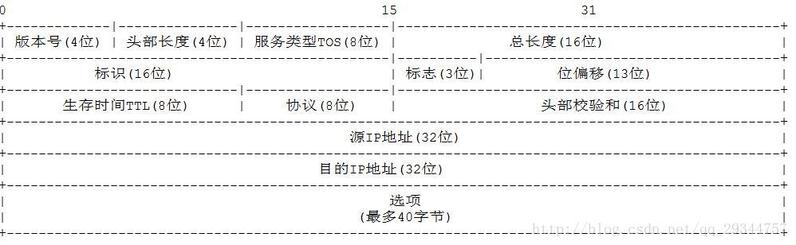

# 计 算机网络

## 1.说说计算机的通信方式

第一种方式：客户-服务器模式。这种传统的方式时互联网上最常见的方式。客户是服务请求方，服务器是客户提供方。C/S模型有一个特例，那就是B/S模式，即浏览器/服务器模式。它只安装维护一个服务器，而客户端采用浏览器运行软件。

第二种方式：对等连接（P2P)方式。是指两台主机在通信时不区分那个事服务请求方那个是服务提供方，只要两台主机都运行了对等连接软件（p2p软件），它们就可进行通信。

## 2.什么是分组交换，优缺点

分组交换采用存储转发技术，把一个报文划分为几个分组后再进行传送。分组的首部非常重要，包含了目的地址和源地址等重要信息，这样每个分组才能再互联网中独立的选择传输路径，并背正确的交付到分组传输的终点，最后再组合起来。

优点：

高效，再分组传世是动态分配带宽、对通信链路逐段占用。

灵活，为每一个分组独立的选择最合适的转发路由。

迅速，以分组为单位，可以不建立连接就能向主机发送数据。

可靠，分布式多路由，是传输可靠性强。

缺点

分组在路由器存储转发时需要排队，有时延。

分组必须携带控制信息也造成了开销

## 3.子网掩码的作用

用于屏蔽IP地址的一部分以区分网络标识和主机标识，并说明该IP是在局域网上还是在远程网上。

用于将一个大的IP网络划分为若干个小的网络

## 4.说说TCP/IP四层分层模式，每层说两个协议

[

**应用层**：应用层是体系结构中的最高层，其任务是**通过应用进程间的交互来完成特定网络应用**。应用层协议定义了**应用进程间的通信和交互规则**。

1.DNS：DNS协议是用来将域名转换为IP地址

2.HTTP：超文本传输协议，在浏览器与服务器传送数据

3.SMTP：简单邮件协议

4.FTP：文件传输协议

**传输层**：其任务是**两台主机进程之间的通讯提供通用的数据传输服务**

1.TCP：提供面向连接的，可靠的数据传输服务

2.UDP：提供无连接的、尽最大努力可靠交付的传输服务。

3.SCTP：一种传输协议，兼有TCP/UDP两者特征。

**网络层**：其**任务是负责为分组交换网上的不同信息提供通信服务**

1.IP：（1）寻址（2）路由选择（3）分组与交换

2.ICMP：用于在IP主机、路由器之间传送控制消息，用来提供网络诊断信息。

**链路层**：负责两台主机间的数据传输

1.ARP：ARP地址解析协议用于将计算机的网络地址转化为物理地址。

2.RARP：将MAC地址解析为对应的IP地址。

## 5.TCP与UDP的区别

TCP需要建立1对1的稳定连接；UDP无连接

TCP一对一，UDP可以一对一，一对多，多对多

TCP可靠传输，序列号、确认应答、超时重传；UDP不可靠传输，尽最大努力交付

TCP头部一般为20字节；UDP8个字节

TCP开销大，UDP灵活开销少

TCP提供可靠的服务，适用于通讯质量要求高的场景；UDP传输效率搞，适用于高速传输和实时性要求的场景。

## 6.TCP、UDP、IP

### TCP


16位源端口号和16位目的端口号。

32位序号：一次TCP通信过程中某一个传输方向上的字节流的每个字节的编号，通过这个来确认发送的数据有序，比如现在序列号为1000，发送了1000，下一个序列号就是2000。

32位确认号：用来响应TCP报文段，给收到的TCP报文段的序号加1，三握时还要携带自己的序号。

4位头部长度：标识该TCP头部有多少个4字节，共表示最长15*4=60字节。同IP头部。

6位保留。6位标志。URG（紧急指针是否有效）ACK（表示确认号是否有效）PSH（提示接收端应用程序应该立即从TCP接收缓冲区读走数据）RST（表示要求对方重新建立连接）SYN（表示请求建立一个连接）FIN（表示通知对方本端要关闭连接）

16位窗口大小：TCP流量控制的一个手段，用来告诉对端TCP缓冲区还能容纳多少字节。

16位校验和：由发送端填充，接收端对报文段执行CRC算法以检验TCP报文段在传输中是否损坏。

16位紧急指针：一个正的偏移量，它和序号段的值相加表示最后一个紧急数据的下一字节的序号。

### UDP


UDP 报文中每个字段的含义如下：

源端口：这个字段占据 UDP 报文头的前 16 位，通常包含发送数据报的应用程序所使用的 UDP 端口。接收端的应用程序利用这个字段的值作为发送响应的目的地址。这个字段是可选的，所以发送端的应用程序不一定会把自己的端口号写入该字段中。如果不写入端口号，则把这个字段设置为 0。这样，接收端的应用程序就不能发送响应了。

目的端口：接收端计算机上 UDP 软件使用的端口，占据 16 位。

长度：该字段占据 16 位，表示 UDP 数据报长度，包含 UDP 报文头和 UDP 数据长度。因为 UDP 报文头长度是 8 个字节，所以这个值最小为 8。

校验值：该字段占据 16 位，可以检验数据在传输过程中是否被损坏。

### IP

IPv4的头部结构长度为20字节，若含有可变长的选项部分，最多60字节。



 (1) 版本号：IP协议的版本。对于IPv4来说值是4
  (2) 头部长度：4位最大为0xF，注意该字段表示单位是字(4字节)
  (3) 服务类型(Type Of Service，TOS)：3位优先权字段(现已被忽略) + 4位TOS字段 + 1位保留字段(须为0)。4位TOS字段分别表示最小延时、最大吞吐量、最高可靠性、最小费用，其中最多有一个能置为1。应用程序根据实际需要来设置 TOS值，如ssh和telnet这样的登录程序需要的是最小延时的服务，文件传输ftp需要的是最大吞吐量的服务
  (4) 总长度: 指整个IP数据报的长度，单位为字节，即IP数据报的最大长度为65535字节(2的16次方)。**由于MTU的限制，长度超过MTU的数据报都将被分片传输，所以实际传输的IP分片数据报的长度远远没有达到最大值**

## 7.TCP为什么要三次握手，能两次吗？

不能两次，第一次握手，服务端知道自己接受数据正常，与客户端发送数据正常。第二次握手，客户端知道自己与服务器的功能均为正常，此时服务器还不知道是否正常，所以要进行第三次握手建立连接。

## 8.TCP为什么四次挥手，能三次吗？

可能会有三次的情况，比如说首先客户端向服务端发送FIN请求，服务器回复ACK确定FIN请求，此时如果服务器没有数据向客户端发送，第三次挥手的FIN请求会与第二次挥手合并，最后是客户端回复ACK，等待2msl后断开连接。

## 9.说说TCP三次握手的过程。

刚开始客户端处于 Closed 的状态，服务端处于 Listen 状态，进行三次握手：

- 第一次握手：客户端给服务端发一个 SYN 报文，并指明客户端的初始化序列号 ISN(c)。此时客户端处于 `SYN_SEND` 状态。

  首部的同步位SYN=1，初始序号seq=x，SYN=1的报文段不能携带数据，但要消耗掉一个序号。

- 第二次握手：服务器收到客户端的 SYN 报文之后，会以自己的 SYN 报文作为应答，并且也是指定了自己的初始化序列号 ISN(s)。同时会把客户端的 ISN + 1 作为ACK 的值，表示自己已经收到了客户端的 SYN，此时服务器处于 `SYN_RCVD` 的状态。

  在确认报文段中SYN=1，ACK=1，确认号ack=x+1，初始序号seq=y。

- 第三次握手：客户端收到 SYN 报文之后，会发送一个 ACK 报文，当然，也是一样把服务器的 ISN + 1 作为 ACK 的值，表示已经收到了服务端的 SYN 报文，此时客户端处于 `ESTABLISHED` 状态。服务器收到 ACK 报文之后，也处于 `ESTABLISHED` 状态，此时，双方已建立起了连接。

  确认报文段ACK=1，确认号ack=y+1，序号seq=x+1（初始为seq=x，第二个报文段所以要+1），ACK报文段可以携带数据，不携带数据则不消耗序号。

发送第一个SYN的一端将执行主动打开（active open），接收这个SYN并发回下一个SYN的另一端执行被动打开（passive open）。

在socket编程中，客户端执行connect()时，将触发三次握手


## 10.四次挥手的过程

客户端向服务端发送FIN请求关闭连接，服务器接受到之后会回复一个ACK应答，等到服务器没有数据发送给客户端，就会发送一个FIN请求，此时客户端回复一个ACK应答，服务器接受到之后关闭连接，客户端等待2msl后关闭连接。

## 11.为什么第四次挥手后，客户端要等待2msl

因为客户端无法确定服务器是否接受到回复的ACK应答，如果服务器没有接收到ACK应答，就会触发超时重传，再次向客户端发送FIN报文。客户端等待的2msl就是为了防止这种情况。

## 12.什么是(SYN攻击)洪泛攻击？怎么避免？

攻击者发送TCP连接请求，却不进行第三次握手，导致服务器一直在消耗资源维持数量庞大的半连接队列。服务器可能会因为消耗资源过多无法正常工作。

最常用的避免方式是降低SYN timeout时间，使主机尽快释放半连接的占用。还有就是采用SYN cookie，就是给每一个请求连接的IP地址分配一个Cookie，如果短时间收到某个IP的重复SYN报文，就认为使收到了攻击，通过防火墙屏蔽这个IP。

## 13.如果应对短链接、高并发的场景。

采用IO多路复用模型，比如说select，poll，epoll。

采用服务器负载均衡手段。

采用缓存的方式。

数据库层面我们可以对数据库进行分表，或者读写分离。

应对短链接加高并发，相当于一次洪泛攻击，所以我们还可以缩短SYN timeout时间，采用SYN cookie等。如果通信双方支持长连接，我们可以使用长连接通讯。

## 14.说说TCP的可靠机制

通过序列号、确认应答、超时重传保证接受方确定正确的接受发送方的数据。

通过窗口控制，提高双方通信的效率。如果没有窗口控制，有可能接受方已经不能接受数据，而发送方一直在发送，会导致发送方接收到大量重复的ACK报文。

拥塞控制，为了应对网络拥堵，需要进行拥塞控制。主要有慢启动，拥塞避免，快恢复，快重传。

## 15.说说拥塞控制算法

慢启动：定义拥塞窗口，一开始将该窗口设置为1，之后每次成功来回传输，就将拥塞窗口乘2（指数级增长）

拥塞避免：设置慢启动阈值，当窗口大小到达阈值后，窗口大小不再指数级上升，而是加1（线性级增长）

快恢复：是指当收到三个重复的ACK后，就将窗口大小与阈值设置为当前大小的一半，之后走拥塞避免算法

快重传：收到三次重复ACK后，重新发送该报文，而不是超时重传后发送该报文。

## 16.受说TCP的ACK机制，有什么好处？

因为通信过程的不可靠性，传送的数据不可避免的会出现丢失，延迟，错误，重复等各种状态，TCP协议为了解决这些问题设计了一些列机子和。这个机制的核心，就是发送方向接收方发送数据后，接收方要向发送方发送ACK。如果发送方没有接收到正确的ACK，就会重新发送数据直到接受到ACK未知。

## 17.如何让UDP变得可靠

我们可以在应用层模拟TCP传输协议，以达到让UDP变得可靠的目的。

## 18.什么使负载均衡。

我们有很多服务器，组成服务器集群，当用户访问时，先访问一个中间服务器，再让这个服务器在服务器集群中选择一个压力较小的服务器，将访问请求引入该服务器。如此以来，每个服务器的压力趋于平衡。

负载均衡实现方式主要有轮询、权重轮询、IP-hash等。

## 19.Session和Cookie的区别

1、数据存放位置不同：cookie数据存放在客户的浏览器上，session数据放在服务器上。

2、安全程度不同：cookie不是很安全，别人可以分析存放在本地的COOKIE并进行COOKIE欺骗,考虑到安全应当使用session。

3、性能使用程度不同：session会在一定时间内保存在服务器上。当访问增多，会比较占用你服务器的性能,考虑到减轻服务器性能方面，应当使用cookie。

4、数据存储大小不同：单个cookie保存的数据不能超过4K，很多浏览器都限制一个站点最多保存20个cookie，而session则存储与服务端，浏览器对其没有限制。
5、会话机制不同
session会话机制：session会话机制是一种服务器端机制，它使用类似于哈希表（可能还有哈希表）的结构来保存信息。

cookies会话机制：cookie是服务器存储在本地计算机上的小块文本，并随每个请求发送到同一服务器。 Web服务器使用HTTP标头将cookie发送到客户端。在客户端终端，浏览器解析cookie并将其保存为本地文件，该文件自动将来自同一服务器的任何请求绑定到这些cookie。

## 20.网络调试工具

1.Ping命令：ping属于一个通信协议，是TCP/IP协议的一部分。利用“ping”命令可以检查网络是否通畅或者网络连接速度，很好地分析和判定网络故障。
**它的原理是**：利用网络上机器IP地址的唯一性，给目标IP地址发送一个数据包，通过对方回复的数据包来确定两台网络机器是否连接相通，时延是多少。

2.Nslookup(name server lookup)是一个用于查询因特网域名信息或诊断DNS 服务器问题的工具.

3.Fiddler（中文名称：小提琴）是一个HTTP的调试代理，以代理服务器的方式，监听系统的Http网络数据流动，Fiddler可以也可以让你检查所有的HTTP通讯，设置断点，以及Fiddle所有的“进出”的数据

4.网站压力测试工具——webbench

## 21.请说说socket网络编程的步骤


（1）服务器根据地址类型（ ipv4, ipv6 ）、 socket 类型、协议创建 socket。

（2）服务器为 socket 绑定 IP 地址和端口号。

（3）服务器 socket 监听端口号请求，随时准备接收客户端发来的连接，这时候服务器的socket 并没有被打开 。

（4）客户端创建 socket。

（5）客户端打开 socket，根据服务器 IP 地址和端口号试图连接服务器 socket。

（6）服务器 socket 接收到客户端 socket 请求，被动打开，开始接收客户端请求，直到客户端返回连接信息 。这时候 socket 进入阻塞状态，所谓阻塞即accept（）方法一直到客户端返回连接信息后才返回，开始接收下一个客户端连接请求 。

（7）客户端连接成功，向服务器发送连接状态信息 。

（8）服务器 accept 方法返回，连接成功 。

（9）客户端向 socket 写入信息 。

（10）服务器读取信息 。

（11）客户端关闭 。

（12）服务器端关闭 。

## 22.请说说socket网络编程的接口

1.socket函数创建接口

2.bind函数绑定IP地址和端口号

3.listen函数监听

4.accept接受客户端请求

5.close函数关闭socket

6.connect函数是客户端请求

7.read和write函数用来读取和发送数据

## 23.什么是TCP粘包/拆包？

TCP是面向流的，根本就没有粘包一说，我们经常提到的粘包是因为流的原因，接收方无法确定接受到的数据那里应该在那里分开。

##### 解决方案

1. 消息定长。

2. 在包尾部增加回车或者空格符等特殊字符进行分割。

3. 将消息分为消息头和消息尾。
4. 使用其它复杂的协议，如RTMP协议等。

## 24.简述一下Nagle算法

Nagle算法简单的说，当提交一段数据给TCP时，TCP并不立刻发送此段数据，而是等待一段时间，看看在等待期间是否还有要发送的数据，若有则会一次把多段数据发送出去。

## 25.为什么UDP不粘包

UDP是面向报文发送数据的，它的头部也会记录发送数据的大小。

## 26.什么是封包和解包？

**封包**就是给一段数据加上包头，这样一来数据包就分为包头和包体两部分内容了（可加上包尾）。包头其实是一个大小固定的结构体，其中有个**结构体成员变量**表示包体的长度，这是个很重要的变量，其他的结构体成员可根据需要自己定义。根据固定的包头长度以及包头中含有的包体长度变量值就能正确的拆分出一个完整的数据包。

利用底层的缓冲区来进行**解包**时，由于TCP也维护了一个缓冲区，所以可以利用TCP的缓冲区来**解包**，也就是循环不停地接收包头给出的数据，直到收够为止，这就是一个完整的TCP包。

## 27.请说说HTTP的工作原理。

HTTP协议采用了**请求/响应模型**。客户端向服务器发送一个**请求报文**。服务器返回对应的响应报文。

## 28.在浏览器地址栏键入URL，按下回车之后会经历哪些流程？

1.浏览器向 DNS 服务器请求解析该 URL 中的域名所对应的 IP 地址;

2.解析出 IP 地址后，根据该 IP 地址，和服务器建立TCP连接;

3.浏览器发出读取文件(URL 中域名后面部分对应的文件)的HTTP 请求，该请求报文作为 TCP 三次握手的第三个报文的数据发送给服务器;

4.服务器对浏览器请求作出响应，并把对应的响应报文发送给浏览器;

5.释放 TCP连接;

6.浏览器解析响应报文代码。

## 29.请你说说HTTP请求包含哪些内容？

请求报文包含请求的方法、URL、协议版本、请求头部、空行和请求数据。

## 30.请说说有哪些请求方法？

请求方法，**GET和POST**是最常见的HTTP方法，除此以外还包括DELETE、HEAD、OPTIONS、PUT、TRACE。

## 31.get和post的区别是什么？

1.get是获取数据，post是修改数据。

1.get具有幂等性，而post不具有幂等性。

2.get将数据放在url后面，post将数据放在报文体

3.url长度会受到特定的浏览器及服务器的限制，而报文体长度没有限制。

4.get将数据放在url后面，post方法将数据放在报文体中。

## 32.请你说说HTTP状态码

| 状态码 | 意义                 | 解释                                                         |
| ------ | -------------------- | ------------------------------------------------------------ |
| 301    | Permanently Moved    | 被请求的资源已永久移动到新位置，新的URL在Location头中给出，浏览器应该自动地访问新的URL。301为永久重定向。 |
| 302    | Found                | 请求的资源现在临时从不同的URL响应请求。302为临时重定向。     |
| 200    | OK                   | 表示从客户端发来的请求在服务器端被正确处理                   |
| 304    | Not Modified         | 告诉浏览器可以从缓存中获取所请求的资源。                     |
| 400    | bad request          | 请求报文存在语法错误                                         |
| 403    | forbidden            | 表示对请求资源的访问被服务器拒绝                             |
| 404    | not found            | 表示在服务器上没有找到请求的资源                             |
| 500    | internal sever error | 表示服务器端在执行请求时发生了错误                           |
| 503    | service unavailable  | 表明服务器暂时处于超负载或正在停机维护，无法处理请求         |

## 33.请说说HTTP响应头有哪些内容？

HTTP响应也是由四个部分组成，分别是：状态行、消息报头、空行、响应正文。

## 34.请说说HTTP协议的特点

1.**支持客户/服务器模式**

HTTP协议规定，请求从客户端发出，最后服务器端响应该请求并返回。换句话说，肯定是先从客户端开始建立通信的，服务器端在没有接收到请求之前不会发送响应。

2.**简单快速**

客户向服务器请求服务时，只需传送请求方法和路径。请求方法常用的有GET、HEAD、POST。由于HTTP协议简单，使得HTTP服务器的程序规模小，因而通信速度很快。

3.**灵活**

HTTP允许传输任意类型的数据对象。正在传输的类型由Content-Type（Content-Type是HTTP包中用来表示内容类型的标识）加以标记。

4.**无连接**

无连接的含义是限制每次连接只处理一个请求。服务器处理完客户的请求，并收到客户的应答后，即断开连接。采用这种方式可以节省传输时间。（早期会有，现在有长连接）

5.**无状态**

无状态是指协议对于事务处理没有记忆能力，服务器不知道客户端是什么状态。即我们给服务器发送 HTTP 请求之后，服务器根据请求，会给我们发送数据过来，但是，发送完，不会记录任何信息。

## 35.HTTP1.0、HTTP1.1的区别

**长连接(Persistent Connection)**：HTTP1.1支持长连接和请求的流水线处理，在一个TCP连接上可以传送多个HTTP请求和响应，减少了建立和关闭连接的消耗和延迟。

**节约带宽**：HTTP1.0中存在一些浪费带宽的现象，例如客户端只是需要某个对象的一部分，而服务器却将整个对象送过来了，并且不支持断点续传功能。HTTP1.1支持只发送header信息（不带任何body信息），如果服务器认为客户端有权限请求服务器，则返回100，客户端接收到100才开始把请求body发送到服务器；如果返回401，客户端就可以不用发送请求body了，节约了带宽。

**HOST域**：在HTTP1.0中认为每台服务器都绑定一个唯一的IP地址，因此，请求消息中的URL并没有传递主机名（hostname），HTTP1.0没有host域。HTTP1.1的请求消息和响应消息都支持host域，且请求消息中如果没有host域会报告一个错误（400 Bad Request）。

**缓存处理**：在HTTP1.0中主要使用header里的If-Modified-Since,Expires来做为缓存判断的标准，HTTP1.1则引入了更多的缓存控制策略例如Entity tag，If-Unmodified-Since, If-Match, If-None-Match等更多可供选择的缓存头来控制缓存策略。

## 36.什么是长连接？

HTTP1.1规定了默认保持长连接（HTTP persistent connection ，也有翻译为持久连接），数据传输完成了**保持TCP连接不断开**（不发RST包、不四次握手），等待在同域名下继续用这个通道传输数据；相反的就是短连接。长连接的**好处**是效率高，**缺点**是占用资源。

## 37.HTTP2.0有哪些改动？

1.**多路复用**允许同时通过单一的 HTTP/2 连接发起多重的请求-响应消息。

2.**二进制分帧**：在应用层(HTTP/2)和传输层(TCP or UDP)之间增加一个二进制分帧层。将所有传输的信息分割为更小的消息和帧（frame）,并对它们采用二进制格式的编码 ，其中 HTTP1.x 的首部信息会被封装到 HEADER frame，而相应的 Request Body 则封装到 DATA frame 里面。二进制分帧的好处是二进制码健壮性高，增强通信的稳定性。

3.**首部压缩**：http1.x的header由于cookie和user agent很容易膨胀，而且每次都要重复发送。http2.0使用encoder来减少需要传输的header大小

4.**服务端推送**：http2.0能通过push的方式将客户端需要的内容预先推送过去

## 38.HTTPS的加密原理

HTTPS采用**对称密钥**加密和**非对称密钥**加密的方式，两者混合加密。两者都有各自的优点。**对称密钥加密处理速度快，但密钥无法安全发送给对方**；**非对称密钥加密处理速度慢，但密钥能够安全交换**。但如果我们将两种加密方式一起使用，则两种加密方式就能互补。

也就是说，利用**非对称密钥加密**方式安全地交换在稍后的**对称密钥加密**中要使用的密钥，在确保密钥安全前提下，使用**对称密钥加密**方式进行通信。


## 39.什么是对称加密？什么是非对称加密？两者区别？

1.**对称密钥加密：加密与解密使用同一个密钥**

也就是说在加密的同时，也会把密钥发送给对方。**在发送密钥过程中可能会造成密钥被窃取**

2.**非对称密钥加密**

非对称密钥有两把密钥，一把叫私有密钥，另一把叫公有密钥，私有密钥不让任何人知道，公有密钥随意发送。

也就是说，发送密文时，使用对方的公有密钥进行加密，对方接受到信息后，使用私有密钥进行解密。在不使用私有密钥情况下很难还原信息。

## 40.数字证书用来干嘛的？

服务器会给客户端发出数字证书来证明自己的身份。**客户端在接受到服务端发来的SSL证书时，会对证书的真伪进行校验**。证书中包含的具体内容有：

1. 证书的发布机构CA
2. 证书的有效期
3. 公钥
4. 证书所有者
5. 签名

这样我们通过数字证书，就可以安全交换对称秘钥了，**既解决了公钥获取问题，又解决了黑客冒充问题**，一箭双雕。

## 41.HTTPS为什么比HTTP更安全


在HTTP基础上我们通过加密后，又衍生出了新的通信协议——**HTTPS**。HTTPS 协议（HyperText Transfer Protocol over Secure Socket Layer）：可以理解为**HTTP+SSL/TLS**， 即 HTTP 下加入 SSL 层，HTTPS 的安全基础是 SSL，因此加密的详细内容就需要 SSL，用于安全的 HTTP 数据传输。

## 42.HTTPS和HTTP的区别

1.http是是明文传输，https则是具有安全性的tsl加密传输协议。

2.https除了三次握手以外，还要进行ssl握手，协商加密使用对称密钥

3.https需要服务端申请证书，浏览器端安装根证书

4.端口也不一样，前者默认是80，后者默认是443

## 43.HTTPS的通信建立过程


1. 在使用HTTPS是需要保证服务端配置正确了对应的安全证书
2. 客户端发送请求到服务端
3. 服务端返回公钥和数字证书到客户端
4. 客户端接收后会验证证书的安全性，如果通过，则会随机生成一个随机数，用公钥对其加密，发送到服务端
5. 服务端接受到这个加密后的随机数后，会用私钥对其解密得到真正的随机数，随后用这个随机数当做**对称加密密钥**对需要发送的数据进行对称加密
6. 客户端在接收到加密后的数据**对称加密密钥**与服务器通信。
7. SSL加密建立

## 44.DNS工作原理

将主机域名转换为ip地址，属于应用层协议，使用UDP传输。（DNS应用层协议，以前有个考官问过）

 

 总结： 浏览器缓存，系统缓存，路由器缓存，IPS服务器缓存，根域名服务器缓存，顶级域名服务器缓存，主域名服务器缓存。 

一、主机向本地域名服务器的查询一般都是采用递归查询。

二、本地域名服务器向根域名服务器的查询的迭代查询。

1.当用户输入域名时，浏览器先检查自己的缓存中是否 这个域名映射的ip地址，有解析结束。 

2.若没命中，则检查操作系统缓存（如Windows的hosts）中有没有解析过的结果，有解析结束。 

3.若无命中，则请求本地域名服务器解析（ LDNS）。 

4.若LDNS没有命中就直接跳到根域名服务器请求解析。根域名服务器返回给LDNS一个主域名服务器地址。 

5.此时LDNS再发送请求给上一步返回的gTLD（ 通用顶级域）， 接受请求的gTLD查找并返回这个域名对应的Name Server的地址 

6.Name Server根据映射关系表找到目标ip，返回给LDNS 

7.LDNS缓存这个域名和对应的ip， 把解析的结果返回给用户。

## 45.TCP协议如何保证可靠传输的

建立连接（标志位）：通信前确认通信实体存在。

序号机制（序号、确认号）：确保了数据是按序、完整到达。

数据校验（校验和）：CRC校验全部数据。

超时重传（定时器）：保证因链路故障未能到达数据能够被多次重发。

窗口机制（窗口）：提供流量控制，避免过量发送。

拥塞控制：同上。

## 46.TCP流量控制

> 流量控制是为了控制发送方发送速率，保证接收方来得及接收。TCP 利用滑动窗口实现流量控制。

  TCP 中采用滑动窗口来进行传输控制，滑动窗口的大小意味着**接收方还有多大的缓冲区可以用于接收数据**。发送方可以通过滑动窗口的大小来确定应该发送多少字节的数据。当滑动窗口为 0 时，发送方一般不能再发送数据报，但有两种情况除外，一种情况是可以发送紧急数据。

  > 例如，允许用户终止在远端机上的运行进程。另一种情况是发送方可以发送一个 1 字节的数据报来通知接收方重新声明它希望接收的下一字节及发送方的滑动窗口大小。

  

## 47.OSI 的七层模型分别是？各自的功能是什么？

##### 简要概括

- 物理层：底层数据传输，如网线；网卡标准。
- 数据链路层：定义数据的基本格式，如何传输，如何标识；如网卡MAC地址。
- 网络层：定义IP地址，定义路由功能；如不同设备的数据转发。
- 传输层：端到端传输数据的基本功能；如 TCP、UDP。
- 会话层：控制应用程序之间会话能力；如不同软件数据分发给不同软件。
- 表示层：数据格式标识，基本压缩加密功能。
- 应用层：各种应用软件，包括 Web 应用。

##### 总结

- 网络七层模型是一个标准，而非实现。
- 网络四层模型是一个实现的应用模型。
- 网络四层模型由七层模型简化合并而来。

## 48.为什么域名解析用UDP协议？

因为UDP快啊！UDP的DNS协议只要一个请求、一个应答就好了。

而使用基于TCP的DNS协议要三次握手、发送数据以及应答、四次挥手，但是UDP协议传输内容不能超过512字节。

不过客户端向DNS服务器查询域名，一般返回的内容都不超过512字节，用UDP传输即可。

## 49.为什么区域传送用TCP协议？

因为TCP协议可靠性好啊！

你要从主DNS上复制内容啊，你用不可靠的UDP？ 因为TCP协议传输的内容大啊，你用最大只能传512字节的UDP协议？万一同步的数据大于512字节，你怎么办？所以用TCP协议比较好！

## 50.为什么服务器会缓存这一项功能?如何实现的？

**原因**

- 缓解服务器压力；
- 降低客户端获取资源的延迟：缓存通常位于内存中，读取缓存的速度更快。并且缓存服务器在地理位置上也有可能比源服务器来得近，例如浏览器缓存。

**实现方法**

- 让代理服务器进行缓存；
- 让客户端浏览器进行缓存。

## 51.一个TCP连接可以对应几个HTTP请求？

首先http1.0不支持长连接，所以http1.0一个TCP对应一个http请求，http1.1及以上如果维持连接，一个 TCP 连接是可以发送多个 HTTP 请求的。

## 52.一个 TCP 连接中 HTTP 请求发送可以一起发送么（比如一起发三个请求，再三个响应一起接收）？

HTTP/1.1 存在一个问题，单个 TCP 连接在同一时刻只能处理一个请求，意思是说：两个请求的生命周期不能重叠，任意两个 HTTP 请求从开始到结束的时间在同一个 TCP 连接里不能重叠。

在 HTTP/1.1 存在 Pipelining 技术可以完成这个多个请求同时发送，但是由于浏览器默认关闭，所以可以认为这是不可行的。在 HTTP2 中由于 Multiplexing 特点的存在，多个 HTTP 请求可以在同一个 TCP 连接中并行进行。

那么在 HTTP/1.1 时代，浏览器是如何提高页面加载效率的呢？主要有下面两点：

- 维持和服务器已经建立的 TCP 连接，在同一连接上顺序处理多个请求。
- 和服务器建立多个 TCP 连接。

## 53.浏览器对同一 Host 建立 TCP 连接到的数量有没有限制？

**有。Chrome 最多允许对同一个 Host 建立六个 TCP 连接。不同的浏览器有一些区别。**

如果图片都是 HTTPS 连接并且在同一个域名下，那么浏览器在 SSL 握手之后会和服务器商量能不能用 HTTP2，如果能的话就使用 Multiplexing 功能在这个连接上进行多路传输。不过也未必会所有挂在这个域名的资源都会使用一个 TCP 连接去获取，但是可以确定的是 Multiplexing 很可能会被用到。

如果发现用不了 HTTP2 呢？或者用不了 HTTPS（现实中的 HTTP2 都是在 HTTPS 上实现的，所以也就是只能使用 HTTP/1.1）。那浏览器就会在一个 HOST 上建立多个 TCP 连接，连接数量的最大限制取决于浏览器设置，这些连接会在空闲的时候被浏览器用来发送新的请求，如果所有的连接都正在发送请求呢？那其他的请求就只能等等了。

## 54.DNS负载均衡是什么策略？

当一个网站有足够多的用户的时候，假如每次请求的资源都位于同一台机器上面，那么这台机器随时可能会崩掉。处理办法就是用DNS负载均衡技术，它的原理是在**DNS服务器中为同一个主机名配置多个IP地址,在应答DNS查询时,DNS服务器对每个查询将以DNS文件中主机记录的IP地址按顺序返回不同的解析结果,将客户端的访问引导到不同的机器上去,使得不同的客户端访问不同的服务器**,从而达到负载均衡的目的｡例如可以根据每台机器的负载量，该机器离用户地理位置的距离等等。

## 55.什么是SSL/TLS ？

SSL代表安全套接字层。它是一种用于加密和验证应用程序（如浏览器）和Web服务器之间发送的数据的协议。 身份验证 ，加密Https的加密机制是一种共享密钥加密和公开密钥加密并用的混合加密机制。

SSL/TLS协议作用：认证用户和服务，加密数据，维护数据的完整性的应用层协议加密和解密需要两个不同的密钥，故被称为非对称加密；加密和解密都使用同一个密钥的

对称加密：优点在于加密、解密效率通常比较高 ，HTTPS 是基于非对称加密的， 公钥是公开的，

## 56.HTTPS是如何保证数据传输的安全，整体的流程是什么？（SSL是怎么工作保证安全的）

（1）客户端向服务器端发起SSL连接请求； 

（2） 服务器把公钥发送给客户端，并且服务器端保存着唯一的私钥 

（3）客户端用公钥对双方通信的对称秘钥进行加密，并发送给服务器端 

（4）服务器利用自己唯一的私钥对客户端发来的对称秘钥进行解密， 

（5）进行数据传输，服务器和客户端双方用公有的相同的对称秘钥对数据进行加密解密，可以保证在数据收发过程中的安全，即是第三方获得数据包，也无法对其进行加密，解密和篡改。

因为数字签名、摘要是证书防伪非常关键的武器。 “摘要”就是对传输的内容，通过hash算法计算出一段固定长度的串。然后，通过发送方的私钥对这段摘要进行加密，加密后得到的结果就是“数字签名”

SSL/TLS协议的基本思路是采用公钥加密法，也就是说，客户端先向服务器端索要公钥，然后用公钥加密信息，服务器收到密文后，用自己的私钥解密。

## 57.如何保证公钥不被篡改？

将公钥放在数字证书中。只要证书是可信的，公钥就是可信的。 公钥加密计算量太大，如何减少耗用的时间？ 每一次对话（session），客户端和服务器端都生成一个"对话密钥"（session key），用它来加密信息。由于"对话密钥"是对称加密，所以运算速度非常快，而服务器公钥只用于加密"对话密钥"本身，这样就减少了加密运算的消耗时间。 （1） 客户端向服务器端索要并验证公钥。 （2） 双方协商生成"对话密钥"。 （3） 双方采用"对话密钥"进行加密通信。上面过程的前两步，又称为"握手阶段"（handshake）。

## 58.Cookie是什么？

HTTP 协议是**无状态**的，主要是为了让 HTTP 协议尽可能简单，使得它能够处理大量事务，HTTP/1.1 引入 Cookie 来保存状态信息。

Cookie 是**服务器发送到用户浏览器并保存在本地的一小块数据**，它会在浏览器之后向同一服务器再次发起请求时被携带上，用于告知服务端两个请求是否来自同一浏览器。由于之后每次请求都会需要携带 Cookie 数据，因此会带来额外的性能开销（尤其是在移动环境下）。

Cookie 曾一度用于客户端数据的存储，因为当时并没有其它合适的存储办法而作为唯一的存储手段，但现在随着现代浏览器开始支持各种各样的存储方式，Cookie 渐渐被淘汰。

新的浏览器 API 已经允许开发者直接将数据存储到本地，如使用 Web storage API（本地存储和会话存储）或 IndexedDB。

cookie 的出现是因为 HTTP 是无状态的一种协议，换句话说，服务器记不住你，可能你每刷新一次网页，就要重新输入一次账号密码进行登录。这显然是让人无法接受的，cookie 的作用就好比服务器给你贴个标签，然后你每次向服务器再发请求时，服务器就能够 cookie 认出你。

抽象地概括一下：一个 cookie 可以认为是一个「变量」，形如 name=value，存储在浏览器；一个 session 可以理解为一种数据结构，多数情况是「映射」（键值对），存储在服务器上。

## 59.Cookie有什么用途？用途

- 会话状态管理（如用户登录状态、购物车、游戏分数或其它需要记录的信息）
- 个性化设置（如用户自定义设置、主题等）
- 浏览器行为跟踪（如跟踪分析用户行为等）

## 60.Session 的工作原理是什么？

除了可以将用户信息通过 Cookie 存储在用户浏览器中，也可以利用 Session 存储在服务器端，存储在服务器端的信息更加安全。

session 的工作原理是客户端登录完成之后，服务器会创建对应的 session，session 创建完之后，会把 session 的 id 发送给客户端，客户端再存储到浏览器中。这样客户端每次访问服务器时，都会带着 sessionid，服务器拿到 sessionid 之后，在内存找到与之对应的 session 这样就可以正常工作了。

## 61.什么是QUIC

QUIC（Quick UDP Internet Connections）是一种实验性传输层网络协议，提供与TLS/SSL相当的安全性，同时具有更低的连接和传输延迟。QUIC基于UDP，因此拥有极佳的弱网性能，在丢包和网络延迟严重的情况下仍可提供可用的服务。QUIC在应用程序层面就能实现不同的拥塞控制算法，不需要操作系统和内核支持，这相比于传统的TCP协议，拥有了更好的改造灵活性，非常适合在TCP协议优化遇到瓶颈的业务。

## 62.SQL注入攻击了解吗？

攻击者在HTTP请求中注入恶意的SQL代码，服务器使用参数构建数据库SQL命令时，恶意SQL被一起构造，并在数据库中执行。

## 63.什么是RARP？工作原理

概括： 反向地址转换协议，网络层协议，RARP与ARP工作方式相反。 RARP使只知道自己硬件地址的主机能够知道其IP地址。RARP发出要反向解释的物理地址并希望返回其IP地址，应答包括能够提供所需信息的RARP服务器发出的IP地址。 原理： (1)网络上的每台设备都会有一个独一无二的硬件地址，通常是由设备厂商分配的MAC地址。主机从网卡上读取MAC地址，然后在网络上发送一个RARP请求的广播数据包，请求RARP服务器回复该主机的IP地址。

(2)RARP服务器收到了RARP请求数据包，为其分配IP地址，并将RARP回应发送给主机。

(3)PC1收到RARP回应后，就使用得到的IP地址进行通讯。

## 64.端口有效范围是多少到多少？

0-1023为知名端口号，比如其中HTTP是80，FTP是20（数据端口）、21（控制端口）

UDP和TCP报头使用两个字节存放端口号，所以端口号的有效范围是从0到65535。动态端口的范围是从1024到65535

## 65.为何需要把 TCP/IP 协议栈分成 5 层（或7层）？开放式回答。

答：ARPANET 的研制经验表明，对于复杂的计算机网络协议，其结构应该是层次式的。

分层的好处：

①隔层之间是独立的

②灵活性好

③结构上可以分隔开

④易于实现和维护

⑤能促进标准化工作。


## 66.DNS查询方式有哪些？

##### 递归解析

当局部DNS服务器自己不能回答客户机的DNS查询时，它就需要向其他DNS服务器进行查询。此时有两种方式。**局部DNS服务器自己负责向其他DNS服务器进行查询，一般是先向该域名的根域服务器查询，再由根域名服务器一级级向下查询**。最后得到的查询结果返回给局部DNS服务器，再由局部DNS服务器返回给客户端。

##### 迭代解析

当局部DNS服务器自己不能回答客户机的DNS查询时，也可以通过迭代查询的方式进行解析。局部DNS服务器不是自己向其他DNS服务器进行查询，**而是把能解析该域名的其他DNS服务器的IP地址返回给客户端DNS程序**，客户端DNS程序再继续向这些DNS服务器进行查询，直到得到查询结果为止。也就是说，迭代解析只是帮你找到相关的服务器而已，而不会帮你去查。比如说：baidu.com的服务器ip地址在192.168.4.5这里，你自己去查吧，本人比较忙，只能帮你到这里了。


## 67.HTTP中缓存的私有和共有字段？知道吗？

private 指令规定了将资源作为私有缓存，只能被单独用户使用，一般存储在用户浏览器中。

```
Cache-Control: private
```

public 指令规定了将资源作为公共缓存，可以被多个用户使用，一般存储在代理服务器中。

```
Cache-Control: public
```


## 68.GET 方法参数写法是固定的吗？

在约定中，我们的参数是写在 ? 后面，用 & 分割。

我们知道，解析报文的过程是通过获取 TCP 数据，用正则等工具从数据中获取 Header 和 Body，从而提取参数。

比如header请求头中添加token，来验证用户是否登录等权限问题。

也就是说，我们可以自己约定参数的写法，只要服务端能够解释出来就行，万变不离其宗。


## 69.GET 方法的长度限制是怎么回事？

网络上都会提到浏览器地址栏输入的参数是有限的。

首先说明一点，HTTP 协议没有 Body 和 URL 的长度限制，对 URL 限制的大多是浏览器和服务器的原因。

浏览器原因就不说了，服务器是因为处理长 URL 要消耗比较多的资源，为了性能和安全（防止恶意构造长 URL 来攻击）考虑，会给 URL 长度加限制。


## 70.POST 方法比 GET 方法安全？

有人说POST 比 GET 安全，因为数据在地址栏上不可见。

然而，从传输的角度来说，他们都是不安全的，因为 HTTP 在网络上是明文传输的，只要在网络节点上捉包，就能完整地获取数据报文。

要想安全传输，就只有加密，也就是 HTTPS。


## 71.POST 方法会产生两个 TCP 数据包？你了解吗？

有些文章中提到，POST 会将 header 和 body 分开发送，先发送 header，服务端返回 100 状态码再发送 body。

HTTP 协议中没有明确说明 POST 会产生两个 TCP 数据包，而且实际测试(Chrome)发现，header 和 body 不会分开发送。

所以，header 和 body 分开发送是部分浏览器或框架的请求方法，不属于 post 必然行为。

## 72.Session和cookie应该如何去选择（适用场景）？

- Cookie 只能存储 ASCII 码字符串，而 Session 则可以存储任何类型的数据，因此在考虑数据复杂性时首选 Session；
- Cookie 存储在浏览器中，容易被恶意查看。如果非要将一些隐私数据存在 Cookie 中，可以将 Cookie 值进行加密，然后在服务器进行解密；
- 对于大型网站，如果用户所有的信息都存储在 Session 中，那么开销是非常大的，因此不建议将所有的用户信息都存储到 Session 中。

## 73.DDos 攻击了解吗？

客户端向服务端发送请求链接数据包，服务端向客户端发送确认数据包，客户端不向服务端发送确认数据包，服务器一直等待来自客户端的确认 没有彻底根治的办法，除非不使用TCP DDos 预防： 

1. 限制同时打开SYN半链接的数目 
2. 缩短SYN半链接的Time out 时间 
3. 关闭不必要的服务

## 74.MTU和MSS分别是什么？

MTU：maximum transmission unit，最大传输单元，由硬件规定，如以太网的MTU为1500字节。

MSS：maximum segment size，最大分节大小，为TCP数据包每次传输的最大数据分段大小，一般由发送端向对端TCP通知对端在每个分节中能发送的最大TCP数据。MSS值为MTU值减去IPv4 Header（20 Byte）和TCP header（20 Byte）得到。

## 75.HTTP中有个缓存机制，但如何保证缓存是最新的呢？（缓存过期机制）

max-age 指令出现在请求报文，并且缓存资源的缓存时间小于该指令指定的时间，那么就能接受该缓存。

max-age 指令出现在响应报文，表示缓存资源在缓存服务器中保存的时间。

```
Cache-Control: max-age=31536000
```

- 在 HTTP/1.1 中，会优先处理 max-age 指令；
- 在 HTTP/1.0 中，max-age 指令会被忽略掉。


## 76.TCP头部中有哪些信息？

- 端口号：源端口号，目的端口号，各16位。

- 序号（32bit）：传输方向上字节流的字节编号。初始时序号会被设置一个随机的初始值（ISN），之后每次发送数据时，序号值 = ISN + 数据在整个字节流中的偏移。假设A -> B且ISN = 1024，第一段数据512字节已经到B，则第二段数据发送时序号为1024 + 512。用于解决网络包乱序问题。
- 确认号（32bit）：接收方对发送方TCP报文段的响应，其值是收到的序号值 + 1。
- 首部长（4bit）：标识首部有多少个4字节 * 首部长，最大为15，即60字节。
- 标志位（6bit）：
  - URG：标志紧急指针是否有效。
  - ACK：标志确认号是否有效（确认报文段）。用于解决丢包问题。
  - PSH：提示接收端立即从缓冲读走数据。
  - RST：表示要求对方重新建立连接（复位报文段）。
  - SYN：表示请求建立一个连接（连接报文段）。
  - FIN：表示关闭连接（断开报文段）。
- 窗口（16bit）：接收窗口。用于告知对方（发送方）本方的缓冲还能接收多少字节数据。用于解决流控。
- 校验和（16bit）：接收端用CRC检验整个报文段有无损坏。


## 77.常见TCP的连接状态有哪些？

- CLOSED：初始状态。
- LISTEN：服务器处于监听状态。
- SYN_SEND：客户端socket执行CONNECT连接，发送SYN包，进入此状态。
- SYN_RECV：服务端收到SYN包并发送服务端SYN包，进入此状态。
- ESTABLISH：表示连接建立。客户端发送了最后一个ACK包后进入此状态，服务端接收到ACK包后进入此状态。
- FIN_WAIT_1：终止连接的一方（通常是客户机）发送了FIN报文后进入。等待对方FIN。
- CLOSE_WAIT：（假设服务器）接收到客户机FIN包之后等待关闭的阶段。在接收到对方的FIN包之后，自然是需要立即回复ACK包的，表示已经知道断开请求。但是本方是否立即断开连接（发送FIN包）取决于是否还有数据需要发送给客户端，若有，则在发送FIN包之前均为此状态。
- FIN_WAIT_2：此时是半连接状态，即有一方要求关闭连接，等待另一方关闭。客户端接收到服务器的ACK包，但并没有立即接收到服务端的FIN包，进入FIN_WAIT_2状态。
- LAST_ACK：服务端发动最后的FIN包，等待最后的客户端ACK响应，进入此状态。
- TIME_WAIT：客户端收到服务端的FIN包，并立即发出ACK包做最后的确认，在此之后的2MSL时间称为TIME_WAIT状态。

## 78.TCP是什么？

TCP（Transmission Control Protocol 传输控制协议）是一种面向连接的、可靠的、基于字节流的传输层通信协议。

## 79.TCP标志位.

一共有6个，这里介绍三个

1. **ACK**：这个标识可以理解为发送端发送数据到接收端，发送的时候 ACK 为 0，标识接收端还未应答，一旦接收端接收数据之后，就将 ACK 置为 1，发送端接收到之后，就知道了接收端已经接收了数据。
2. **SYN**：表示「同步序列号」，是 TCP 握手的发送的第一个数据包。用来建立 TCP 的连接。SYN 标志位和 ACK 标志位搭配使用，当连接请求的时候，SYN=1，ACK=0连接被响应的时候，SYN=1，ACK=1；这个标志的数据包经常被用来进行端口扫描。扫描者发送一个只有 SYN 的数据包，如果对方主机响应了一个数据包回来 ，就表明这台主机存在这个端口。
3. **FIN**：表示发送端已经达到数据末尾，也就是说双方的数据传送完成，没有数据可以传送了，发送FIN标志位的 TCP 数据包后，连接将被断开。这个标志的数据包也经常被用于进行端口扫描。发送端只剩最后的一段数据了，同时要告诉接收端后边没有数据可以接受了，所以用FIN标识一下，接收端看到这个FIN之后，哦！这是接受的最后的数据，接受完就关闭了；**TCP四次分手必然问**。

## 80.应用层常见协议知道多少？了解几个？

| 协议   | 名称                       | 默认端口       | 底层协议                                                  |
| ------ | -------------------------- | -------------- | --------------------------------------------------------- |
| HTTP   | 超文本传输协议             | 80             | TCP                                                       |
| HTTPS  | 超文本传输安全协议         | 443            | TCP                                                       |
| Telnet | 远程登录服务的标准协议     | 23             | TCP                                                       |
| FTP    | 文件传输协议               | 20传输和21连接 | TCP                                                       |
| TFTP   | 简单文件传输协议           | 69             | UDP                                                       |
| SMTP   | 简单邮件传输协议（发送用） | 25             | TCP                                                       |
| POP    | 邮局协议（接收用）         | 110            | TCP                                                       |
| DNS    | 域名解析服务               | 53             | 服务器间进行域传输的时候用TCP 客户端查询DNS服务器时用 UDP |

## 81.什么是半连接队列？

服务器第一次收到客户端的 SYN 之后，就会处于 SYN_RCVD 状态，此时双方还没有完全建立其连接，服务器会把此种状态下请求连接放在一个**队列**里，我们把这种队列称之为**半连接队列**。

当然还有一个**全连接队列**，就是已经完成三次握手，建立起连接的就会放在全连接队列中。如果队列满了就有可能会出现丢包现象。

这里在补充一点关于**SYN-ACK 重传次数**的问题： 服务器发送完SYN-ACK包，如果未收到客户确认包，服务器进行首次重传，等待一段时间仍未收到客户确认包，进行第二次重传。如果重传次数超过系统规定的最大重传次数，系统将该连接信息从半连接队列中删除。 注意，每次重传等待的时间不一定相同，一般会是指数增长，例如间隔时间为 1s，2s，4s，8s......


## 82.ISN(Initial Sequence Number)是固定的吗？

**三次握手的其中一个重要功能是客户端和服务端交换 ISN(Initial Sequence Number)，以便让对方知道接下来接收数据的时候如何按序列号组装数据。如果 ISN 是固定的，攻击者很容易猜出后续的确认号，因此 ISN 是动态生成的。**


## 83.三次握手过程中可以携带数据吗？

其实第三次握手的时候，是可以携带数据的。但是，**第一次、第二次握手不可以携带数据**

也就是说，**第一次握手不可以放数据，其中一个简单的原因就是会让服务器更加容易受到攻击了。而对于第三次的话，此时客户端已经处于 ESTABLISHED 状态。对于客户端来说，他已经建立起连接了，并且也已经知道服务器的接收、发送能力是正常的了，所以能携带数据也没啥毛病。**

## 84.OSI七层模型中表示层和会话层功能是什么？

- 表示层：图像、视频编码解，数据加密。
- 会话层：建立会话，如session认证、断点续传。


## 85.对称密钥加密的优点缺点？

对称密钥加密（Symmetric-Key Encryption），加密和解密使用同一密钥。

- 优点：运算速度快
- 缺点：无法安全地将密钥传输给通信方


## 86.非对称密钥加密你了解吗？优缺点？

非对称密钥加密，又称公开密钥加密（Public-Key Encryption），加密和解密使用不同的密钥。

公开密钥所有人都可以获得，**通信发送方获得接收方的公开密钥之后，就可以使用公开密钥进行加密**，**接收方收到通信内容后使用私有密钥解密**。

非对称密钥除了用来加密，还可以用来进行签名。因为私有密钥无法被其他人获取，因此通信发送方使用其私有密钥进行签名，通信接收方使用发送方的公开密钥对签名进行解密，就能判断这个签名是否正确。

- 优点：可以更安全地将公开密钥传输给通信发送方；
- 缺点：运算速度慢。


## 87.HTTPS是什么

HTTPS 并不是新协议，而是让 **HTTP 先和 SSL（Secure Sockets Layer）通信，再由 SSL 和 TCP 通信，也就是说 HTTPS 使用了隧道进行通信**。通过使用 SSL，HTTPS 具有了加密（防窃听）、认证（防伪装）和完整性保护（防篡改）。


## 88.HTTP的缺点有哪些？

- 使用明文进行通信，内容可能会被窃听；
- 不验证通信方的身份，通信方的身份有可能遭遇伪装；
- 无法证明报文的完整性，报文有可能遭篡改。

## 89.HTTPS采用的加密方式有哪些？是对称还是非对称？

HTTPS 采用混合的加密机制，使用**非对称密钥加密用于传输对称密钥来保证传输过程的安全性**，之后使用**对称密钥加密进行通信来保证通信过程的效率**。

[](https://camo.githubusercontent.com/2ae759553b285e8c3014fe7d3d3aa068b1ddf4957bd3d9c20d734fccae1d2ecb/68747470733a2f2f63646e2e6a7364656c6976722e6e65742f67682f666f7274686573706164612f6d65646961496d6167653240312e342f3230323130332f6e65742d37332d312e706e67)

确保传输安全过程（其实就是rsa原理）：

1. Client给出协议版本号、一个客户端生成的随机数（Client random），以及客户端支持的加密方法。
2. Server确认双方使用的加密方法，并给出数字证书、以及一个服务器生成的随机数（Server random）。
3. Client确认数字证书有效，然后生成呀一个新的随机数（Premaster secret），并使用数字证书中的公钥，加密这个随机数，发给Server。
4. Server使用自己的私钥，获取Client发来的随机数（Premaster secret）。
5. Client和Server根据约定的加密方法，使用前面的三个随机数，生成”对话密钥”（session key），用来加密接下来的整个对话过程。


## 90.为什么有的时候刷新页面不需要重新建立 SSL 连接？

TCP 连接有的时候会被浏览器和服务端维持一段时间，TCP 不需要重新建立，SSL 自然也会用之前的。


## 91.SSL中的认证中的证书是什么？了解过吗？

通过使用 **证书** 来对通信方进行认证。

数字证书认证机构（CA，Certificate Authority）是客户端与服务器双方都可信赖的第三方机构。

服务器的运营人员向 CA 提出公开密钥的申请，CA 在判明提出申请者的身份之后，会对已申请的公开密钥做数字签名，然后分配这个已签名的公开密钥，并将该公开密钥放入公开密钥证书后绑定在一起。

进行 HTTPS 通信时，服务器会把证书发送给客户端。客户端取得其中的公开密钥之后，先使用数字签名进行验证，如果验证通过，就可以开始通信了。


## 92.HTTP如何禁用缓存？如何确认缓存？

HTTP/1.1 通过 Cache-Control 首部字段来控制缓存。

**禁止进行缓存**

no-store 指令规定不能对请求或响应的任何一部分进行缓存。

```
Cache-Control: no-store
```

强制确认缓存

no-cache 指令规定缓存服务器需要先向源服务器验证缓存资源的有效性，只有当缓存资源有效时才能使用该缓存对客户端的请求进行响应。

```
Cache-Control: no-cache
```

## 93.网络层常见协议？可以说一下吗？

| 协议 | 名称                 | 作用                                                         |
| ---- | -------------------- | ------------------------------------------------------------ |
| IP   | 网际协议             | IP协议不但定义了数据传输时的基本单元和格式，还定义了数据报的递交方法和路由选择 |
| ICMP | Internet控制报文协议 | ICMP就是一个“错误侦测与回报机制”，其目的就是让我们能够检测网路的连线状况﹐也能确保连线的准确性，是ping和traceroute的工作协议 |
| RIP  | 路由信息协议         | 使用“跳数”(即metric)来衡量到达目标地址的路由距离             |
| IGMP | Internet组管理协议   | 用于实现组播、广播等通信                                     |

## 94.为何快速重传是选择3次ACK？

主要的考虑还是要区分包的丢失是由于链路故障还是乱序等其他因素引发。

两次duplicated ACK时很可能是乱序造成的！三次duplicated ACK时很可能是丢包造成的！四次duplicated ACK更更更可能是丢包造成的，但是这样的响应策略太慢。丢包肯定会造成三次duplicated ACK!综上是选择收到三个重复确认时窗口减半效果最好，这是实践经验。

在没有fast retransmit / recovery 算法之前，重传依靠发送方的retransmit timeout，就是在timeout内如果没有接收到对方的ACK，默认包丢了，发送方就重传，包的丢失原因

1）包checksum 出错

2）网络拥塞

3）网络断，包括路由重收敛，但是发送方无法判断是哪一种情况，于是采用最笨的办法，就是将自己的发送速率减半，即CWND 减为1/2，这样的方法对2是有效的，可以缓解网络拥塞，3则无所谓，反正网络断了，无论发快发慢都会被丢；但对于1来说，丢包是因为偶尔的出错引起，一丢包就对半减速不合理。

于是有了fast retransmit 算法，基于在反向还可以接收到ACK，可以认为网络并没有断，否则也接收不到ACK，如果在timeout 时间内没有接收到> 2 的duplicated ACK，则概率大事件为乱序，乱序无需重传，接收方会进行排序工作；

而如果接收到三个或三个以上的duplicated ACK，则大概率是丢包，可以逻辑推理，发送方可以接收ACK，则网络是通的，可能是1、2造成的，先不降速，重传一次，如果接收到正确的ACK，则一切OK，流速依然（包出错被丢）。

而如果依然接收到duplicated ACK，则认为是网络拥塞造成的，此时降速则比较合理。


## 95.对于FIN_WAIT_2，CLOSE_WAIT状态和TIME_WAIT状态？你知道多少?

- FIN_WAIT_2：

  - 此时是半连接状态，即有一方要求关闭连接，等待另一方关闭。客户端接收到服务器的ACK包，但并没有立即接收到服务端的FIN包，进入FIN_WAIT_2状态。

- CLOSE_WAIT状态：

  - 被动关闭连接一方接收到FIN包会立即回应ACK包表示已接收到断开请求。
  - 被动关闭连接一方如果还有剩余数据要发送就会进入CLOSE_WAIT状态。

- TIME_WAIT状态：

  - 又叫2MSL等待状态。
  - 如果客户端直接进入CLOSED状态，如果服务端没有接收到最后一次ACK包会在超时之后重新再发FIN包，此时因为客户端已经CLOSED，所以服务端就不会收到ACK而是收到RST。所以TIME_WAIT状态目的是防止最后一次握手数据没有到达对方而触发重传FIN准备的。
  - 在2MSL时间内，同一个socket不能再被使用，否则有可能会和旧连接数据混淆（如果新连接和旧连接的socket相同的话）。

## 96.封包和拆包你听说过吗？它是基于TCP还是UDP的？

封包和拆包都是基于TCP的概念。因为TCP是无边界的流传输，所以需要对TCP进行封包和拆包，确保发送和接收的数据不粘连。

- 封包：封包就是在发送数据报的时候为每个TCP数据包加上一个包头，将数据报分为包头和包体两个部分。包头是一个固定长度的结构体，里面包含该数据包的总长度。
- 拆包：接收方在接收到报文后提取包头中的长度信息进行截取。

## 97.TCP对应的应用层协议

FTP：定义了文件传输协议，使用21端口. Telnet：它是一种用于远程登陆的端口,23端口 SMTP：定义了简单邮件传送协议，服务器开放的是25号端口。 POP3：它是和SMTP对应，POP3用于接收邮件。


## 98.UDP对应的应用层协议

DNS：用于域名解析服务，用的是53号端口 SNMP：简单网络管理协议，使用161号端口 TFTP(Trival File Transfer Protocal)：简单文件传输协议，69


## 99.数据链路层常见协议？可以说一下吗？

| 协议 | 名称             | 作用                                                         |
| ---- | ---------------- | ------------------------------------------------------------ |
| ARP  | 地址解析协议     | 根据IP地址获取物理地址                                       |
| RARP | 反向地址转换协议 | 根据物理地址获取IP地址                                       |
| PPP  | 点对点协议       | 主要是用来通过拨号或专线方式建立点对点连接发送数据，使其成为各种主机、网桥和路由器之间简单连接的一种共通的解决方案 |


## 100.Ping命令基于哪一层协议的原理是什么？

ping命令基于网络层的命令，是基于ICMP协议工作的。


## 101.在进行UDP编程的时候，一次发送多少bytes好?

下面我们由下至上一步一步来看:以太网(Ethernet)数据帧的长度必须在46-1500字节之间,这是由以太网的物理特性决定的.这个1500字节被称为链路层的MTU(最大传输单元).但这并不是指链路层的长度被限制在1500字节,其实这这个MTU指的是链路层的数据区.并不包括链路层的首部和尾部的18个字节.

所以,事实上,这个1500字节就是网络层IP数据报的长度限制。因为IP数据报的首部为20字节,所以IP数据报的数据区长度最大为1480字节.而这个1480字节就是用来放TCP传来的TCP报文段或UDP传来的UDP数据报的.又因为UDP数据报的首部8字节,所以UDP数据报的数据区最大长度为1472字节.这个1472字节就是我们可以使用的字节数。

当我们发送的UDP数据大于1472的时候会怎样呢？ 这也就是说IP数据报大于1500字节,大于MTU.这个时候发送方IP层就需要分片(fragmentation). 把数据报分成若干片,使每一片都小于MTU.而接收方IP层则需要进行数据报的重组. 这样就会多做许多事情,而更严重的是,由于UDP的特性,当某一片数据传送中丢失时,接收方便 无法重组数据报.将导致丢弃整个UDP数据报。

因此,在普通的局域网环境下，我建议将UDP的数据控制在1472字节以下为好.

进行Internet编程时则不同,因为Internet上的路由器可能会将MTU设为不同的值. 如果我们假定MTU为1500来发送数据的,而途经的某个网络的MTU值小于1500字节,那么系统将会使用一系列的机 制来调整MTU值,使数据报能够顺利到达目的地,这样就会做许多不必要的操作.

鉴于Internet上的标准MTU值为576字节,所以我建议在进行Internet的UDP编程时. 最好将UDP的数据长度控件在548字节(576-8-20)以内

## 102.可以解释一下RTO，RTT和超时重传分别是什么吗？

- 超时重传：发送端发送报文后若长时间未收到确认的报文则需要重发该报文。可能有以下几种情况：
  - 发送的数据没能到达接收端，所以对方没有响应。
  - 接收端接收到数据，但是ACK报文在返回过程中丢失。
  - 接收端拒绝或丢弃数据。
- RTO：从上一次发送数据，因为长期没有收到ACK响应，到下一次重发之间的时间。就是重传间隔。
  - 通常每次重传RTO是前一次重传间隔的两倍，计量单位通常是RTT。例：1RTT，2RTT，4RTT，8RTT......
  - 重传次数到达上限之后停止重传。
- RTT：数据从发送到接收到对方响应之间的时间间隔，即数据报在网络中一个往返用时。大小不稳定。


## 103.CSRF攻击？你知道吗？

跨站点请求伪造，指攻击者通过跨站请求，以合法的用户的身份进行非法操作。可以这么理解CSRF攻击：攻击者盗用你的身份，以你的名义向第三方网站发送恶意请求。CRSF能做的事情包括利用你的身份发邮件，发短信，进行交易转账，甚至盗取账号信息。


## 104.如何防范CSRF攻击

**安全框架**，例如Spring Security。 **token机制**。在HTTP请求中进行token验证，如果请求中没有token或者token内容不正确，则认为CSRF攻击而拒绝该请求。 **验证码**。通常情况下，验证码能够很好的遏制CSRF攻击，但是很多情况下，出于用户体验考虑，验证码只能作为一种辅助手段，而不是最主要的解决方案。 **referer识别**。在HTTP Header中有一个字段Referer，它记录了HTTP请求的来源地址。如果Referer是其他网站，就有可能是CSRF攻击，则拒绝该请求。但是，服务器并非都能取到Referer。很多用户出于隐私保护的考虑，限制了Referer的发送。在某些情况下，浏览器也不会发送Referer，例如HTTPS跳转到HTTP。 1）验证请求来源地址； 2）关键操作添加验证码； 3）在请求地址添加 token 并验证。


## 105.文件上传漏洞是如何发生的？你有经历过吗？

文件上传漏洞，指的是用户上传一个可执行的脚本文件，并通过此脚本文件获得了执行服务端命令的能力。 许多第三方框架、服务，都曾经被爆出文件上传漏洞，比如很早之前的Struts2，以及富文本编辑器等等，可被攻击者上传恶意代码，有可能服务端就被人黑了。


## 106.如何防范文件上传漏洞

文件上传的目录设置为不可执行。

1）判断文件类型。在判断文件类型的时候，可以结合使用MIME Type，后缀检查等方式。因为对于上传文件，不能简单地通过后缀名称来判断文件的类型，因为攻击者可以将可执行文件的后缀名称改为图片或其他后缀类型，诱导用户执行。

2）对上传的文件类型进行白名单校验，只允许上传可靠类型。

3）上传的文件需要进行重新命名，使攻击者无法猜想上传文件的访问路径，将极大地增加攻击成本，同时向shell.php.rar.ara这种文件，因为重命名而无法成功实施攻击。

4）限制上传文件的大小。

5）单独设置文件服务器的域名。

## 107.如何区分流量控制和拥塞控制？

- 流量控制属于通信双方协商；拥塞控制涉及通信链路全局。
- 流量控制需要通信双方各维护一个发送窗、一个接收窗，对任意一方，接收窗大小由自身决定，发送窗大小由接收方响应的TCP报文段中窗口值确定；拥塞控制的拥塞窗口大小变化由试探性发送一定数据量数据探查网络状况后而自适应调整。
- 实际最终发送窗口 = min{流控发送窗口，拥塞窗口}。

## 108.服务器出现大量close_wait的连接的原因是什么？有什么解决方法？

close_wait状态是在TCP四次挥手的时候收到FIN但是没有发送自己的FIN时出现的，服务器出现大量close_wait状态的原因有两种：

- 服务器内部业务处理占用了过多时间，都没能处理完业务；或者还有数据需要发送；或者服务器的业务逻辑有问题，没有执行close()方法
- 服务器的父进程派生出子进程，子进程继承了socket，收到FIN的时候子进程处理但父进程没有处理该信号，导致socket的引用不为0无法回收

处理方法：

- 停止应用程序
- 修改程序里的bug


## 109.一台机器能够使用的端口号上限是多少，是否可以修改？如果想要用的端口超过这个限制怎么办？

65536.因为TCP的报文头部中源端口号和目的端口号的长度是16位，也就是可以表示2^16=65536个不同端口号，因此TCP可供识别的端口号最多只有65536个。但是由于0到1023是知名服务端口，所以实际上还要少1024个端口号。

而对于服务器来说，可以开的端口号与65536无关，其实是受限于Linux可以打开的文件数量，并且可以通过MaxUserPort来进行配置。

## 110.物理层有什么作用

主要解决两台物理机之间的通信，通过二进制比特流的传输来实现，二进制数据表现为电流电压上的强弱，到达目的地再转化为二进制机器码。网卡、集线器工作在这一层。

## 111.数据链路层有什么作用

在不可靠的物理介质上提供可靠的传输，接收来自物理层的位流形式的数据，并封装成帧，传送到上一层；同样，也将来自上层的数据帧，拆装为位流形式的数据转发到物理层。这一层在物理层提供的比特流的基础上，通过差错控制、流量控制方法，使有差错的物理线路变为无差错的数据链路。提供物理地址寻址功能。交换机工作在这一层。

## 112.网络层有什么作用

将网络地址翻译成对应的物理地址，并决定如何将数据从发送方路由到接收方，通过路由选择算法为分组通过通信子网选择最佳路径。路由器工作在这一层。

## 113.传输层有什么作用

传输层提供了进程间的逻辑通信，传输层向高层用户屏蔽了下面网络层的核心细节，使应用程序看起来像是在两个传输层实体之间有一条端到端的逻辑通信信道。

## 114.会话层有什么作用

建立会话：身份验证，权限鉴定等； 保持会话：对该会话进行维护，在会话维持期间两者可以随时使用这条会话传输局； 断开会话：当应用程序或应用层规定的超时时间到期后，OSI会话层才会释放这条会话。

## 115.表示层有什么作用

对数据格式进行编译，对收到或发出的数据根据应用层的特征进行处理，如处理为文字、图片、音频、视频、文档等，还可以对压缩文件进行解压缩、对加密文件进行解密等。

## 116.应用层有什么作用

提供应用层协议，如HTTP协议，FTP协议等等，方便应用程序之间进行通信。

## 117.转发和重定向的区别

转发是服务器行为。服务器直接向目标地址访问URL,将相应内容读取之后发给浏览器，用户浏览器地址栏URL不变，转发页面和转发到的页面可以共享request里面的数据。

重定向是利用服务器返回的状态码来实现的，如果服务器返回301或者302，浏览器收到新的消息后自动跳转到新的网址重新请求资源。用户的地址栏url会发生改变，而且不能共享数据。

## 118.简述http1.0

规定了请求头和请求尾，响应头和响应尾（get post）

每一个请求都是一个单独的连接，做不到连接的复用

## 119.简述http1.1的改进

HTTP1.1默认开启长连接，在一个TCP连接上可以传送多个HTTP请求和响应。使用 TCP 长连接的方式改善了 HTTP/1.0 短连接造成的性能开销。

支持管道（pipeline）网络传输，只要第一个请求发出去了，不必等其回来，就可以发第二个请求出去，可以减少整体的响应时间。

服务端无法主动push

## 120.简述http2.0的改进

提出多路复用。多路复用前，文件时串行传输的，请求a文件，b文件只能等待，并且连接数过多。引入多路复用，a文件b文件可以同时传输。

引入了二进制数据帧。其中帧对数据进行顺序标识，有了序列id，服务器就可以进行并行传输数据。

## 121.了解REST API吗

REST API全称为表述性状态转移（Representational State Transfer，REST）即利用HTTP中get、post、put、delete以及其他的HTTP方法构成REST中数据资源的增删改查操作：

- Create ： POST
- Read ： GET
- Update ： PUT/PATCH
- Delete： DELETE

## 122.Put与Delete区别

Put规定默认为更新某一资源，和Post一样，一般该操作会对服务器资源进行改变 Delete规定默认为删除某一资源，和Post一样，一般该操作会对服务器资源进行改变

## 123.http的request具体格式

http request部分报文分三部分。第一部分是请求行，第二部分是请求头，第三部分是请求实体。

请求行包括：请求方法（GET、HEAD、PUT、POST、TRACE、OPTIONS、DELETE），请求的url，协议版本格式（http1.0/http1.1）

请求头包括一些附加信息，比如说：

- Host：域名或ip加端口号
- User-Agent：发送请求的应用程序名称，比如XX浏览器
- Connection：连接是不是长连接
- Accept-Charset：编码样式
- Accept-Encoding：数据压缩格式

请求实体： 比如post就会把需要的数据放入请求实体中。

## 124.http的response具体格式

HTTP响应报文分为三部分。第一部分是状态行，第二部分是响应头部，第三部分是响应正文。

状态行由协议版本，状态码，状态码描述三部分组成。

响应头部包含了一些附加信息，如：

- server:服务器（apache等）
- content-type：如application/json
- content-charset:编码格式
- content-encoding:数据压缩格式

响应正文：响应的详细回传数据。

## 125.简述dos攻击

DoS是Denial of Service的简称，也称为拒绝服务攻击，通过发送大量的无用请求数据包给服务器，耗尽服务器资源，从而无法通过正常的访问服务器资源，导致服务器崩溃。

