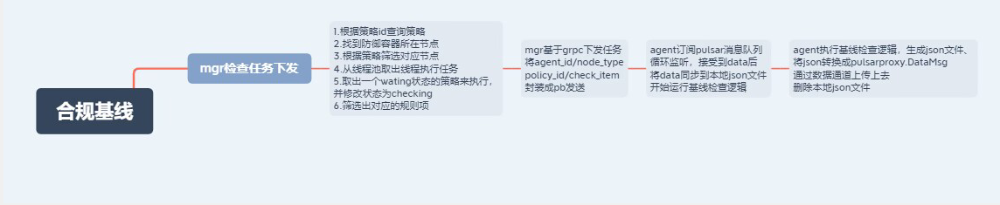

# 深信服



## 项目介绍

这个容器安全的项目相当于集群的安全管家，会对集群容器进行镜像检查、基线检查、漏洞扫描等功能。而基线检查便是根据互联网安全中心（*CIS*）提供的一套全球公认的共识驱动型最佳实践，旨在帮助安全从业者实施和管理他们的网络安全防御。我在深信服负责的是基线种原有基线的维护与新基线的开发。

## 相关技术

### Docker底层

Docker 底层的核心技术包括 Linux 上的命名空间（Namespaces）、控制组（Control groups）、Union 文件系统（Union file systems）和容器格式（Container format）。

我们知道，传统的虚拟机通过在宿主主机中运行 hypervisor 来模拟一整套完整的硬件环境提供给虚拟机的操作系统。虚拟机系统看到的环境是可限制的，也是彼此隔离的。 这种直接的做法实现了对资源最完整的封装，但很多时候往往意味着系统资源的浪费。 例如，以宿主机和虚拟机系统都为 Linux 系统为例，虚拟机中运行的应用其实可以利用宿主机系统中的运行环境。

我们知道，在操作系统中，包括内核、文件系统、网络、PID、UID、IPC、内存、硬盘、CPU 等等，所有的资源都是应用进程直接共享的。 要想实现虚拟化，除了要实现对内存、CPU、网络IO、硬盘IO、存储空间等的限制外，还要实现文件系统、网络、PID、UID、IPC等等的相互隔离。 前者相对容易实现一些，后者则需要宿主机系统的深入支持。

随着 Linux 系统对于命名空间功能的完善实现，程序员已经可以实现上面的所有需求，让某些进程在彼此隔离的命名空间中运行。大家虽然都共用一个内核和某些运行时环境（例如一些系统命令和系统库），但是彼此却看不到，都以为系统中只有自己的存在。这种机制就是容器（Container），利用命名空间来做权限的隔离控制，利用 cgroups 来做资源分配。

联合文件系统（[UnionFS](https://en.wikipedia.org/wiki/UnionFS)）是一种分层、轻量级并且高性能的文件系统，它支持对文件系统的修改作为一次提交来一层层的叠加，同时可以将不同目录挂载到同一个虚拟文件系统下(unite several directories into a single virtual filesystem)。

# 仙途智能

## 项目介绍

在车辆自动驾驶过程中可能由于各种情况促使人工接管，而这些接管对于算法组而言就是bug。而问题上报的最终目的就是将发生接管时的摄像头信息，雷达信息，接管类型进行收集汇总。每天晚上运维人员需要在web端对问题进行描述，故提供了收集问题的查找，修改等grpc接口。由于视频文件太大，并且车辆在运行状态下网络并不稳定，所以提供了导出接口，将视频文件与json文件达成压缩包后在稳定网络下在另一个平台传输到服务器。

我在这个过程中主要是对外提供查询，修改，导出接口。以及通过ROS topic 收集 手动接管信息、摄像头信息等。      


# 高性能HTTP服务器

### 高并发HTTP服务器简介

这是一个高并发HTTP服务器，在双核4G的Centos7系统中，支持15000+的并发。

**项目概述**：HTTP服务器启动后会监听对应端口号的TCP连接，当用户通过浏览器访问时，HTTP会解析用户的HTTP请求报文并 将解析后的结果生HTTP响应报文发送给用户浏览器。 

**设计思路**：使用线程池与IO多路复用处理用户请求。对操作系统特有的函数进行封装抽象与逻辑代码解耦。项目遵循设计原则 并在适当的地方使用恰当的设计模式。

服务器可以分为7个模块，分别是线程模块、事件监听模块、HTTP模块、网Socket模块、IO模块、数据库模块、日志模块。

## 线程模块

对线程、互斥锁、信号量、条件变量进行抽象，使用**抽象工厂**设计模式生产其对象。**线程池**由生产者消费者模型 与线程工厂实现。

### 线程设计

线程，我们要考虑线程要运行什么呢？又是在什么时候运行？在这里使用了一个策略设计模式，线程会调用一个抽象类的对应函数，所以说其他类要想使用线程，那么就需要继承这个抽象类，这两个类分别是`Thread`与`ThreadKey`，当创建`Thread`后会立即创建一个新的线程并调用`ThreadKey`的`threadDispose()`函数。此外`Thread`还有`jion()`和`detach()`函数。

在这里我们说一说线程的具体实现，我们使用的Linux系统，所以我们在使用`pthread_create()`需要传递一个`void * fun(void * arg)`函数，所以我们将`ThreadKey*`作为`fun`的参数进行传递。具体实现为

```c++
void* MyThread::worke(void *arg){
    //收到cancel就立马结束
    pthread_setcanceltype(PTHREAD_CANCEL_ASYNCHRONOUS, NULL);
    ThreadKey * key = (ThreadKey*)arg;
    key->threadDispose();
    return NULL;
}
```

还有需要注意的是，我们在析构函数里会调用`pthread_cancel()`函数用来销毁线程，而在`worke`函数中我们设置了`pthread_setcanceltype(PTHREAD_CANCEL_ASYNCHRONOUS, NULL);`使线程收到销毁信号后立即结束。

### 信号量、互斥锁、条件变量

我们对信号量进行了抽象，有`wait()`与`post()`函数。

我们对互斥锁进行抽象，有`lock()`与`unlock()`函数。

条件变量则有`wait()//进入等待`、`signal()//唤醒一个`、`broadcast()//唤醒所有`函数，这里具体实现由需要说明的使我们要对`pthread_cond_wait()`传入一个已经解锁的互斥锁，之后再进行解锁。不过项目中并没有用到信号量，这部分代码实现可能有一定问题。

```c++
bool MyCond::wait(){
    bool ans = pthread_mutex_lock(&mut) == THREAD_TRUE;
    ans = ans && pthread_cond_wait(&con,&mut) == THREAD_TRUE;
    ans = ans && pthread_mutex_unlock(&mut) == THREAD_TRUE;
    return ans;
}
```

### 线程工厂

很明显在linux中的posix的标准中的线程、互斥量、信号量、互斥锁有一定的关联性，所以我们使用抽象工厂来生成它们对应的实现类，这样做到了线程池与linux解耦，只需要接受一个抽象工厂即可。

### 线程池设计 (可以讲讲线程池设计时候遇到的问题)

线程池的作用就是接受一系列的`ThreadKey*`对象并进行执行，所以有一个抽象的`append(ThreadKey* request)`的函数(生产者)。在具体实现方面，我们可以让线程池继承`ThreadKey`并且重写`threadDispose()`函数并给`Thread`传入线程池对象本身，这样做会导致多个线程公用同一段内存空间，在高并发的情况下出现问题。我们的解决方案是在`ThreadPoll`中生成一个内部类继承了`ThreadKey`，线程池有多少个线程(消费者)，就有多少个内部类为线程提供不同的空间，内部类继承`disposeThread()`代码如下

```c++
void MyThreadPoll::MyThreadPollKey::threadDispose(){
    while(true){
        poll->quesem->wait();
        poll->lock->lock();
        if(poll->thread_ve.empty()){
            poll->lock->unlock();
            continue;
        }
        ThreadKey * request = poll->qu.front();
        poll->qu.pop();
        poll->lock->unlock();//解锁后再执行，没有线程没有自己的栈空间，可能导致，所以线程不安全
        if(request == nullptr) continue;
        request->threadDispose();
    }
}
```

## IO模块

对**网络IO**进行封装，负责请求报文的读取以及响应报文的发送。具体的有读、写和IO工厂。

### Read

读我们只有一个抽象函数`read()`，具体要从那里读，怎么读还是需要看具体的实现，在该项目中的具体实现是从非阻塞网络文件描述符中读。

### Write

为了适应项目，我们抽象了`addString()`、`addFile()`进行缓存要写的内容，以及通过`write()`进行写。

### IOFactory

生成具体的读写函数。不过没有用到，因为HTTP适配器对读入有要求。日志模块又是使用的单例设计模式。

## 数据库模块

对数据库进行抽象并使用生产者消费者模型实现**数据库连接池**，负责对用户登录、注册的校验。

### 数据库

对数据库进行抽象分别有执行SQL语句的`exeSQL`函数，以及判断行是否在结果集的`isExist`函数，还有获取结果集的`getResult`函数。

### 数据库连接池

数据库连接池，有两个函数`getSQL`和`freeSQL(SQL** sql)`为什么要传入双重指针呢，是因为我们要将对应的指针置空。

## 日志模块

日志模块使用单例设计模式与生产者消费者模型实现。使用`log()`函数获取该单例，并且重载了`operator<<`简化日志输出模式。`Log`继承了`ThreadKey`使用一个单独的线程进行写操作，提高了服务器的并发能力。

## Socket模块

我们对Socket抽象后有`accept`函数返回`ScoektKey`从全连接队列获取一个连接，还有`getSocket`函数获取`Socket`滋生对应的描述符，在具体实现中`SocketKey`中有且仅有一个fd文件描述符。

## HTTP处理模块

负责根据网络IO读取的信息，使用**状态设计模式**提取出对应的请求报文，解析请求报文后生成对应的响应报文交由网络IO发送。

### HTTPState

怎么样读取报文头呢？请求报文分为请求行、请求头、空行、请求体。我们可以使用状态转移，请求行只有一个行，如果读取的是一个完整的行，就转移到请求头；当请求头读取到空行时，判断是否具有`Content-Length`关键字，存在则转移到请求体，否则转移到请求头结果返回真；请求体根据`Content-Length`对应的长度读取对应的字节即可。具体的对应实现分别是`AskLine`、`AskHead`、`AskBody`。

### HTTPRequest

这个类就是`HTTPState`的上下文，提供了`changeState`函数，以及提供了`requestDispose`函数接受字符串并转换成对应的HTTP请求报文。

### HTTPLogic

这个没有进行更加细节的划分，所以实现类显得有些臃肿。在抽象方面，提共`logicDispose`纯虚函数，将HTTP请求报文转换为HTTP响应报文。具体实现函数看下表，从`logicDispose`一步一步来，分类处理了`GET`方法和`POST`方法，具体函数如下。

```c++
   int getDispose(std::map<int,std::string> & request,std::list<std::pair<bool,std::string>> & response);//处理GET方法
    int postDispose(std::map<int,std::string> & request,std::list<std::pair<bool,std::string>> & response);//处理POST方法
    int elseDispose(std::map<int,std::string> & request,std::list<std::pair<bool,std::string>> & response);//处理其他方法
    bool checkCookie(std::string & cookie);//判断Cookie是否过期
    bool checkURLSecurity(std::string & url);//判断URL是否安全
    long long getFileLength(const std::string & file);//获取一个文件的大小
    int addBodyFile(std::list<std::pair<bool,std::string>> & response,const std::string & file);//添加Body对应的文件
    int defaultHead(std::map<int,std::string> & request,std::list<std::pair<bool,std::string>> & response);//添加默认的头
    int err404(std::map<int,std::string> & request,std::list<std::pair<bool,std::string>> & response);//返回error404
    int err500(std::map<int,std::string> & request,std::list<std::pair<bool,std::string>> & response);//返回error500
    int dirDispose(std::map<int,std::string> & request,std::list<std::pair<bool,std::string>> & response);//如果url是目录的处理
    int fileDispose(std::map<int,std::string> & request,std::list<std::pair<bool,std::string>> & response);//如果url是文件的处理
    std::pair<std::string,std::string>  getNamePassword(const std::string & naps);//获取账号密码。
```

### HTTPFactory

使用抽象工厂设计的HTTP工厂。

## 事件监听模块

我们对事件监听进行抽象，对 IO 多路复用进行抽象，用来监听新增连接、HTTP 请求等状态发生变化事件并使用**观察者设计模式**通知该事件对应的对象处理该事件。分别有插入，更新，删除，事件处理四个函数

```c++
    virtual bool insert(EventKey * key) = 0;
    virtual bool update(EventKey * key) = 0;
    virtual bool remove(EventKey * key) = 0;
    virtual void eventsDispose() = 0;
```

而`EventKey`就是发生对应事件时我们要进行的处理。具体实现中使用了`epoll`。`EpollKey`设计了变量`is_dynamic`关键字，当关键字为真时会被设置长时间未响应进行删除操作`clear_time_out_listen`。

### SocketAdaptor

`Socket`的适配器，该适配器继承了`EpollKey`以用来监听端口产生新的TCP连接并将对应的描述符设置为非阻塞。

### HTTPAdaptor

该类继承了`EpollKey`与`ThreadKey`使用多线程处理数据接收、报文解析、发送响应报文等工作。需要注意的是，`HTTPAdaptor`迭代器在同一时间只能被同一个类处理，为事件描述添加`EPOLLONESHOT`选项，每次需要被监听就需要进行更新操作。

